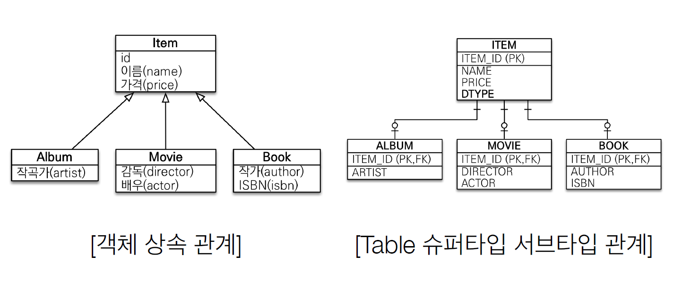

# 1주차

# 01. JPA 소개


- 추가 JPA이전의 영속성 프레임워크

### JDBC API 
- 자바 표준 Api으로 DB connection, SQL을 통한 기본 DB연동 구현
- 커넥션 관리, 쿼리 관리가 불편하여 SQLMAPPER 등장

### SQLMAPPER
- SQL을 java코드에서 분리해냄
- 메소드에 관한 쿼리를 XML으로 매핑해주고 매핑해둔 쿼리를 사용.

### ORM
- Object Relational Mapping
- 근본적으로 DB와 객체지향의 패러다임 불일치로 인한 문제 해결.

## 1.1 SQL을 직접 다룰 때 발생하는 문제점

- 반복적인 코드를 계속해서 작성해야함
(1.SQL 작성 - 2. JDBC API로 SQL 실행 - 3. 조회결과를 매핑)
- SQL에 의존적인 개발
: DAO를 사용해서 SQL을 숨겨도 DAO를 직접 실행해서 SQL을 확인해야한다.
-> SQL에 의존적인 개발을 할 수 밖에없다.

- SQL에 의존적이므로 진정한 의미의 계층분할이 어렵다

-> JPA를 통해서 SQL에 의존적인 부분을 제거할 수 있다.

EX)
```java
jpa.persist(member); //저장

String memberId = "helloId";
Member member = jpa.find(Member.class, memberId); //조회
```

## 1.2 패러다임 불일치

객체지향 프로그래밍과 데이터 베이스 각각의 패러다임.

### * 객체지향 프로그래밍 *
정의
> 객체 지향 프로그래밍은 컴퓨터 프로그램을 명령어의 목록으로 보는 시각에서 벗어나 여러 개의 독립된 단위, 즉 "객체"들의 모임으로 파악
- 추상화, 캡슐화, 정보은닉, 상속, 다형성 등 의 주요개념.
- SOLID
### 데이터 베이스
정의
>여러 사람이 공유하여 사용할 목적으로 체계화해 통합, 관리하는 데이터의 집합이다. 작성된 목록으로써 여러 응용 시스템들의 통합된 정보들을 저장하여 운영할 수 있는 공용 데이터들의 묶음
- 데이터 중심으로 구조화, 집합적인 사고를 요함
- 데이터를 빠르게 조회하는 것이 주된 목적.

-> 둘의 목적과 패러다임이 다르기 때문에 객체지향을 DB에 적용시키려면 개발자가 중간에서 해결해야함!


## 패러다임 불일치 문제 & JPA를 통한 해결
- 상속
- 연관관계
- 데이터 타임
- 데이터 식별 방법

## 1.2.1 상속


- 객체 : 상속의 개념 존재
- 데이터베이스 : 상속 X, 유사한 슈퍼타입과 서브타입 존재

### JPA 없이 패러다임 불일치 해결하려면?

- 저장시, 부모와 자식을 따로 insert 해줘야함
- 자식 조회시, 부모와 자식 테이블 따로 select 한다음 join 해줘야함.
```
INSERT INTO ITEM - - -
INSERT INTO ALBUM - - - 

SELECT FROM ITEM, ALBUM - - -
JOIN - - - 조건
```

### JPA를 통한 해결
- 자바 컬렉션처럼 데이터를 저장할 수 있음!
```java
//저장
jpa.persist(album);

//조회
String albumId="100id";
Album album=jpa.find(Album.class,albumId);
```

## 1.2.2 연관관계

- 객체 : 참조를 통해서 연관관계 조회.
- 테이블 : 외래키를 통해서 조인하여 연관된 테이블 조회.
- 객체는 참조가 있는 방향으로만 조회 가능.(반대 방향 불가능)

### JPA없이 해결하려면? 객체지향 모델링
- 개발자가 직접 객체를 생성하고 연관관계를 설정해서 반환한다.
```java
public Member find(String memberId){
    //SQL 실행
    Member member = new Member();

    //DB에서 조회한 회원 정보 입력
    Team team = new Team();

    //회원과 팀 관계 설정
    member.setTeam(team);
    return member;
}
```

### JPA를 통한 해결
- 회원과 팀의 관계 설정하고 회원객체를 저장하기만 하면 된다.
```java
//연관관계 설정후 저장
member.setTeam(team);
jpa.persist(member);
```

## 1.2.3 객체 그래프 탐색
정의
> 참조를 사용해서 연관된 객체를 계속해서 찾아가는 것.

- 객체라면 마음 껏 그래프 탐색이 가능해야함 -> DB를 객체로 만들면 가능해야함!

### JPA이 없다면
- 처음 실행하는 SQL에 따라 객체 그래프를 어디까지 탐색할수 있는지 정해진다.
- SQL에 조인되어 있는 DB에 대해서만 탐색할 수 있다.

```java
class MemberService{
    public void process(){
        Member member =memberDAO.find(memberId);
        member.getTeam();
        member.getOrder.getDelivery();
    }
}
```
- 위의 주어진 코드만 가지고는 DAO에서 어떤 쿼리를 실행하는지 모르기 때문에 어디까지 탐색 가능한지 알 수 없다.
- 그러므로 직접 SQL을 보고 확인해야하므로 SQL의존적이게 된다.

### JPA을 통한 해결
- JPA는 연관된 객체를 "사용하는 시점"에 적절한 SELECT SQL을 실행한다.
- 실제 객체를 사용하는 시점까지 데이터베이스 조회를 미룬다고 해서 지연로딩이라고 부른다.

```java
class Member {
    private Order order;

    public Order getOrder(){
        return order;
    }
}
```
- 객체를 보면 어디까지 탐색가능한지 바로 알 수 있다.


## 1.2.4 비교

- 데이터베이스에서의 비교 : 기본키의 값으로 각 row를 구분
- 객체에서의 비교 : 동일성(주소값) 비교와 등등성(value) 비교 두가지가 있다.
- 이로인해, 같은 객체를 두 번 조회해도 다르다는 결과로 나온다(주소값 비교)

```java
String memberId="100";
Member member1 = memberDao.getMember(memberId);
Member member2 = memberDao.getMember(memberId);

member1 == member2; //다르다고 나옴.
```

### JPA이 없다면
- 같은 로우 조회할 때마다 같은 인스턴스를 반환하도록 구현해야한다.
- 구현이 어려움..!

### JPA를 통한 해결
> JPA는 같은 트랜잭션일때 같은 객체가 조회되는 것을 보장한다.

## 1.3 JPA란 무엇인가?

정의
> JPA는 자바 진영의 ORM 기술 표준이다. JDBC API를 이용한다.

### ORM
- Object Relational Mapping
- 객체와 테이블의 패러다임 불일치 문제를 해결해준다.
- 각 언어마다 대표적인 ORM이 존재한다.
- SQL을 대신 생성 & 전달, 패러다임 불일치 문제 해결

 ### 하이버네이트(Hibernate)
 - 자바 언어를 위한 객체 관계 매핑 구현체이다.
 - Java EE server 없이도 동작한다.


## 1.3.2 JPA 사용의 이점
- 생산성 : 반복적인 SQL코드를 작성하지 않아도 된다.
- 객체지향 패러다임 : 데이터 베이스 설계 중심의 패러다임(SQL 중심)을 객체설계 중심으로 역전.
- 유지보수 : JPA없이는 요구사항의 작은 수정에 대해서도 많은 코드 변경이 필요 했으나, JPA를 사용하면 필요없으므로 유지보수에 용이하다.
- 패러다임 불일치 해결
- 성능 : DB와 어플리케이션 사이에서 성능 최적화 제공
- 데이터 접근 추상화와 벤더 독립성: 벤더(DB종류)에 독립적으로 코드 작성 가능. 종속적이지 않음.

# 02. JPA 시작
- 2.1 ~ 2.5 기본적인 jpa 프로젝트 생성 및 h2 연동에 대한 설명으로 주요 개념만 정리!

### H2 데이터베이스
- H2는 자바로 작성된 관계형 데이터베이스 관리 시스템
- JVM 메모리 안의 임베디드 모드, 서버 띄워 동작하는 서버모드 존재
- 웹콘솔 제공, 용량을 적게 차지함
- 시퀀스 & AUTO INCREMENT 지원

### MAVEN
-  아파치 소프트웨어 재단에서 개발하는 Java 기반 프로젝트의 라이프사이클 관리를 위한 빌드 도구
- 컴파일과 빌드를 동시에 수행
- 라이브러리 관리 기능도 내포(repo로부터 받아온다)

### 데이터베이스 방언
- SQL 표준을 지키지 않는 특정 데이터베이스만의 고유한 기능
> Ex1) 가변문자 : MySQL은 VARCHAR, Oracle은 VARCHAR2
  Ex2) 문자열 함수 : SQL표준은 SUBSTRING(), Oracle은 SUBSTR()
  EX3) 페이징: MYSQL은 LIMIT, Oracle은 ROWNUM

## 2.6 어플리케이션 개발


## 2.6.1 엔티티 매니저 설정
### 엔티티 매니저 팩토리 생성

```java
    EntityManagerFactory emf= Persistence.createEntityManagerFactory("jpabook");
```
- persistence.xml에서 jpabook 영속성 유닛 찾아 생성
- DB 커넥션 풀도 실행 될 수 있으므로 자원소모가 크다.
- 그러므로, 엔티티 매니저 팩토리는 딱 한번만 생성하고 공유해서 사용해야 한다.
- 싱글톤패턴.

### 엔티티 매니저 생성 및 종료

```java
    EntityManager em = emf.createEntityManager();
```
- emf에서 엔티티 매니저를 생성한다.
- 일종의 가상의 데이터베이스 역할을 한다.
- DB커넥션과 밀접한 관계가 있으므로 스레드간의 공유 및 재사용이 금지되어 있다.

```java
    em.close();
    emf.close();
```

## 2.6.2 트랙잭션 관리

트랙잭션 설명)
>데이터베이스 트랜잭션은 일관성 있고 신뢰할 수 있는 방식으로 독립적이게 처리되는 작업 단위를 뜻한다. 
>
> 데이터베이스 트랜잭션은 크게 두 가지의 목적을 가진다. 
>1. 예상치 못한 에러가 발생해도 데이터베이스를 신뢰성 있는 상태로 만들 수 있도록 신뢰할 수 있는 작업 단위를 제공한다.
>
>2. 데이터베이스에 동시에 접근하는 경우 프로그램 간에 격리를 제공하여 에러를 방지한다.
>
> 한 트랜잭션은 커밋되거나 롤백된다.

- Jpa를 사용하려면 항상 트랙잭션 안에서 데이터를 변경해야한다.
```java
EntityTranscation tx = em.getTransaction();
try{
    tx.begin();
    logic(em);
    tx.commit();
}catch(Exception e){
    tx.rollback();
}
```

## JPQL

- JPA에서 검색쿼리를 어떻게 효율적으로 처리할 수 있을까?
- JPQL(Java Persistence Query Language)라는 쿼리 언어를 통해 검색쿼리를 처리한다.

### JPQL의 특징
- JPQL은 엔티티 객체를 대상으로 쿼리한다.(SQL은 테이블을 대상으로 쿼리한다.)
- JPQL은 SQL을 추사와한 객체지향 쿼리언어이다.
- 객체지향 SQL
- JPA는 JPQL을 분석해서 SQL을 만들어 DB에서 조회한다.

```java
public static void typedQuery(EntityManager em) {
	String jpql = "SELECT b FROM Book b ";
	TypedQuery<Book> query = em.createQuery(jpql, Book.class);
	
	List<Book> bookList = query.getResultList();
	for( Book book : bookList) {
		System.out.println(book.getTitle());
	}
}
```