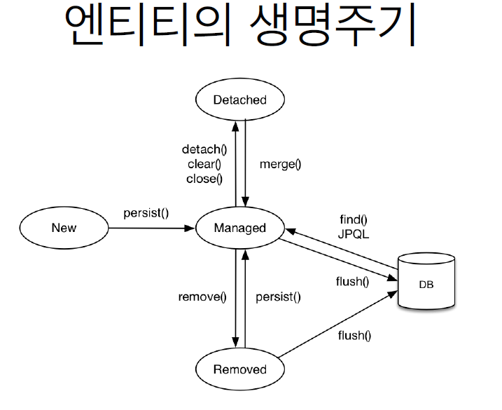
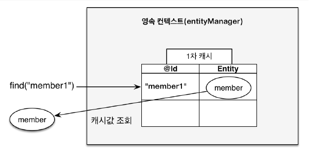
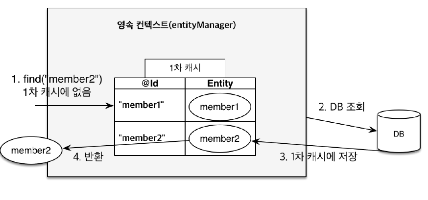
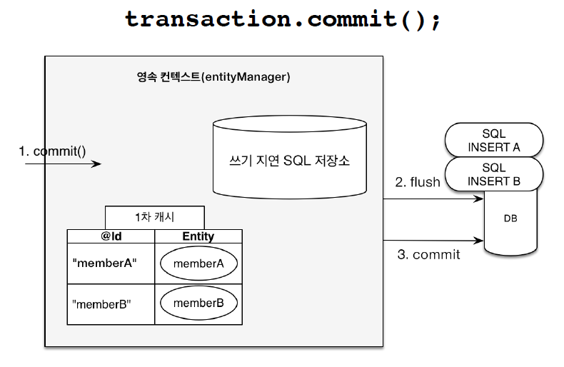
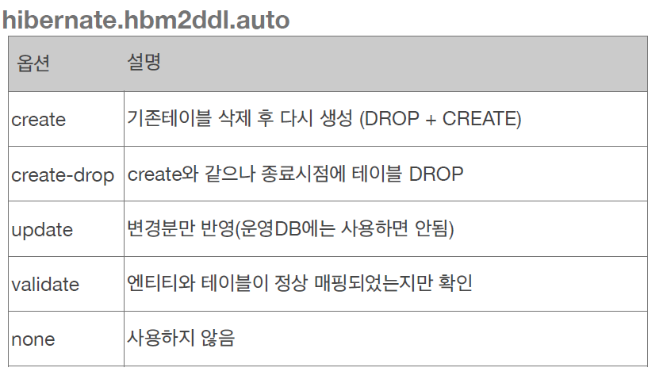
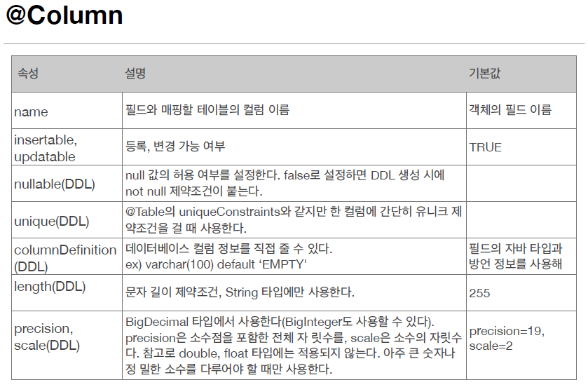
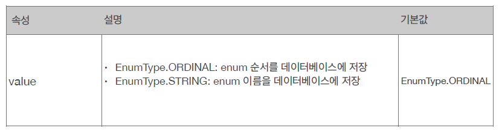
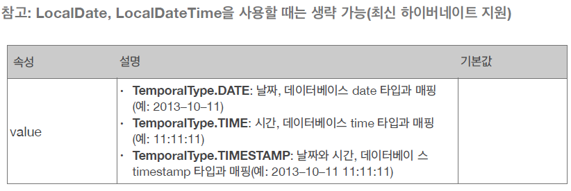
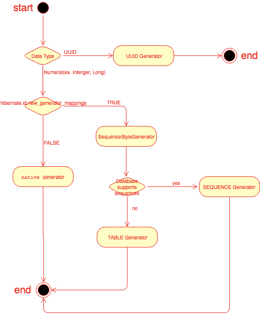

# 2주차(Ch3, Ch4)

# Ch03. 영속성관리
- JPA기능은 엔티티와 테이블을 설계하는 부분과 매핑한 엔티티를 실제 사용하는 부분으로 나뉨
- 영속성관리 부분은 매핑한 엔티티를 실제 사용하는 부분에 해당됨(with EntityManager)

## 영속성(Persistence)?
>컴퓨터 공학에서 영속성이란, 한 객체가 자신을 생성한 작업이 종료되었음에도 불구하고 지속적으로 존재하는 상태

## 3.2 영속성 컨텍스트
>A persistence context is a set of entity instances in which for any persistent entity identity there is a unique entity instance. 
>Within the persistence context, the entity instances and their lifecycle are managed. (원문)

>영속성 컨텍스트는 유일한 ID를 가진 엔티티들의 집합이다.
영속성 컨텍스트 내에서, 엔티티와 생명주기가 관리된다.

- 한 단어로 정의하면 엔티티를 영구 저장하는 환경을 말함.
- JPA에서는 EntityManager를 통해 영속성 컨텍스트를 보관 & 관리

## 3.3 엔티티의 생명주기

- 위 그림에 엔티티의 생명주기가 한번에 정리되어 있다.

- 비영속(new/transient)
    - 영속성 컨텍스트와 전혀 관계없는 상태
    - 순수한 객체인 상태
```java
Member member = new Member();
member.setId("member1");
member.setUsername("회원1");
```

- 영속(managed)
    - 영속성 컨텍스트에 저장된 상태
    - em.find()나 JPQL 사용해서 조회한 엔티티도 포함

```java
//만든 객체를 저장(영속)
em.persist(member);
```
- 준영속(detached)
    - 영속성 컨텍스트에 저장되었다가 분리된 상태
```java
//영속상태에서 준영속으로 바꾸는 3방법
em.detach(member);
em.close();
em.clear();
```
- 삭제(removed)
    - 삭제된 상태
```java
em.remove();
```

## 3.4 영속성 컨텍스트의 특징.

- 영속성 컨텍스트와 식별자 값
    - 영속성 컨텍스트의 정의에 따라, 영속상태는 식별자 값이 반드시 있어야함
- 영속성 컨텍스트와 데이터 저장
    - JPA는 트랜잭션을 보통 커밋하는 순간 쌓아둔 쿼리를 DB에 반영
    - 예외 있음.
- 영속성 컨텍스트를 통한 관리의 장점(효율성 up)
    - 1차 캐시
    - 동일성 보장
    - 쓰기 지연
    - 변경 감지
    - 지연로딩

## 엔티티 조회
- 영속성 컨텍스트는 내부에 캐시를 가짐(1차캐시)
- 1차캐시에서 먼저 조회하고 없으면 DB에서 조회하는 로직을 따른다.
- 앞 단원에서 배웠듯이, 식별자가 같은 엔티티 인스턴스는 1차 캐시에 있는 동일한 객체를 반환해 준다.

### 1차 캐시조회


### DB 조회


### 2차 캐시?
- 애플리케이션 범위의 캐시, 어플리케이션 종료시 사라짐
- 16단원에서 배움..

## 엔티티 등록

### 쓰기지연
>엔티티 매니저는 커밋 직전까지 내부 쿼리 저장소에 SQL을 모은다.
>트랜잭션을 커밋할때 모아둔 쿼리를 DB에 보내는 데 이를 쓰기지연이라한다.

- 동일한 객체를 persist해도 한번의 insert만 발생한다!!

```java
EntityManager em = emf.createEntityManager();
EntityTransaction transaction = em.getTransaction();

transaction.begin();
em.persist(memberA);
em.flush();

em.persist(memberA); // 동일한 객체 persist했으므로 한번의 insert만 발생한다.
em.persist(memberB);
// insert sql을 보내지 않는다.

//insert sql을 보낸다.
transaction.commit();
```



### 쓰기지연이 가능한 이유.
- 같은 트랜잭션 범위안에서 실행되면 결과는 동일하기 때문

```java
tx.begin();

save(A);
save(B);
save(C);

tx.commit();
```

## 엔티티 수정
- JPA는 변경감지를 통해서 SQL 의존 없이 엔티티를 수정할 수 있게한다.

### 변경감지
> 엔티티의 변경사항을 자동으로 반영하는 기능


- 변경감지는 영속성 컨텍스트 관리하의 영속 상태의 엔티티에만 적용
- 비영속, 준영속 X
- JPA 기본 전략은 엔티티의 모든 필드를 업데이트한다
- 이는 수정 쿼리가 항상 같고, 파싱한 쿼리를 재사용할 수 있는 장점이 있다.
```
UPDATE MEMBER
SET
    NAME = ?,
    AGE = ?,
    GRADE = ?,
    ...
WHERE
    ID = ?
```
- 필드가 많거나, 저장 내용이 크면 @DynamicUpdate @DynamicInsert 로 부분 수정이 가능하다.

## 엔티티 삭제

- 대상 엔티티 조회후 수행한다.
- 엔티티 등록과 유사하게 동작한다.
```java
Member memberA = emm.find(Member.class, "memberA");
em.remove(memberA);
```

## 3.5 플러시

### 플러쉬
> 플러쉬는 영속성 컨텍스트의 변경 내용을 DB에 반영한다.

> 구체적으로 변경 감지로 수정된 엔티티 찾고, 수정쿼리를 쓰기지연 SQL저장소에 등록한 후, 쓰기 지연 SQL 저장소의 쿼리를 DB에 전송한다.

- 모아둔 SQL을 DB에 전송하는 것이 핵심으로 이해함.

### 플러쉬를 호출하는 방법

- 직접호출
    - em.flush()
    - 다른 프레임워크와 JPA를 함께 사용할때 이용

- 트랜잭션 커밋시 자동호출
    - 쓰기지연 저장소의 SQL이 전달되지 않으면 변경내용이 DB에 반영이 안됨.
    - 변경내용이 누락되지 않도록, default 설정으로 플러시 자동호출

- JPQL 쿼리 실행시 자동호출
    -JPQL은 SQL로 변환하여 DB에서 직접 엔티티를 조회한다.
    - 한 트랜잭션 도중에 JPQL 실행시, 영속성 컨텍스트 내용이 반영되어 있어야한다.
    - 그래서 JPQL 실행 직전에 플러쉬를 실행한다.

### 플러쉬 모드 옵션

- AUTO
    - 커밋이나 쿼리를 실행할 때
- COMMIT
    - 커밋할 때만

## 3.6 준영속
- 영속 -> 준영속으로의 상태 변화
- 준영속 : 영속성이었다가, 영속성 컨텍스트가 더이상 관리하지 않는 상태

### 준영속 상태를 만드는 방법
- em.detach(entity)
    - 메소드를 호출하는 순간 영속성 컨텍스트 내부의 해당 엔티티 정보가 제거된다.
- em.clear()
    - 영속성 컨텍스트 자체를 초기화해서 모든 엔티티 정보를 지운다.
- em.close()
    - 영속성 컨텍스트가 종료되어 엔티티가 관리되지 않는다.

### 준영속 상태
- 영속성 컨텍스트의 제공 기능의 대상이 아니다.
- 하지만 식별자 값은 가지고 있다.
- 당연히 지연로딩도 불가능하다.

### 병합(merge)
- 병합 메소드를 통해 준영속/비영속 엔티티를 영속상태로 변경가능하다.
- 준영속/비영속 상태의 엔티티 정보를 받아 새로운 영속 상태의 엔티티를 반환한다.
- 이때, 준영속의 경우 엔티티가 속한 엔티티매니저는 기존과 상이하다.
- 병합시 값이 없는 필드는 null로 업데이트 되는 위험이있다.

## 응용) save메서드로 살펴보는 persist와 merge 개념
[참조 링크](https://umanking.github.io/2019/04/12/jpa-persist-merge/)

```java
@Transactional
public <S extends T> S save(S entity) {
    //새로운(transient) 상태 엔티티일경우
    if (this.entityInformation.isNew(entity)) {
        this.em.persist(entity);
        return entity;
    //기존에 있던(detached) 엔티티일 경우.
    } else {
        return this.em.merge(entity);
    }
}
```
- spring data jpa의 save 메소드 구현
- isNew()는 기본키값 찾아 null인지 체크
- 새로운 객체는 persist 수행
- 존재하는 객체에 대해 save 메소드 수행시 merge를 통해 update 시켜줌!!(복사본을 persist 상태로 만듬) 
 

# Ch04. 엔티티 매핑
- JPA기능은 엔티티와 테이블을 설계하는 부분과 매핑한 엔티티를 실제 사용하는 부분으로 나뉨
- 엔티티 매핑 부분은 엔티티와 테이블을 설계하는 부분에 해당됨
- 각 매핑 어노테이션의 속성/기능과 주의사항을 알아보는 단원!
- DB에 대한 지식이 필요!!

## 4.1 @Entity

### 속성
- name : (default) 클래스 이름, 클래스 이름과 다를 경우 설정

### 주의사항
- 기본 생성자 필수(public, protected)
- final, enum, interface, inner 클래스에 사용불가, 필드에 final 사용 금지 <- why? 프록시 객체를 사용할 수 없어서.

## 4.2 @Table

### 속성
- name : (default) 엔티티 이름, 엔티티 이름과 다를 경우 설정

## 4.3 데이터베이스 스키마 자동생성
- 어플리케이션 실행시 자동생성 설정가능
- 자동생성시 create문을 짤필요 없어서, 좀더 객체중심적인 개발가능.

### hbm2ddl.auto 속성


### 개발환경에 따른 auto 속성 추천전략

- 운영장비에는 create, update 사용하면 안된다.
- 개발초기/로컬 : create or update
- 테스트서버 : update or validate
- 운영서버 : validate or none


## 4.5 다양한 컬럼 매핑

### @Column

- DDL 생성기능지원
    - DDL에 Colmn 속성을 통해 제약조건을 추가할 수 있다.
    - ex) @Column(nullable = false, length = 10)
    - DDL은 자동생성시에만 사용되고(켜져있을 경우), 다른 로직에는 영향 미치지 않는다.

### [DB] DDL,DML, DCL

- DDL(데이터 정의어)
    - 테이블과 같은 데이터 구조를 정의하는데 사용되는 명령어들로 (생성, 변경, 삭제, 이름변경) 데이터 구조와 관련된 명령어
    - create, alter, drop, rename, truncate 등
    - 정의어이므로, jpa에서 생성시점에만 영향미침!!

- DML(데이터 조작어)
    - DB의 데이터를 조회, 변형을 가하는 명령어들
    - select, insert, update, delete

- DCL(데이터 제어어)
    - DB에 접근하고 객체 사용권한 부여, 회수
    - grant, revoke

- TCL(트랜잭션 제어어)
    - DML에 의해 조작된 결과를 작업단위(트랜잭션) 별로 제어하는 명령어
    - commit, rollback, savepoint
    
### @Enumerated

- EnumType.ORDINAL : enum 순서 값을 DB에 저장
- EnumType.STRING : enum 이름을 DB에 저장
- ORDINAL의 경우 ENUM이 변경되면 내용, 순서 등이 달라지는 것이 반영이 안되므로, 무조건 STRING을 사용해야한다

### @Temporal
- 과거에 날짜 컬럼매핑에 사용되던 어노테이션


### @Lob
- varchar(255) 등 보다 긴 경우 사용
- 매핑하는 필드 타입이 문자면 clob 아니면 blob으로 매핑된다.

### @Transient
- 메모리 상에만 임시로 보관할 값에 대한 매핑

## 4.6 기본키 매핑
- 기본키는 직접 할당하거나, 대리키를 이용하여 자동생성하는 두가지 방식이 있다.
- 기본키 직접할당
    - @Id사용
- 대리키로 자동생성
    - @IDENTITY
    - @SEQUENCE
    - @TABLE
    - @AUTO

### 기본키 직접할당
- @Id로 매핑한다.
- em.persist()로 엔티티를 저장하기 전에 직접 기본키를 할당한다.
```java
Board board = new Board();
board.setId("id1");
em.persist(board);
```

### IDENTITY 전략
- 기본키 생성을 데이터베이스에 위임한다
- PostgreSQL, SQL, DB2에서 사용한다
- ex) Mysql의 AUTO_INCREMENT는 기본키를 자동을 생성해준다.
- 데이터베이스에 값을 저장하고 나서야 기본 키 값을 구할 수 있을때 사용한다.

```java
@Entity
public class Member {
@Id
@GeneratedValue(strategy = GenerationType.IDENTITY)
private Long id;
}
```

```java
private static void logic(EntityManager em){
    Board board = new Board();
    em.persist(board);
    //이때 persist 했으므로, insert query가 전달되어 id값을 알 수 있다.
}
```

### SEQUENCE 전략
- 유일한 값을 순서대로 생성하여 이를 기본키로 사용한다.
- 오라클, H2 등에서 사용한다.
- @SequenceGenerator를 이용해서 데이터베이스 시퀀스를 매핑해야한다

```java
@Entity
@SequenceGenerator(
name = “MEMBER_SEQ_GENERATOR",
sequenceName = “MEMBER_SEQ", 
initialValue = 1, allocationSize = 1)
public class Member {
    @Id
    @GeneratedValue(strategy = GenerationType.SEQUENCE,
generator = "MEMBER_SEQ_GENERATOR")
    private Long id;
}
```

- IDENTITY 전략에서는 DB에 저장해야 기본키를 알 수있어서 flush를 해야했다.
- 하지만 SEQUENCE 전략에서는 이미 기본키를 할당받았다.
- 그렇기 때문에, 엔티티를 영속성 컨텍스트에만 저장한후 나중에 트랜잭션이 커밋될때 flush를 수행한다.

### SEQUENCE 전략 최적화
- SEQUENCE 전략은 할당받은 시퀀스에 모두 사용하면 시퀀스를 통해 식별자를 조회하는 추가작업이 필요하다.
1) 식별자를 구하려고 DB시퀀스를 조회한다.
2) 조회한 시퀀스를 기본키 값으로 사용해 DB에 저장한다.
- 이러한 추가작업을 줄이기 위해 allocationSize를 이용하여 추가한다.
- 설정한 값 만큼 DB의 시퀀스값을 한번에 증가 시키고 그만큼을 메모리(영속성 컨텍스트)에 할당한다.
- 할당받은 값의 끝에 도달하면 이를 반복한다.
- 성능과 시퀀스값의 증가량의 TRADE-OFF를 고려하여 Allocationsize를 설정하자.

### TABLE 전략
- 키 생성 전용 테이블을 만들고 이름과 값으로 사용할 칼럼을 만들어 사용한다.
- 모든 데이터베이스에 적용가능하나 효율성이 떨어진다.
- @TableGenerator를 사용해서 테이블키 생성기를 등록한다.
- 테이블을 사용하는 것외에는 Sequence전략과 동일한다.

```java
@Entity
@TableGenerator(
name = "MEMBER_SEQ_GENERATOR",
table = "MY_SEQUENCES",
pkColumnValue = "MEMBER_SEQ", allocationSize = 1)
public class Member {
    @Id
    @GeneratedValue(strategy = GenerationType.TABLE,
    generator = "MEMBER_SEQ_GENERATOR")
    private Long id;
}
```

### AUTO 전략
- 데이터베이스 방언에 따라 자동으로 위 세전략중 하나를 선택한다.
- ex) 오라클은 SEQUENCE, MYSQL은 IDENTITY
- AUTO가 동작하는 방식



1. UUID라면, UUID로 처리 한다.

2. UUID가 아니고 Number Data Type이라면 `hibernate.id.new_generator_mapping`의 여부를 확인하게 된다.

- FALSE라면, Native Genertaor를 사용하게 된다 (MySQL이라면 `auto_increment`)

3. hibernate.id.new_generator_mapping 이 TRUE 라면 `SequenceStyleGenetrator` 를 사용하게 된다.

- Sequence Call을 하게 되고,  ID를 받는다

- 만약 사용하려고 하는 DBMS가 Sequence API를 지원하지 않는다면 `GeneratedType.TABLE`로 동작하게 된다.

### 권장하는 식별자 전략
- DB의 기본키 제약조건(정의) : Not null, unique, no change
- 변하지 않는 것을 만족하기 어렵기에 자연키 선택은 권장하지 않는다.
- 자연키 : 주민번호, 이메일, 전화번호 등
- 비즈니스와 관련없는 대리키를 사용할 것을 권장한다 : 시퀀스, auto_increment, table 등
- 김영한님 권장 : LONG형 + 대체키 + 키생성전략 이용

### 자연키와 인조키
- 자연키 : 비즈니스 모델에서 자연스레 나오는 속성으로 기본키를 정한다고해서 자연키 (Natural Key) 라고 표현
- 대리키|인조키: 비즈니스 모델과 달리 키를 위한 데이터 측벽에서 인조키 (Artifical Key) 라고부른다.