### Section 3 : 영속성 관리 - 내부 동작 방식

------

> 영속성 컨텍스트 1

* entity manager factory : entity manager을 만드는 공장이다. factory를 만드는 비용은 매우 크기 때문에 한 개만 만들어서 전체에서 공유하도록 설계되어있다.  엔티티 매니터 팩토리는 **여러 스레드가 동시에 접근해도 안전하여 서로 다른 스레드간의 공유가 가능**하다.
* entity manager : entity manager를 생성하는 비용은 거의 들지 않는다. entity manager는 transaction 단위마다 생성하고 transaction이 끝나면 close 한다. 엔티티 매니저는 여러 스레드가 동시에 접속하면 **동시성 문제**가 발생하므로 공유해서는 안된다. 

#### # 영속성 컨텍스트

* 엔티티를 영구 저장하는 환경

* 엔티티 매니저는 영속성 컨텍스트에 엔티티를 보관하고 관리한다.

  `EntityManager.persist(entity);`

  * persist - DB에 저장하는 것이 아니라 영속성 컨텍스트에 보관한다. 

* 엔티티의 생명주기

  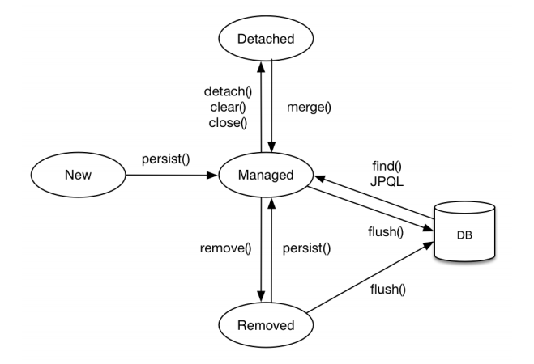

  * New / transient (비영속) - 영속성 컨텍스트와 전혀 관계가 없는 **새로운** 상태

  * Managed (영속) - persist를 통해서 영속성 컨텍스트에 **관리**되는 상태 

    * `em.find();`나 JPQL을 사용해서 조회한 엔티티도 영속성 컨텍스트가 관리하는 영속상태이다.
    * em.persist(); DB에 query가 날라가는 것은 아니다. 

    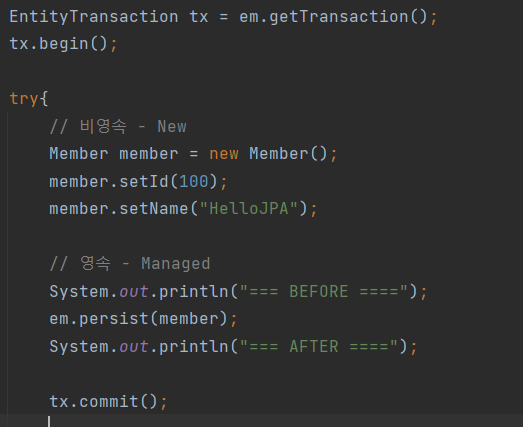

    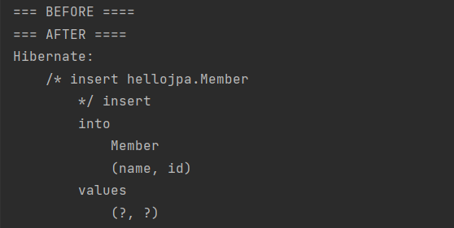

  * Detached (준영속) - 영속성 컨텍스트에 저장되었다가 분리된 상태 - *밑에서 더 자세히 설명*

    * `em.detach(member);`
    * `em.close();`

  * Remove (삭제) -  객체를 삭제한 상태

    * `em.remove(member);`

> 영속성 컨텍스트 2

1. **엔티티 조회, 1차 캐시**

* 1차 캐시에는 식별자 @Id와 값 Entity를 구분한다. 영속 상태에는 식별자 값이 반드시 있어야 한다.

* 만약 `em.find();`를 통해서 값을 조회할 경우 *먼저 1차 캐시에 entity가 있는지 먼저 확인하여 **있을 경우 **영속성 컨텍스트에서 값을 가져온다.*

* 영속성 컨텍스트에 없을 경우, query를 통해 DB를 조회하고 1차 캐시에 저장하고 entity를 반환한다.

  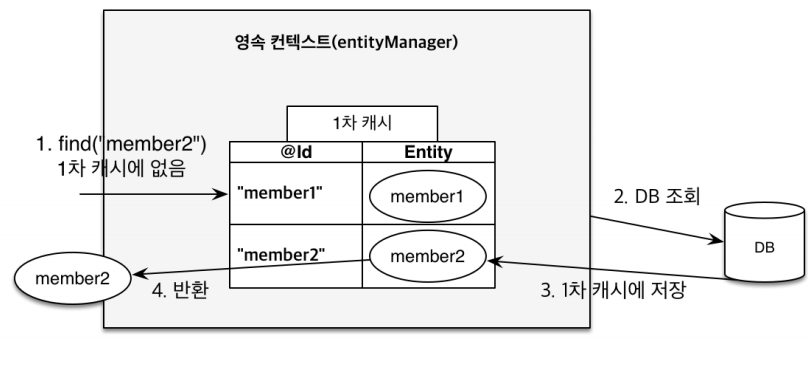

  * 1차 캐시는 데이터베이스 한 transaction 안에서만 효과가 있기 때문에, 별 큰 이득을 주지는 않는다. 왜냐하면 한 transaction을 완료하면 영속성 컨텍스트를 포함한 entity manager을 삭제하기 때문이다.

* 예시, 새로운 entity를 저장하고 바로 조회할 경우, entity를 조회하기 위해서 *query를 보내지 않아도 1차 캐시에서 조회* 하여 출력할 수 있다.

  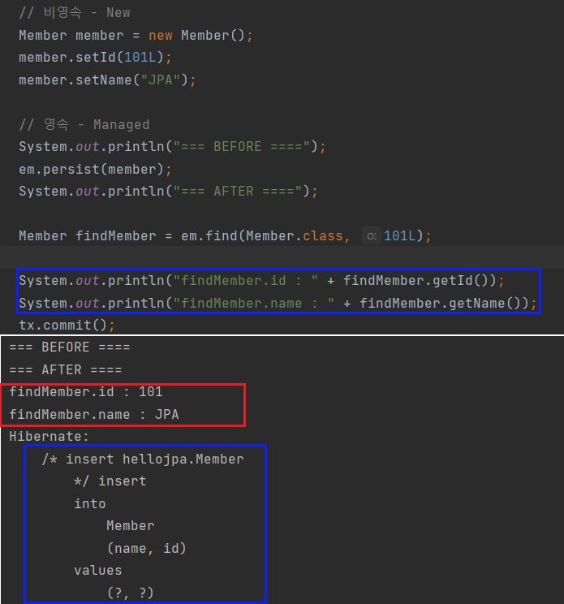

2. **영속 엔티티의 동일성 보장**

* 마치 자바컬렉션에서 조회할 경우 reference가 같아서 동일성이 보장되는 것처럼 영속성 컨텍스트는 영속 엔티티의 동일성을 보장해준다. 

  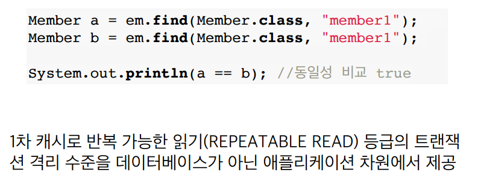

3. **엔티티 등록 - 트랜잭션을 지원하는 쓰기 지연**

   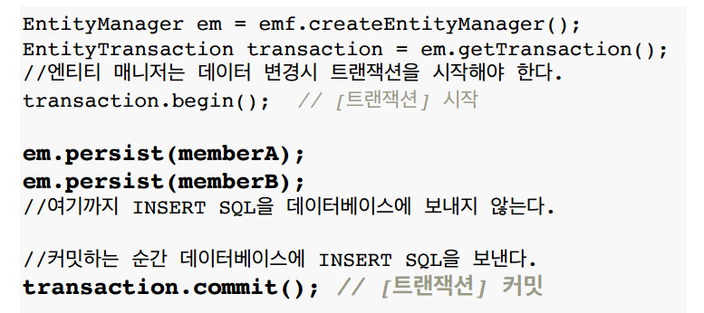

* `em.persist(memberA);`를 처리하게 되면,,, 1차 캐시에 저장하면서 동시에 *쓰기 지연 SQL*에 insert SQL를 생성하여 저장한다. 

* `em.persist(memberB);`도 마찬가지이다.

  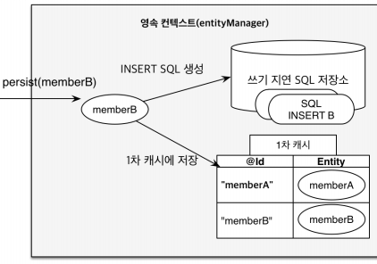

* `transaction.commit();`하는 순간, **쓰기 지연 SQL 저장소**에 저장된 SQL에 flush되면서 DB에 처리된다. 

  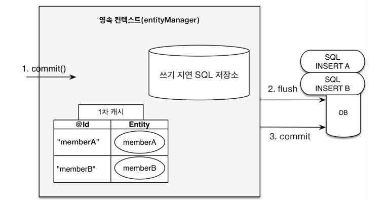

  * persist 할 때마다 query를 보내면 최적화할 여지가 없다. 또한query를 보낸다고 해도 트랜잭션을 commit하지 않으면 아무 소용 없다. 즉, commit 직전에만 데이터베이스에 SQL를 전달해도 되기때문에 *쓰기 지연* 이 가능한 것이다.

  * JDBC batch : 데이터베이스로 한번에 처리할 수 있는 기능

  * hibernate는 별도의 옵션을 가지고 있어서 size만큼 모아서 한번에 처리할 수 있다. 

    `persistence.xml - properties에 추가`

    `<property name="hibernate.jdbc.batch_size" value="10"/>`

4.  **변경 감지 (Dirty Check)**

* JPA는 변경 감지 기능이 제공된다. 

  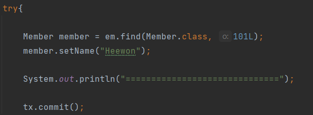

  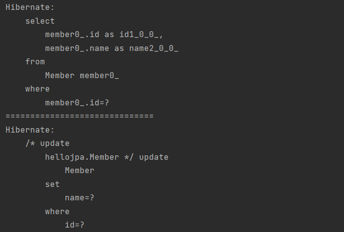

  * commit하는 시점에, 내부적으로 flush가 호출된다. 1차 캐시 안에 **entity와 스냅샷(영속성 컨텍스트에 들어온 시점의 entity를 저장한) 을 비교**하여 **변경**되었을 경우, update query를 쓰기지연 SQL에 저장한다.  
  * 그 다음 update query를 DB에 반영하고 commit 처리한다.

  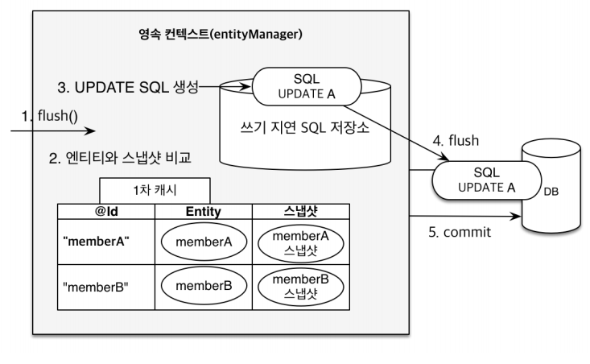

> 플러시

* 영속성 컨텍스트의 변경내용을 데이터 베이스에 반영 즉, *동기화*
  * 변경 감지 후 수정된 엔티티를 쓰기 지연 SQL 저장소에 등록
  * 쓰기 지연 SQL 저장소의 쿼리를 데이터 베이스에 전송
  * 플러시가 된다고, 1차 캐시가 지워지지는 않는다. 

* 영속성 컨텍스트를 플러시하는 방법

  * em.flush() : 직접호출, 강제 플러시

  * 트랜잭션 commit 시 자동 호출 

  * JPQL 쿼리 실행시 자동 호출

    * `em.persist(A); em.persist(B);`를 persist 하고, 모든 멤버를 조회했을 경우 데이터베이스 반영되지 않았기 때문에 A,B가 조회되지 않을 가능성이 있다.

      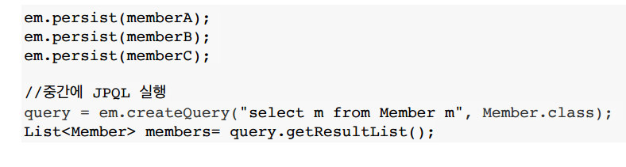

    * 이런 문제를 해결하기 위해서 JPQL를 호출하면 자동으로 플러시가 호출된다. 

  참고 :

  ​	FlushModeType.AUTO (기본값) - commit or query 플러시 

  ​	FlushModeType.COMMIT - commit할 경우만 플러시

> 준영속 상태

* 영속 상태의 엔티티가 영속성 컨텍스트에서 분리되는 것을 말한다.

* 영속성 컨텍스트가 제공하는 기능(Drity check, flush 포함인듯)을 사용하지 못한다.

* JPA에서 관리하지 않기 때문에.... 변경되지 않음

  * Q : 새로 insert할 경우, 영속성 컨텍스트에서 제거하면 insert query도 나가지 않을까? -- **안 나감**

    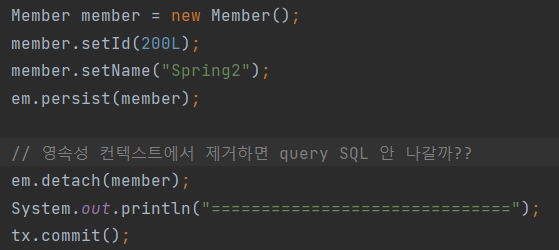

    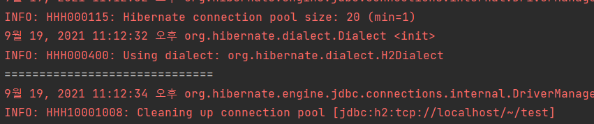

* 준영속 상태로 만드는 방법
  * 특정 entity만 detach : `em.detach(member);`
  * 영속성 컨텍스트를 전체 날림 : `em.clear();`
  * 영속성 컨텍스트 종료 : `em.close();`

### Section 4 : Entity Mapping

-----

> 객체와 테이블 매핑

​	@ Entity

  * *@Entity* 가 붙은 클래스는 JPA가 관리하는 엔티티이다.

    		* 기본 생상자 필수(파라미터 없는 public 또는 protected 생성자)
        		* final 클래스, enum, interface, inner 클래스 사용 X
        		* 저장할 필드에 final 사용 X

    | 속성 | 기능                           | 기본값      |
    | :--- | ------------------------------ | ----------- |
    | name | JPA구분하는 내부적인 이름이다. | 클래스 이름 |

​	@ Table

| 속성                   | 기능                            | 기본값      |
| ---------------------- | ------------------------------- | ----------- |
| name                   | DB의 매핑할 테이블 이름         | entity 이름 |
| catalog                | DB catalog 매핑                 |             |
| schema                 | DB schema 매핑                  |             |
| uniqueConstraints(DDL) | DDL 생성시 유니크 제약조건 생성 |             |

* name 예시 : 

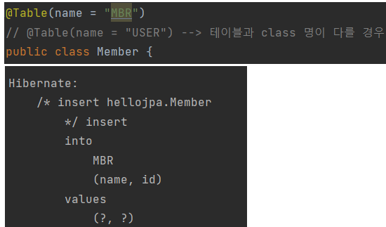

> 데이터 베이스 스키마 자동생성

* DDL을 애플리케이션 실행 시점에 자동생성

* 데이터 베이스 방언에 맞춰서 적절한 DDL (varchar etc) 생성한다

* 개발 단계에서만 사용, 운용서버에는 사용하지 않는다. 

  `persistence.xml - property 추가`

  `<property name="hibernate.hbm2ddl.auto" value="none" />`

  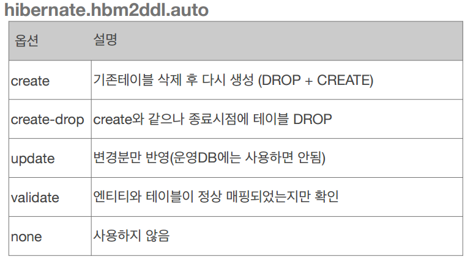

  * update - column 추가하는 것은 alter table로 가능하지만 지우는 것은 불가능하다.
  * validate - 정상 매핑이 되지 않으면 error 나오고 처리되지 않음.

* 데이터 베이스 방언별로 달라지는 것 - 적절한 DB에 맞게 생성

  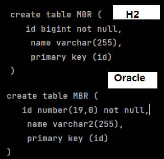

* 주의점
  * 운영 장비에는 절대 **create, create-drop, update**를 사용하면 안된다.
  * 개발 초기 - create 또는 update
  * 테스트 서버 - update 또는 validate
  * 스테이징, 운영 서버 - **validate 또는 none**

* DDL 생성 기능

  * runtime(JPA 실행 로직)에 영향 미치지 않고 DDL 생성에만 영향을 미친다.

    * 제약조건 추가 

      `@Column(nullable = false, length = 10)`

    * 유니크 제약조건 추가

> 필드와 컬럼 매핑

​	**매핑 어노테이션	**

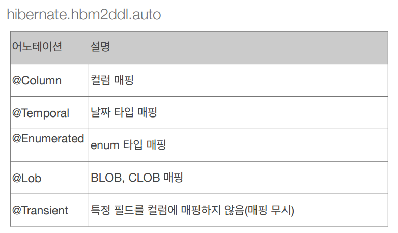

* TemporalType
  * DATE  : 날짜
  * TIME : 시간
  * TIMESTAMP : 날짜와 시간
* Lob - varchar을 넘어서는 큰 contents를 넣는 경우
  * 문자와 관련 있는 경우 - clob
  * 나머지 경우에는  - blob 
* Transient : DB랑 관련없게 사용하고 싶은 경우 

**@Column**

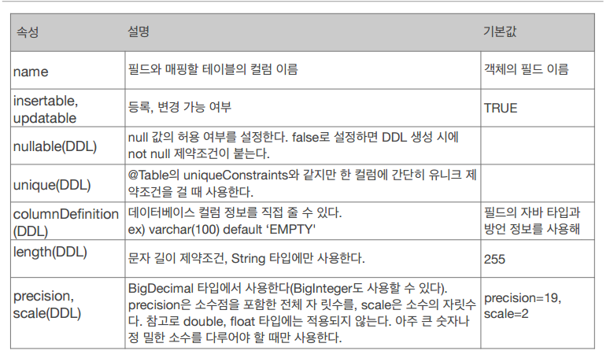

* insertable - column이 등록, 변경되었을 때 반영할 것인지 여부를 의미한다. 기본값이 true이다.

* nullable - 기본이 true이다. 만약 false로 바꾸면 not null 제약조건이 걸리게 된다.

* unique - column에 unique를 줄 경우, 알아보기 싶지 않아서 보통 Table에 준다.(Table은 unique의 name 값도 줄 수 있음 )

  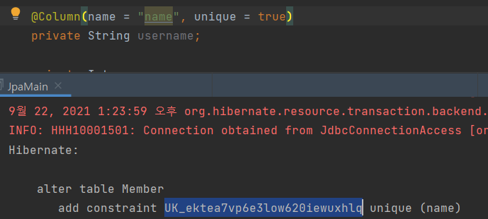

**@Enumerated**

* 기본 값은 ORDINAL이다.

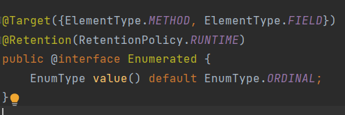

* ORDINAL의 문제점

  ORDINAL 즉, 기본값으로 ROLETYPE 생성시 - integer 타입으로 생성

  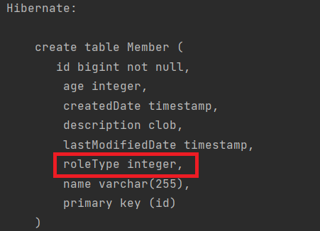

  만약 ROLETYPE 이 USER, ADMIN이 있었던 상태에서 고객 정보를 입력했을 경우,

  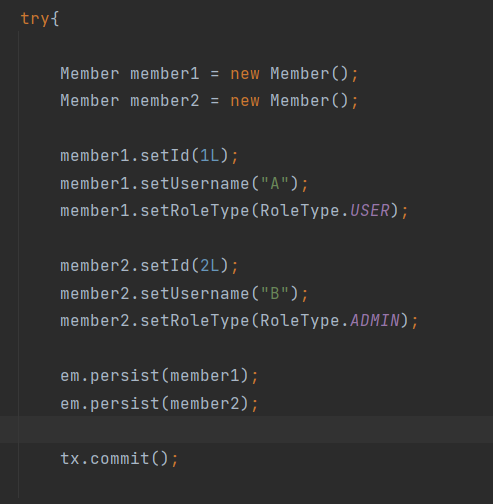

  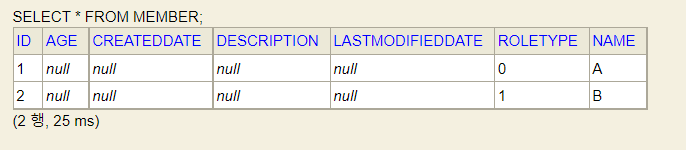

  USER는 0으로 , ADMIN은 1로 추가된다.

  ***그러나***

  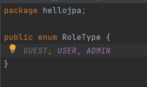

  USER 앞에 **GUEST** 가 추가될 경우...

  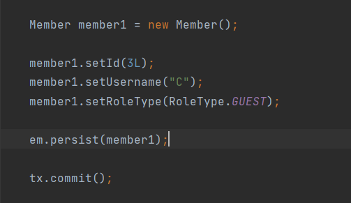

  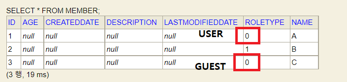

  *그 전에 ROLETYPE 변경되지 않기*때문에 위험하다.

* 그래서 **EnumType.STRING**으로 사용한다.

  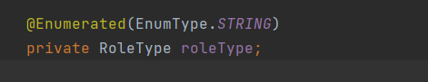

  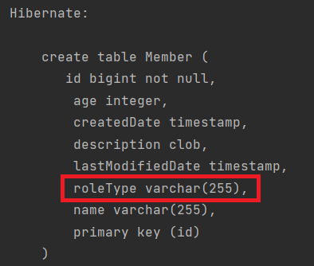

  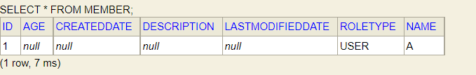

**@Temporal**

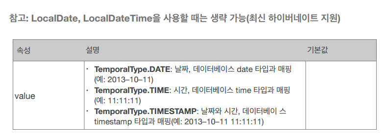

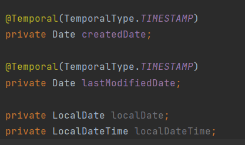

* LocalDate == TemporalType.DATE
* LocalDateTime == TemporalType.TIMESTAMP

> 기본 키 매핑

*@Id* - 직접 할당

*@GeneratedValue* - 자동생성

* **IDENTITY**

  * 기본 키 생성을 데이터베이스에 위임
  * 데이터베이스에 *insert를 해봐야 id* 값을 알 수 있다. 밑에 사진을 보면 values( null, ? ) null로 되어 있다.

  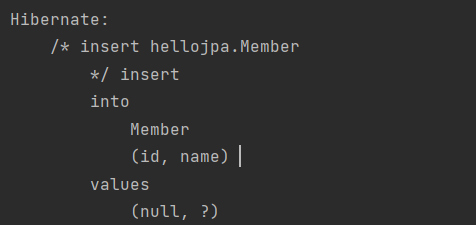

  * 그러나 영속성 컨텍스트에서 관리되려면 pk 값이 있어야하고 그렇기 때문에 **persist를 호출하는 시점에 insert query**를 날린다. 즉, 모아서 insert하는 것이 가능하지 않음.

  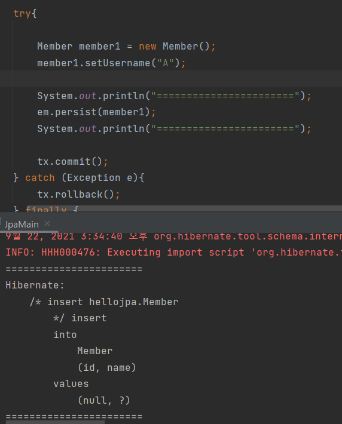

* **SEQUENCE** 

  * Integer 보다 long 사용 추천. 10억을 넘어갈 때 type을 바꾸는 것이 더 힘들기 때문에 long으로 권장한다.

  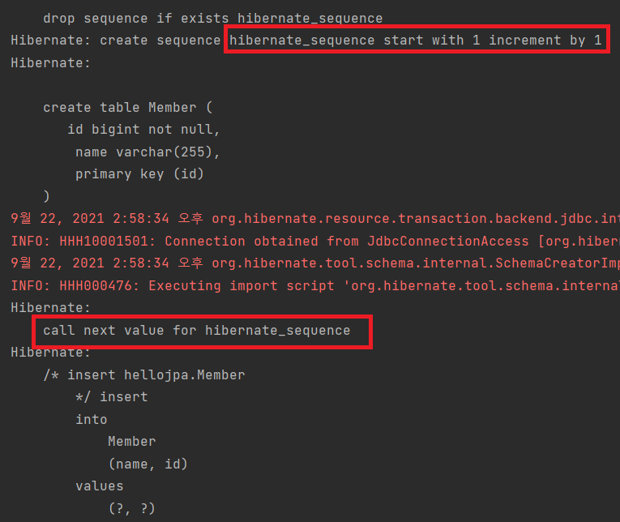

  * 기본 sequence 는 hibernate_sequence를 사용한다.
  * 만약 테이블 마다 따로 sequnece를 관리하고 싶다면, SequenceGenerator을 사용하면 된다.

  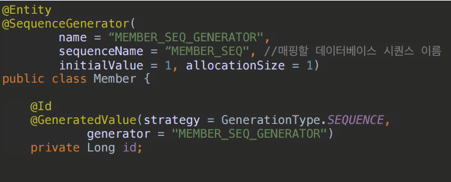

  * persist할 때 - *member seq 다음 값*을 가져와서 영속성 컨텍스트에 저장, insert query는 commit하는 시점에 호출되게 된다.

  * persist 할 때 마다 *member seq* 가져오는 것(call)하는 것에 대한 성능을 개선하기 위해서 allocatesize 설정으로 한꺼번에 가져올 수 있다. 

  *  allocationSize = 50으로 설정할 경우, 처음 DB의 시퀸스를 호출할 때 1 이 나오기 위해서 초기 설정은 아래와 같이 되어있다.

    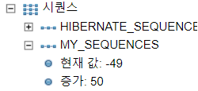

  * 처음 1개의 값을 저장한다면, **call next value가 두 번** 호출되게 된다. 처음 호출을 통해 DB SEQ값은 1이 되고, 그 다음 호출을 통해 DB SEQ 값은 51이 된다. 

    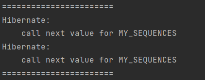

    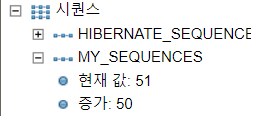

  * 그리고 50까지 메모리에서 현재 시퀸스 값을 저장하여 가상으로 증가시키며 관리하기 때문에 member을 50개 저장하기 전에는 call next value가 호출되지 않는다. (51번째 호출 됨)

    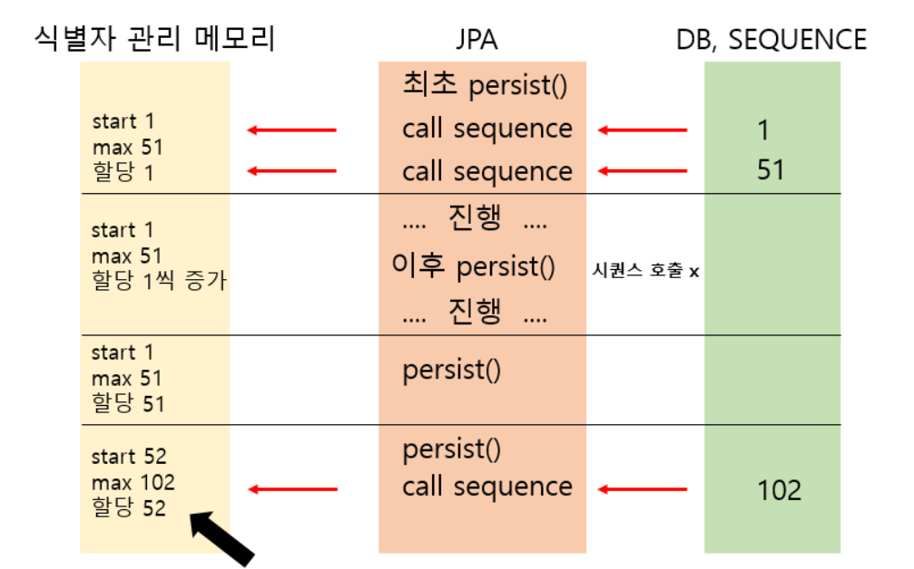

  * 1. 최초 persist() 실행시에 설정에 따른 DB 시퀀스를 두 번 호출하여 첫번째 시퀀스값을 가상으로 관리할 시작값, 두번째 시퀀스 값을 가상으로 관리할 범위의 끝(MAX)값으로 지정합니다.

    2. 이후에는 persist()를 실행해도 db에 시퀀스를 호출하지 않고 메모리에서 가상으로 관리하며 할당합니다. persist() 실행시마다 메모리에서 관리하는 가상의 값을 1씩 증가시키며 엔티티에 할당합니다.
  
    3. 어느 시점에 다다르면 엔티티에 식별자를 할당할 값이 관리할 범위의 끝(MAX)이 되고, 이후 다시 한번 persist()를 실행하는 시점에 DB에 시퀀스를 호출합니다.
  
    4. 다시 호출한 시퀀스값을 가상으로 관리할 끝(MAX)값으로 바꾸고 시작값 또한 변경하는데 끝(MAX)값 - (allocationSize - 1) 공식을 사용하 시작값을 정합니다.
  
       출처 :   https://dololak.tistory.com/479 [코끼리를 냉장고에 넣는 방법]
  
  
  
  **SequenceGenerator**
  
  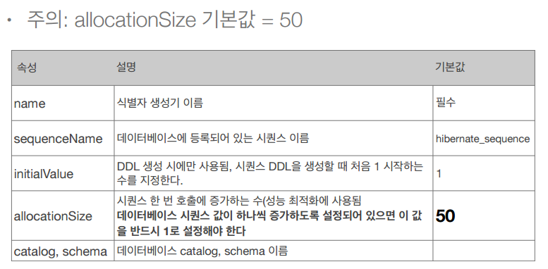

* **TABLE**

  * 데이터베이스 sequence를 흉내내는 전략으로 모든 데이터 베이스에 적용 가능하다. 별도의 테이블을 사용하기 때문에 성능의 문제가 발생한다.

  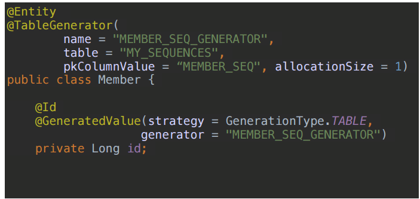

  

  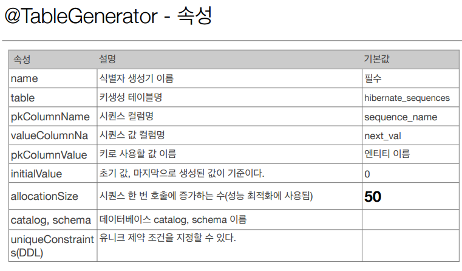

* 권장하는 식별자 전략 :

  * null 아님

  * 유일해야하고,

  * 미래까지 변하면 안된다. ==> 대리키(대체키) 사용

  * *권장 : Long 형 + 대체키 + 키 생성 전략 사용*

    

