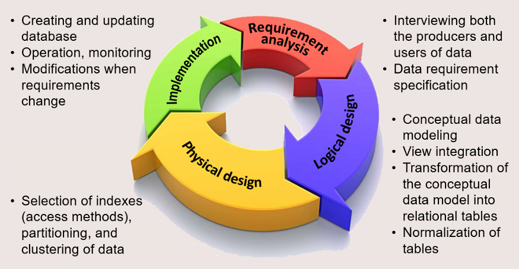
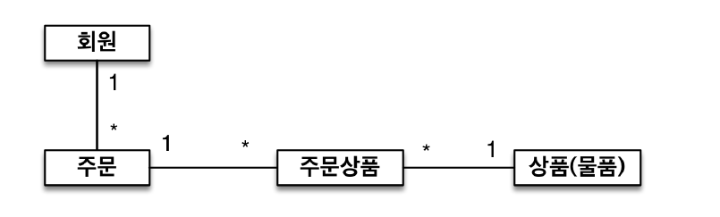
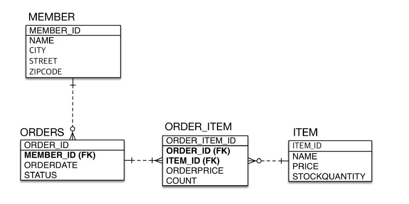
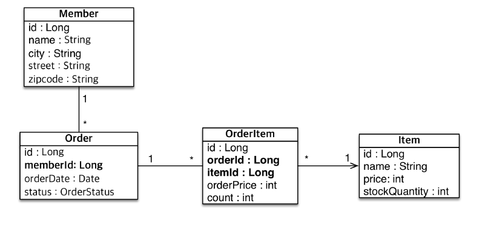
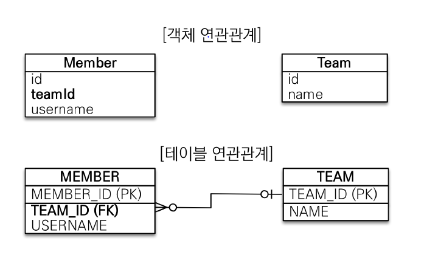
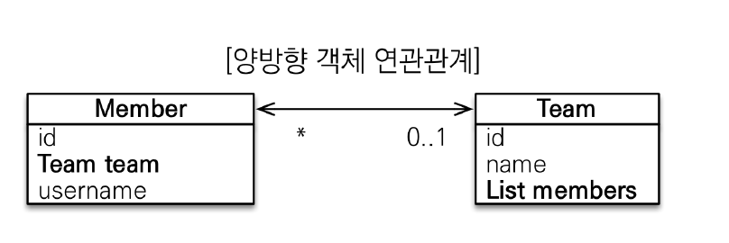

# 3주차(Ch4,Ch5)

# 04. 엔티티 매핑 - 실전예제

핵심: 데이터 중심설계로 인한 문제점, JPA의 해결방안

## 데이터 베이스 설계 과정?

- According to Teorey, Lightstone, Nadeau, and Jagadish (2011)

1) 요구사항 분석
2) 논리적 디자인
3) 물리적 디자인
4) 데이터베이스 적용, 모니터링, 수정

## 도메인 모델 분석


- 회원과 주문 : 일대다
- 주문과 상품 : 다대다

## 테이블 설계(ERD)


## 엔티티 설계와 매핑


- 식별자는 @Id와 @GeneratedValue 사용
- 외래키를 저장하여 연관된 테이블 나타냄

## 데이터 중심 설계의 문제점
- 객체지향적이지 않다!!! -> 객체가 아닌 테이블끼리의 관계 중심적이다.
- 테이블의 외래키를 객체에 그대로 가져오고 있음
-> 테이블은 조인이 있으나 객체는 조인이 없음
-> 객체는 참조를 이용하여 다른 객체를 탐색함
-> 그러므로 외래키를 통해서는 객체 그래프 탐색이 불가능!!

- 참조가 없으므로 UML도 잘못되어 있음.

> 객체지향스럽게 만들기 위해서 연관관계 매핑을 이해하고 적용하는 것이 필요하다.
> JPA에서는 참조와 외래키를 어떻게 매핑할까?

# Ch05. 연관관계 매핑 기초
핵심: 객체의 참조와 외래키 매핑하기

## 용어정리

### 방향(direction)
- 누가 누구를 참조하는지 나타냄
- 단방향, 양방향

>The direction of a relationship can be either bidirectional or unidirectional. A bidirectional relationship has both an owning side and an inverse side. A unidirectional relationship has only an owning side. The owning side of a relationship determines how the Persistence runtime makes updates to the relationship in the database.
(공식문서)

> 방향은 양방향이거나 단방향일 수 있다.
> 양방향 관계는 포함하는 쪽과 반대쪽을 가진다.
포함하는 쪽에서는  영속성 런타임에서 어떻게 데이터 베이스에 연관관계를 업데이트할지에 대한 정보를 가진다.

### 다중성(Multiplicity)
- [다대일, 일대다, 일대일, 다대다]

### 연관관계의 주인(owner)
- owning side
- 연관관계에서 포함하는 쪽을 owner라고 말한다.


## 5.1 단방향 연관관계
- 다대일(N:1) 단방향 관계


- 객체 연관관계
    - member 객체는 team 필드로 team 객체와 연관관계를 맺는다.
    - 단방향관계이다(member->team 조회만 가능하다)

- 테이블 연관관계
    - member 테이블은 team_id 외래키로 team 테이블과 연관관계를 맺는다.
    - 양방향관계이다(team_id 외래키로 양쪽에서 각각을 조회할 수 있다.)

- 객체 연관관계 vs 테이블 연관관계
    - 객체의 "참조"를 통한 연관관계는 단뱡항이다.
    - 객체에서 양방향을 만드려면 양쪽에서 서로 다른 단방향 연관관계를 만들어야 한다.
    - 반면에, 테이블은 외래키를 통해 하나만으로 양방향 설정이 가능하다.

### 5.1.1 순수한 객체 연관관계(JPA 없이)

```java
public class Member{
    private String id;
    private String username;

    private Team team;

    public void setTeam(Team team){
        this.team=team;
    }
}

public class Team{
    private String id;
    private String name;
}

public static void main(String[] args){
    Member member1=new Member("member1","회원1");
    Member member2=new Member("member2","회원2");
    Team team1=new Team("team1","팀1");

    member1.setTeam(team1);
    member2.setTeam(team1);

    Team findTeam =member1.getTeam();
}
```

### 5.1.2 테이블에 맞추어 모델링

```java
    @Entity
    public class Member {
        @Id @GeneratedValue
        private Long id;
        @Column(name = "USERNAME")
        private String name;
        @Column(name = "TEAM_ID")
        private Long teamId;
     …
    }
    @Entity
    public class Team {
        @Id @GeneratedValue
        private Long id;
        private String name;
     …
    }

    public static void main(String[] args){
    
    Team team = new Team();
    team.setName("TeamA");
    em.persist(team);
    
    Member member = new Member();
    member.setName("member1");
    member.setTeamId(team.getId());
    em.persist(member);

    //조회
    Member findMember = em.find(Member.class, member.getId());
    //반대로는 연관관계 없음..
    Team findTeam = em.find(Team.class, team.getId());
}
```

- 앞서 설명했듯이, 데이터베이스 중심으로 모델링하면 협력관계가 만들어지지 않는다!!

### 5.1.3 객체 관계 매핑
- JPA를 이용해서 매핑!

```java
@Entity
public class Member {
    @Id @GeneratedValue
    private Long id;
    @Column(name = "USERNAME")
    private String name;
    private int age;
    // @Column(name = "TEAM_ID")
    // private Long teamId;
    @ManyToOne
    @JoinColumn(name = "TEAM_ID")
    private Team team;
    …
}

 public static void main(String[] args){

    Team team = new Team();
    team.setName("TeamA");
    em.persist(team);

    Member member = new Member();
    member.setName("member1");
    member.setTeam(team);
    em.persist(member);

    //양방향으로 가능
    Member findMember = em.find(Member.class, member.getId());
    
    Team findTeam = findMember.getTeam();
 }
```

### 연관관계 매핑 어노테이션

- @ManyToOne: 다대일 관계라는 매핑정보
- @JoinColumn(name="TEAM_ID")
    - 외래 키를 매핑할때 사용
    - name 속성에는 매핑할 외래키 이름을 지정
    - 생략하면 기본전략으로 설정
    - 기본 전략 : 필드명+_+ 참조하는 테이블의 칼럼명

## 5.2 연관관계 사용
- 연관관계를 등록, 수정, 삭제, 조회하는 예제

### 5.2.1 저장

### 코드
```java
public void testSave(){
    Taem team1 =new Team("team1","팀1");
    em.persist(team1);

    Member member1 =new Member("member1","회원1");
    member1.setTeam(team1);
    em.persist(member1);
}
```
### 실제날라가는 쿼리

```sql
INSERT INTO TEAM(TEAM_ID,NAME) VALUES ('team1','팀1')
INSERT INTO MEMBER(MEMBER_ID,NAME,TEAM_ID) VALUES('member1','회원1','team1')
```
- 외래 키 값으로 참조한 팀의 식별자 값이 입력된다.

### 5.2.2 조회
- 연관관계가 있는 엔티티를 조회하는 방법
    - 객체 그래프 탐색
    - 객체지향 쿼리 사용(JPQL)

### 코드

- 객체 그래프 탐색
```
Member member = em.find(Member.class, "member1");
Team team = member.getTeam();
```

- JPQL 사용
```java
private static void queryLogicJoin(EntityManager em){
    String jpql ="select m from Member m join m.team t where "+ "t.name=:teamName"

    List<Member> resultList=em.createQuery(jpql,Member.class)
        .setParameber("teamName","팀1");
        .getResultList();
    
    for(Member member : resultList){
        System.out.println("[query] member.username=" +
            member.getUsername());
    }
}
```
### 실제날라가는 쿼리

```sql
SELECT M.* FROM MEMBER MEMBER
INNER JOIN
    TEAM TEAM ON MEMBER.TEAM_ID=TEAM1_.ID
WHERE
    TEAM1_.NAME='팀1'
```

### 5.2.3 수정
- 팀1 소속이던 멤버를 팀2에 소속되게 변경

### 코드
```java
private static void updateRelation(EntityManager em){
    Team team2 =new Team("team2","팀2");
    em.persis(team2);

    Member member=em.find(Member.class, "member1");
    member.setTeam(team2);
}
```

- 다른 필드 수정하듯이 대상 변경하면됨!!

### 실제날라가는 쿼리
```sql
UPDATE MEMBER
SET
    TEAM_ID='team2', ...
WHERE
    ID='member1'
```

### 5.2.4 연관관계 제거

### 코드
```java
private static void deleteRelation(EntityManger em){
    Member member1=em.find(Member.class,"member1");
    member1.setTeam(null);
}
```

### 쿼리
```sql
UPDATE MEMBER
SET
    TEAM_ID='NULL',...
WHERE
    ID= 'member1'
```

## 5.3 양방향 연관관계
- 팀에서 회원으로 접근하는 관계도 설정하기.
- 양방향에서 접근할수 있는 양방향 연관관계 매핑하기.



- 다대일을 표현하기 위해서, List컬렉션으로 추가.
- 데이터 베이스에서는 기존 외래키만으로 양방향 가능. -> DB상으로는 차이가 없음!!!!!!!
- 

### 5.3.1 양방향 연관관계 매핑

### 회원 엔티티
```java
@Entity
public class Member{
    @Id
    @Column(name = "MEMBER_ID")
    private String id;

    private String username;

    @ManyToOne
    @JoinColumn(name="TEAM_ID")
    private Team team;

    public void setTeam(Team team){
        this.team = team;
    }
}
```

### 팀 엔티티
```java
@Entity
public class Team{
    @Id
    @Column(name="TEAM_ID")
    private String id;

    private String name;

    //팀 -> Member로의 관계추가
    @OneToMany(mappedBy = "team")
    private List<Member> members = new ArrayList<Member>();
}
```

### 5.3.2 일대다 컬렉션 조회

```java
private void biDirection(){
    Team team = em.find(Team.class,"team1");
    List<Member> mebers=team.getMembers();
}
```

## 5.4 연관관계의 주인(Owner) 설정
- 객체는 양방향이 아니라 단방향 관계 두개를 통해 테이블의 양방향 관계를 흉내냄.
- 이때, 두 객체 연관관계 중 하나를 정해서 테이블의 외래키를 관리하게 한다.
- 그때 외래키를 관리하는 이 객체를 연관관계의 주인(Owner)라고 부른다

### 5.4.1 연관관계의 주인
- 연관관계의 주인만이 DB 연관관계와 매핑되고, 외래키를 관리할 수 있다.
- 주인이 아닌쪽은 읽기만 가능하다.
- 주인은 mappedBy 속성 X, 아니면 mappedBy로 주인지정.
- 연관관계의 주인은 외래키를 관리하는 역할을 가지기 때문에, 테이블에 외래 키가 있는 곳으로 정한다.

## 5.5 양방향 연관관계 저장
```java
public void testSave(){
    Team team1 = new Team("team1","팀1");
    em.persist(team1);

    Member member =new Member("member1", "회원1");
    member1.setTeam(team1);
    em.persist(member1);
}
```

- 연관관계의 주인이 외래키를 관리한다.
- 주인이 아닌 방향으로 값 설정 안해도 DB에 외래키 값이 저장된다.
- team1.getMembers().add(member1) 같은 코드가 필요없다.

## 5.6 양방향 연관관계의 주의점
- 연관관계의 주인에는 값을 입력하지않고, 주인이 아닌 곳에만 값을 입력하면 안된다.
- 이렇게 되면 외래키를 관리하는 주인에 정보가 없으므로 외래키가 null이 된다.

### 5.6.1 순수한 객체까지 고려한 양방향 관계
- TestCase 작성시에는 보통 Jpa를 사용안하고 순수한 객체로 테스트를 한다.
- 이때 주인이 아닌곳에 값을 저장하지 않으면 의도한 대로 결과가 나오지 않을 수 있다.
- 그러므로, 순수한 객체까지 고려하면 양쪽 다 관계를 맺어야 한다.

### 5.6.2 연관관계 편의 메소드
- 양방향 관계에서는 어자피 양쪽 다 관계를 맺어야 하기 때문에, 하나의 메소드로 운영하는 것이 안전한다.
- 이때, 메소드 작성시 기존 팀이 있을 경우 관련된 연관관계를 삭제하는 것과 같이 적절한 처리를 해주어야 오류가 없다.

## 5.7 정리
- 양방향 매핑은 단방향과 비교해서 반대 방향으로 객체 그래프 탐색이 추가된 것 일뿐!!
- Trade-off를 고려했을때 반대 방향 탐색이 필요한 경우 작성하는 식으로 운용하는 것을 추천.!

### Json 라이브러리 사용시 무한루프

```java
public class User {
    public int id;
    public String name;
    public List<Item> userItems;
}

public class Item {
    public int id;
    public String itemName;
    public User owner;
}
```
- 예를들어 Item의 instance를 직렬화 하려고할 때 에러발생

```java
@Test(expected = JsonMappingException.class)
public void givenBidirectionRelation_whenSerializing_thenException()
  throws JsonProcessingException {
 
    User user = new User(1, "John");
    Item item = new Item(2, "book", user);
    user.addItem(item);

    new ObjectMapper().writeValueAsString(item);
}
```
- full exception

```java
com.fasterxml.jackson.databind.JsonMappingException:
Infinite recursion (StackOverflowError) 
(through reference chain: 
org.baeldung.jackson.bidirection.Item["owner"]
->org.baeldung.jackson.bidirection.User["userItems"]
->java.util.ArrayList[0]
->org.baeldung.jackson.bidirection.Item["owner"]
->…..
```
- json으로 직렬화 하는게 연관관계를 타고 계속해서 반복된다
