## Section 5. 연관관계 매핑 기초

   #### **목표**

1. **객체와 테이블 연관관계의 차이의 이해**
2. **객체의 참조와 테이블의 외래키를 매핑 이해**

* 용어 이해
  * 방향 : 단방향, 양방향
  * 다중성 : 다대일, 일대다, 일대일, 다대다
  * **연관관계의 주인** : 양방향 연관관계의 경우 **관리의 주인**은 누가할 것인지? 

* 예제 시나리오 : 회원과 팀

  * 회원은 하나의 팀에만 소속될 수 있고, 팀은 한 명 이상의 회원을 가지고 있다. 
  * 회원과 팀은 **다대일**의 관계를 가지고 있다.

  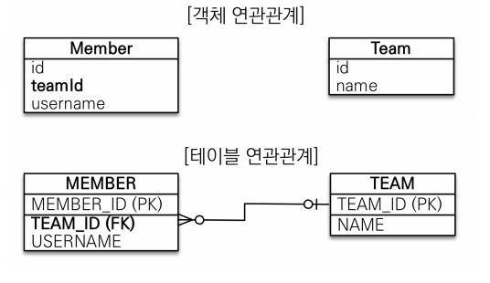

  

##### # 객체와 테이블 연관관계의 차이 이해 

* 문제점

  * **객체는 참조**를 사용해 연관 관계를 찾고, **테이블은 외래 키로 조인**을 사용해서 연관된 테이블을 찾는다. (이 둘 사이의 *괴리감*)
  * 참조 대신에 외래키를 그대로 사용하면,, 

  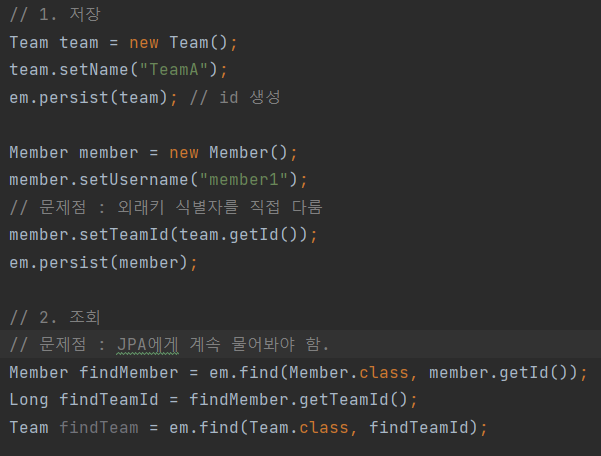

#### 1. 단방향 연관관계

-------------------

* 객체 지향 모델링 : TeamId를 사용하는 것이 아니라 Team을 사용

* 객체 지향 모델링을 하기 위해서는 그 둘의 **관계를 JPA에 알리는 것이 필요**하다. 

  **첫번째 ) ** 누가 N이고 누가 1인지의 관계를 먼저 파악하여, 해당 class를 중심으로 작성한다. 

  예를 들어, Member 입장에서는 Team와 N:1의 관계이므로 `@ManyToOne` 으로 작성한다.

  **두번째 ) ** join해야할 column을 알려준다. 

  예를 들어, Team은 TEAM_ID(FK)와 mapping 필요하므로 `@JoinColumn(name="TEAM_ID")` 으로 작성한다.

  

  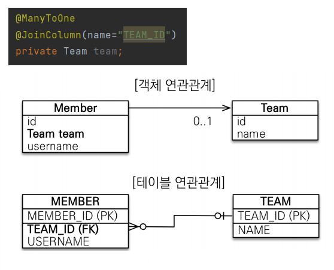

#### 2. 양방향 연관관계와 연관관계의 주인

------------

* 단방향으로 설정한 경우 member에서 Team으로 참조할 수 있음.

* 그러나 Team에서 member로는 참조할 수 없다.

* 테이블의 연관관계는 방향이라는 개념이 없어서 member와 Team 모두 FK와 join을 통해서 자유롭게 알 수 있다. 예를 들어, 팀의 입장에서 소속된 멤버들을 알고 싶다면 나의 PK와 member FK와 join하면 된다.

* 그래서 객체의 경우, Team에서 member로 참조할 수 있도록 하나의 List를 추가해야한다.

  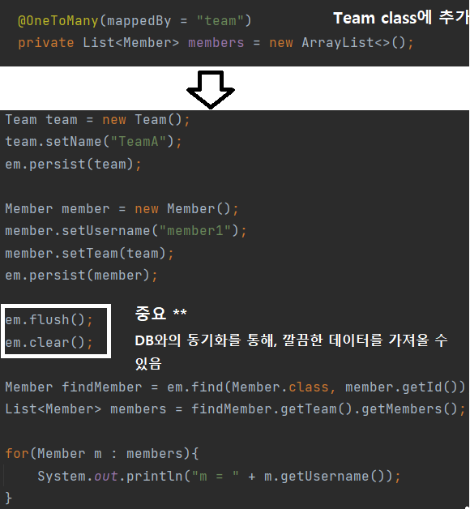

#### # 연관관계의 주인 (mappedBy의 역할??)

1. 우선, mappedby의 역할을 알기 전 객체와 테이블의 연관관계를 알아야한다.

   * 객체는 단방향으로 가는 **연관 관계가 2개** 있는 것이다. (참조 2개)
     * 회원 -> 팀
     * 팀 -> 회원
   * 테이블 연관관계는 딱 하나이다. (FK 하나로 해결가능)
     * 회원 <-> 팀

   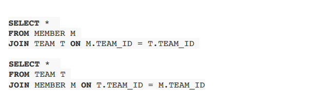

2. 딜레마 발생

   * Member의 Team의 값을 바꿔야 할지 ??
   * Team의 Members의 값이 바뀌었을 때 처리해야할지?
   * 예를 들어서, member가 새로운 team 들어가고 싶을 때,  Member의 Team 값을 바꿔야 할 지 혹은 Team에 있는 members의 list 값을 바꿔야 할 지
   * **외래키를 어떻게 관리**할까? - > 둘 중 **하나**로 외래키를 관리해야 한다.

   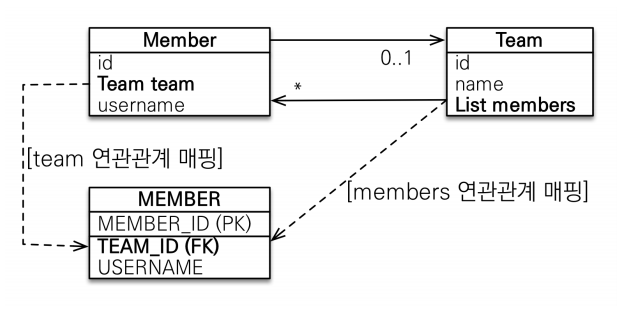

3. **연관관계의 주인**

   * 객체의 두 관계 중 하나만을 연관관계의 주인으로 지정해야 한다.
   * 연관관계의 **주인만이 외래키를 등록하거나 수정**할 수 있고 , 주인이 아니면 읽기만 가능하다.
   * 주인은 MappedBy 속성으로 사용하지 않고,
   * 주인이 아닌 경우 MappedBy로 어떤 주인에 의해 Mapped 되었는지를 지정한다.
   * MappedBy가 적힌 곳은 결국 읽기만 가능함을 의미함. By 다음에 오는 것이 주인이다.

   

4. 누구를 주인으로 지정할 것인가??

   * **외래키가 있는 곳**이 주인으로 정해라. 즉, '다'쪽이 연관관계의 주인
   * 왜냐하면 ,, Team의 Members를 주인으로 한 경우, Team의 Members을 바꿨을 때 Member query가 나오면 헷갈림. 또한 성능 이슈도 발생한다. (밑에 자세히 나옴)

   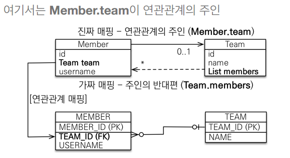

* 연관관계의 주인은 비지니스적으로 중요한 역할을 하는 것은 아니다. 
  * 자동차와 바퀴가 있으면, 바퀴가 연관관계의 주인이 됨. 

#### 3. 양방향 연관관계의 주의점

--------

> 주의점 1 : 연관관계 주인이 아닌 값을 입력하면 - DB 저장이 안됨

* 연관관계의 주인이 아닌 값을 입력하면, 값이 setting 되지 않는다. (null) 왜냐하면 주인이 아닌 자는 조회 권한만을 가지고 있기 때문이다.

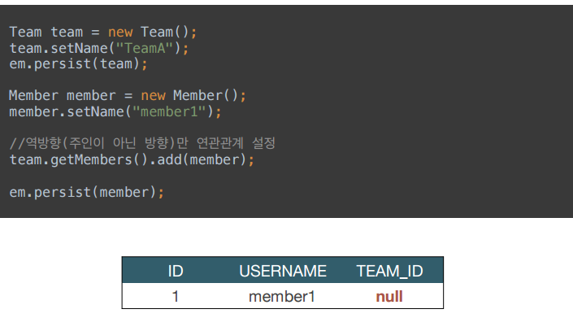

* 연관관계의 주인에 값을 입력해야 저장됨.

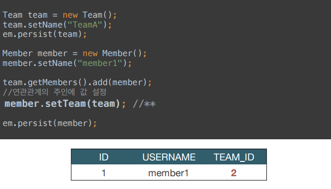

> 주의점 2 : 웬만하면 양쪽 값을 설정할 수 있도록 하자.

왜냐하면

* 만약 `em.flush(), em.clear()` 하지 않았을 경우, 값을 제대로 가져오지 못하는 경우가 발생한다. (1차 캐시에만 저장되는 경우 - JPA가 양쪽으로 값을 세팅하지 않은 상태이므로 문제가 발생할 수 있음. )

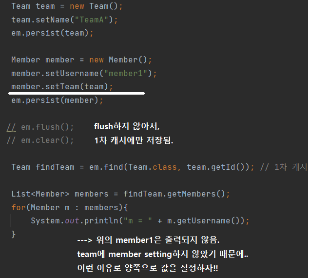

* **연관관계 편의 메소드**를 생성하는 것이 좋음

  * Getter & Setter 관례에 따르지 않는다는 것을 보여주기 위해서 함수명을 단순히 getTeam을 사용하지 않는다. 

  * 여기서 연관관계 편의 메소드는 둘 중 한곳에서 지정해도 된다. (단, **양쪽에서 하면 안 됨**) 왜냐하면 주인은 Member의 Team이지만 값을 세팅 어디서 세팅할 것인지는 개발자 마음이기 때문이다. 

    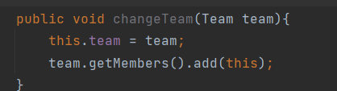

* **양방향 매핑시 무한 루프를 조심하자.**

  * toString(), lombok, JSON 생성 라이브러리의 무한 루프 발생할 수 있음.

    * 예를 들어, Member의 toString을 호출하는 순간 Team의 toString을 호출하고 Team의 toString은 다시 Member의 toString을 호출하기 때문에 무한 루프 발생한다.  
    * 또 다른 예로, JSON으로 serialize하는 순간 마찬가지로 무한 루프에 빠진다. 엔티티를 직접 컨트롤러해서 response로 직접 보낼 경우, 서로를 호출해 장애 발생한다. 
    * controller에는 entity를 직접 반환하지 말기 --> 무한루프 발생 + 엔티티 api 스펙자체가 변경될 가능성이 있음. 그러므로 entity는 DTO로 값을 반환하여 사용하기

    > lombok 란? 어노테이션 기반으로 코드를 자동완성 해주는 라이브러리이다.

    * 클래스 이름 위 혹은 변수 명 위에 @Getter , @Setter 등을 입력하면 자동으로 Getter, Setter 메소드를 만들어준다.
    * 참고자료 : [[Java\] Lombok이란? 및 Lombok 활용법 - MangKyu's Diary (tistory.com)](https://mangkyu.tistory.com/78)

    > Serialize(직렬화) 란 ?

    * 객체를 데이터 스트림으로 만드는 것을 말한다. 반대로 스트림으로부터 데이터를 읽어서 객체를 만드는 것은 역직렬화라고 한다. 직렬화는 객체 자체를 영속적으로 보관할 때 파일 형태로 저장한다. 또한 네트워크를 통해 전송하다.

    > DTO(Data Transfer Object) 란?

    * 계층간 데이터 교환을 위한 객체이다. DB에서 데이터를 얻어 Service나 Controller 등으로 보낼 때 사용하며, 로직을 가지고 있지 않는 순수한 데이터 객체이다. (getter/ 메소드만 가지고 있음)

* 양방향 정리 :
  * 단방향 매핑 제일 중요!!
  * 양방향 매핑은 객체 그래피 탐색 기능이 추가된 것이다.
  * 객체 그래프 탐색 기능 + JPQL 쿼리 탐색이 필요한 경우, 그때 가서 추가해도 된다. 

> 참고 1 

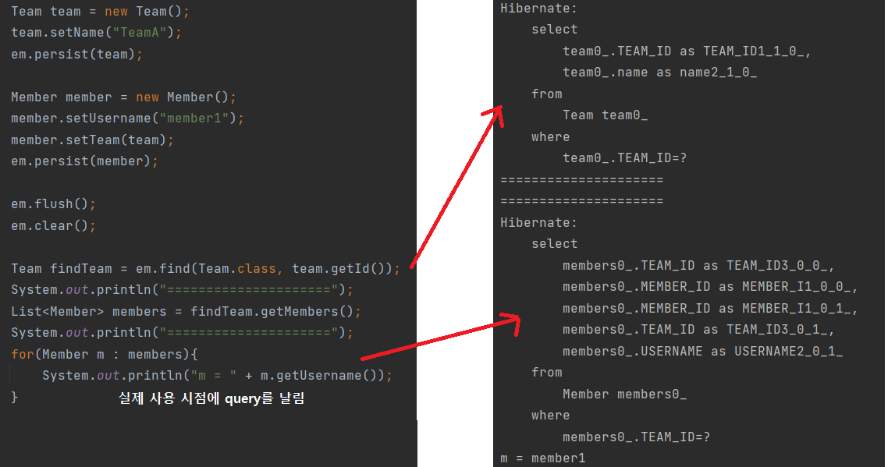

### # 실전예제 1, 2

-----------------

> 실전예제 1 : 쇼핑몰 분석

도메인 모델 분석 : 

1. 회원과 주문 : 회원은 여러 번 주문할 수 있다. (일대다)

2. 주문과 상품 : 주문은 여러 상품을 선택할 수 있고, 상품도 주문이 여러 번 될 수 있다.(다대다)

   * 다대다 관계를 주문상품을 만들어서 주문-주문상품(일대다) / 주문상품-상품(다대일)로 분석

   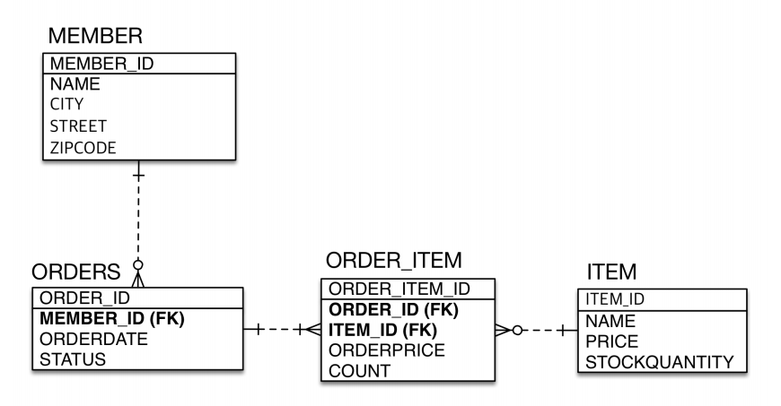

   

   **테이블의 외래키를 그대로 가져와 작성할 경우,,, **

   ---> *객체 그래프 탐색이 불가능한 객체스럽지 못한 설계이다.*

   예시 : 주문을 가져와 주문의 멤버를 확인하고 다시 멤버를 찾아야하는 상황이 발생한다. 

   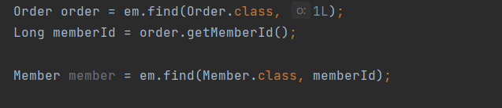

   이런 방식의 설계를 관계형 DB에 맞춘 설계라고 할 수 있음.

   * 테이블의 외래키를 객체 그대로 가져옴.
   * 객체 그래프 탐색이 불가(참조를 가져오는 것이 아님)
   * 참조가 없으므로 UML도 잘못된 것이다.

> 실전예제 2 - 연관 관계 매핑

* 참조를 사용하도록 변경

  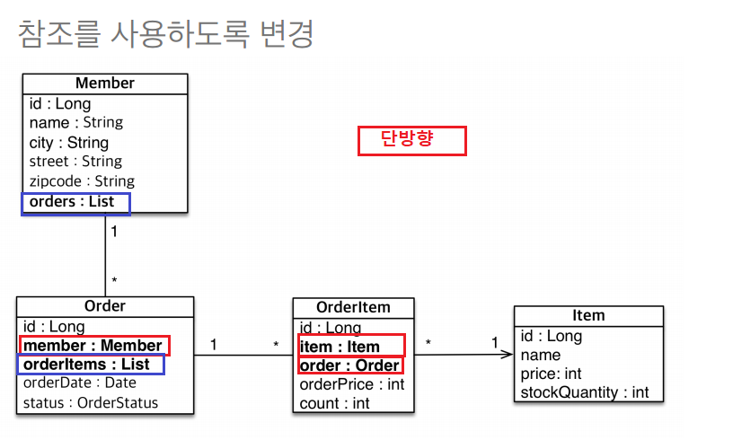

  테이블을 보면, member - orders를 가지고, order는 member와 orderItems를 가지고, OrderItem은 item과 order을 가지고 있다. (거의 대부분의 연관관계 setting 완료)

  그러나 , Item 입장에서는 setting이 없는 이유는 보통 주문 입장에서 상품이 중요하지만 **상품 입장**에서는 어떤 주문에 속했는지 **비지니스적으로 중요하지 않다.**

  

1. 우선 해야할 것은 **단방향 설정**을 먼저 해야한다. (외래키 부분을 mapping 연결)

   * 단방향 매핑만으로도 이미 연관관계의 매핑은 완료되었다고 볼 수 있음.

   * ORDERS에서의 member 매핑

   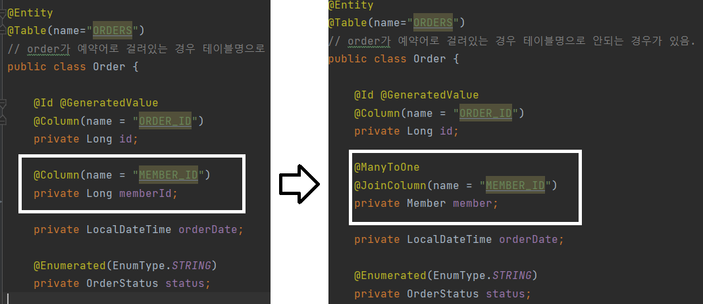

   * ORDERITEM에서의 Item, Order 매핑

   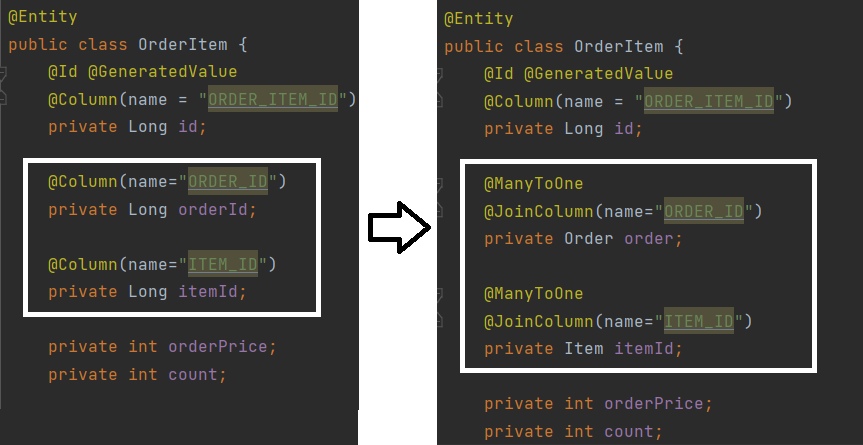

2. 단방향 설정이 끝난 뒤, **양방향 설정**에 대한 고민

* 보통 양방향의 설정은 개발상의 편의(조회할 때 편하게 하기 위해서)하지만 *무조건* 할 필요는 없다.

  * member의 orders 추가

    * member에 orders를 넣는 것이 불필요한 이유 : 
      * 특정 회원의 주문 내역을 보고 싶은 경우 : orders의 member_id를 이용해서 찾는다. member를 찾아서 member에서 order을 찾는 것은 복잡한 설계이다.
      * 설계할 때, 객체 지향이라고 해서 모든 것을 양방향 설정할 필요는 없다. 오히려 연관 관계를 끊는 것도 중요하다.

    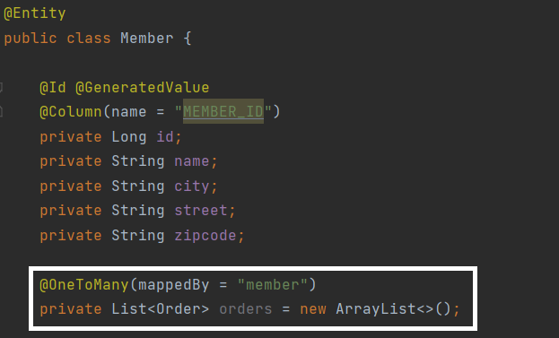

    * orders의 주인은 order의 member가 주인이다.

  * order의 orderItems 추가

    * 이것은 비지니스적으로 충분히 의미가 있을 수 있다. 왜냐하면 주문서의 연관된 아이템 목록을 보고 싶은 경우가 빈번하기 때문이다.

    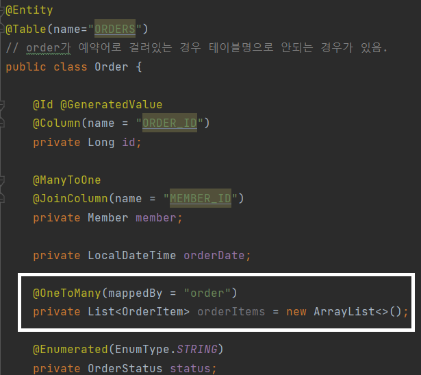

> 참고 2 - ORDER를 ORDERS로 사용하는 이유

* 엔티티 클래스에 선언된 필드나 클래스 이름이 데이터베이스 키워드/예약어와 중복될 경우 오류가 발생할 수 있다.

  * 키워드/예약어 : SELECT , FROM, ORDER, GROUP, WHERE 등 포함

* 해결 방법 :

  1. `@column` 통해서 컬럼 이름을 직접 지정한다. 

  2. `hibernate.globally_quoted_identifiers`을 `true`로 지정하면, SQL이 실행될 때 테이블과 컬럼을 틸드(`)로 감싸주기 때문에 사용하더라도 문제가 발생하지 않는다.

     * `persistence.xml`의 `<properties>` 안에  `<property name="hibernate.globally_quoted_identifiers" value="true" />` **추가**

     혹은 

     * spring boot JPA를 사용하는 경우, application.properties에 `spring.jpa.properties.hibernate.globally_quoted_identifiers=true` **추가**

  참고 사이트 : [하이버네이트 데이터베이스 예약어 충돌 해결](https://www.popit.kr/%EA%B0%80%EC%A7%9C%EB%89%B4%EC%8A%A4%EC%95%84%EC%9B%83-%ED%95%98%EC%9D%B4%EB%B2%84%EB%84%A4%EC%9D%B4%ED%8A%B8-%EB%8D%B0%EC%9D%B4%ED%84%B0%EB%B2%A0%EC%9D%B4%EC%8A%A4-%EC%8A%A4%ED%82%A4%EB%A7%88/)

> 참고 3 - JPA 기본 naming 규칙 

* Spring의 기본적으로 소문자 형식의 snake case으로 테이블 및 column 명을 생성시켜준다.

  * Class명이 Person일 경우, table의 이름은 person이다. 혹은 firstName 은 first_name

* RDMS가 대소문자를 구분할 경우 - 동일 식별자를 정확하게 일치해야 합니다.

* RDMS가 대소문자를 구분하지 않을 경우 - 글자만 맞으면 쿼리가 작동한다.

  * 이 경우, " " 쌍따옴표를 사용하면 해당 식별자를 테이블 및 열 이름과 비교할 때 *대소문자가 일치*해야한다고 알린다. 

* 사용자 지정 명명 규칙을 사용하고 싶을 때,

  1. *SpringPhysicalNamingStrategy* 에서 상속하여 식별자를 대문자로 바꾸는 방법 - getIdentifier() 메소드 재정의.

     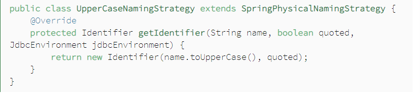

     * application.properties에서 `spring.jpa.hibernate.naming.physical-strategy=com.baeldung.namingstrategy.UpperCaseNamingStrategy` 으로 설정한다.

  2. RDMS가 대소문자를 구분할 수 있도록 변경하는 방법 -> 이 방법 사용시 쿼리에는 " "가 붙는다.

     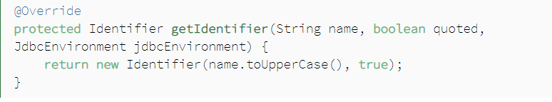

참고 사이트 :  https://www.baeldung.com/spring-data-jpa-custom-naming

