# 다양한 연관관계 매핑

## 연관관계 매핑시 고려사항 3가지

### 다중성

- 다대일 : @ManyToOne
- 일대다 : @OneToMany
- 일대일 : @OneToOne
- 다대다 : @ManyToMany

> 결국, 데이터베이스에 매핑하는 어노테이션이기 때문에 DB 관점에서 다중성을 생각하자. 다대일-일대다와 같이 대칭성도 생각하자.

! 주의 : 다대다는 실무에서 사용하지 않음. 쓰지않도록 주의하자.

### 단방향, 양방향

- 테이블
  - 외래키 하나로 양쪽으로 조인가능
  - 사실 방향이라는 개념 X
- 객체
  - 참조용 필드가 있는 쪽으로만 참조 가능
  - 한쪽만 참조하게 되면 단방향 매핑
  - 양쪽이 서로 참조하면 양방향 매핑
  - 양방향도 사실 각자의 단방향 두 개!

### 연관관계의 주인

- 테이블은 **외래키 하나**로 두 테이블이 연관관계를 맺음
- 객체 양방향 관계는 A->B, B->A 처럼 **참조가 2개**
- 두 테이블 중 외래키를 관리할 곳을 지정해야함.
- 연관관계의 주인 => 외래 키를 관리하는 참조
- 주인이 아닌 곳 => 그냥 읽기만 가능!

## 다대일

### 다대일 단방향

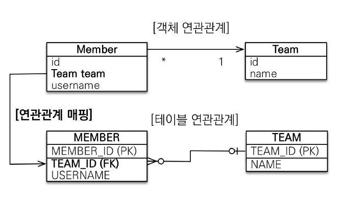

외래키는 다대일 관계에서 "다"에 걸자.

```java
@Entity
public class Member{
  @ManyToOne
  @JoinColumn(name="TEAM_ID")
  private Team team;
}
```

- 외래키가 있는 쪽에만 `@ManyToOne`을 통해 매핑하면 된다.

### 다대일 양방향

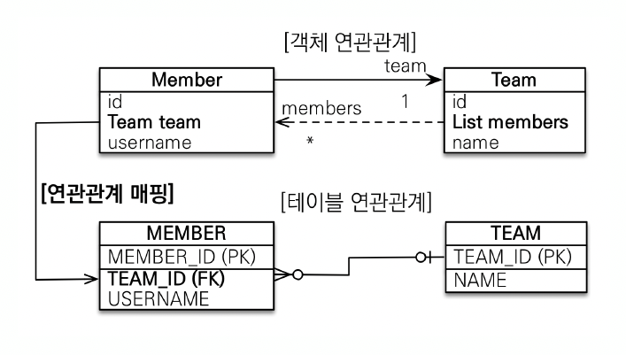

```java
@Entity
public class Member {
  @ManyToOne
  @JoinColumn(name="TEAM_ID")
  private Team team;
}

@Entity
public class Team {
  @OneToMany(mappedBy="team")
  private List<Member> members = new ArrayList<>();
}
```

- 외래키가 있는 쪽은 `@ManyToOne`을, 외래키가 없는 쪽은 `@OneToMany`를 매핑하자.
  - JoinColumn과 mappedBy를 꼭 생각하자.
  - JoinColumn은 실제 테이블 column 이름.
  - mappedBy는 매핑되는 객체의 필드 이름.
- 양방향으로 매핑을 할 때는 **외래키가 있는 쪽이 연관관계의 주인**이라는 것을 항상 기억하자.
- 양쪽을 참조하도록 개발을 할 때, **주인이 아닌 쪽의 데이터는 실제 데이터베이스에 영향을 끼치지 않는다**.
- **연관관계 편의 메소드**를 사용하여 실수를 방지하자.

## 일대다

### 일대다 단방향

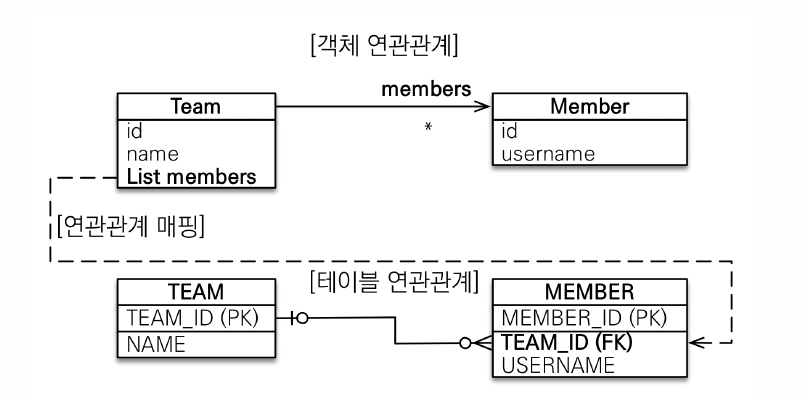

- 외래키는 다대일과 똑같이 "다" 방향에 있음, 하지만 DB와 달리 객체관점에서 연관관계의 방향을 일에다가 놓는 것.
- 사실 데이터베이스 설계 관점상 좋은 설계가 X. 잘 쓰지 않는다.

```java
@Entity
public class Team{
  @OneToMany
  @JoinColumn(name="TEAM_ID")
  private List<Member> members = new ArrayList<>();
}
```

예시 )

```java
Member member = new Member();
member.setUsername("member1");
em.persist(member);

Team team = new Team();
team.setName("teamA")
// 이 코드는 결국 team이 아닌 member를 업데이트하게 됨.
// => 다대일보다 추가적인 쿼리가 1번 더 나감.
team.getMembers().add(member);
em.persist(team);
```

> 실제 개발을 할 때, team을 건들였는데 member가 같이 update 되는 상황이 이상하게 보일 수 있음.

- 1:N 관계에서 1이 연관관계의 주인
- 테이블의 일대다 관계는 항상 N쪽에 외래키가 있음
- 객체와 테이블의 차이 때문에 반대편 테이블의 외래키를 관리하게 됨
- `@JoinColumn`을 꼭 사용해야함. ( 주의 : 그렇지 않으면 `JoinTable`을 사용하게 됨. )

그냥, 다대일 양방향을 사용하자.

### 일대다 양방향

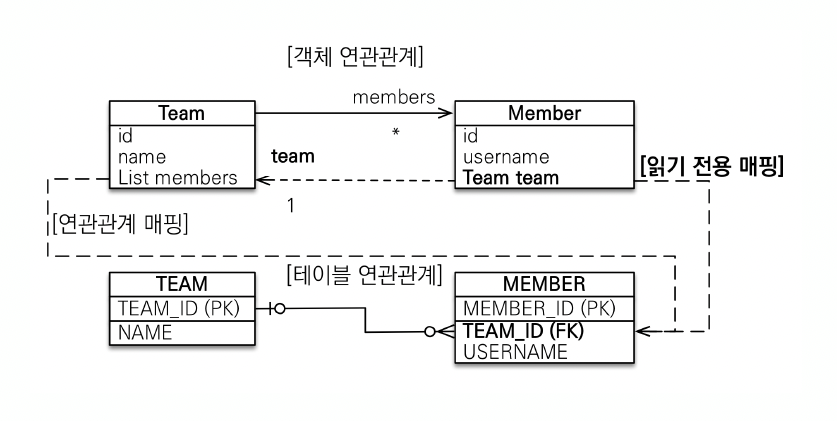

```java
@Entity
public class Team{
  @OneToMany
  @JoinColumn(name="TEAM_ID")
  private List<Member> members = new ArrayList<>();
}

@Entity
public class Member {
  @ManyToOne
  @JoinColumn(name="TEAM_ID", insertable=false, updatable=false)
  private Team team;
}
```

- 이런 매핑은 공식적으로 X
- `@JoinColumn(insertable=false, updatable=false)`
- **읽기전용 필드**를 만들어 양방향처럼 사용하는 방법
  - 스펙상 지원하는 방법이 X. 사용하지말자.
- **다대일 양방향**을 사용하자.

## 일대일

- **일대일 관계는 그 반대도 일대일**
- 주 테이블이나 대상 테이블 중에 외래 키 선택 가능
  - 주 테이블에 외래 키
  - 대상 테이블에 외래 키
- 외래 키에 데이터베이스 유니크(UNIQUE) 제약조건 추가

### 주 테이블 일대일 단방향

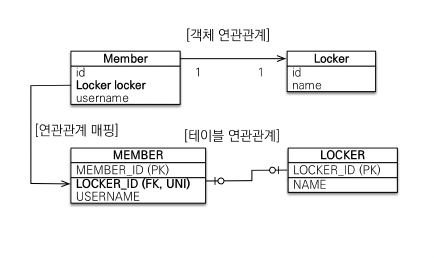

```java
@Entity
public class Member {
  @OneToOne
  @JoinColumn(name="LOCKER_ID")
  private Locker locker;
}


@Entity
public class Locker {
  @Id
  @GenratedValue
  @Column(name="LOCKER_ID")
  private Long id;

  private String name;
}
```

- `@ManyToOne` 단방향 매핑과 유사.

### 주 테이블 일대일 양방향

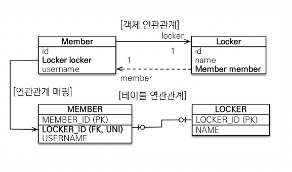

```java
@Entity
public class Member {
  @OneToOne
  @JoinColumn(name="LOCKER_ID")
  private Locker locker;
}


@Entity
public class Locker {
  @Id
  @GenratedValue
  @Column(name="LOCKER_ID")
  private Long id;

  private String name;

  @OneToOne(mappedBy="locker")
  private Member member;
}
```

- 다대일 양방향 매핑처럼 외래키가 있는 곳이 연관관계의 주인
- 반대편은 똑같이 mappedBy 사용

### 대상 테이블에 외래 키 일대일 단방향

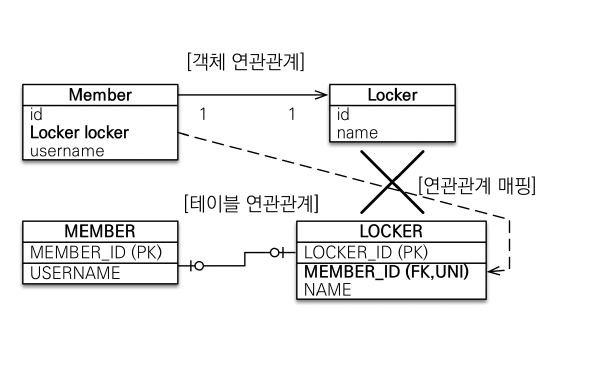

- 단방향 관계는 **JPA에서 지원하지 않음**
- 양방향 관계는 지원

### 대상 테이블에 외래 키 일대일 양방향

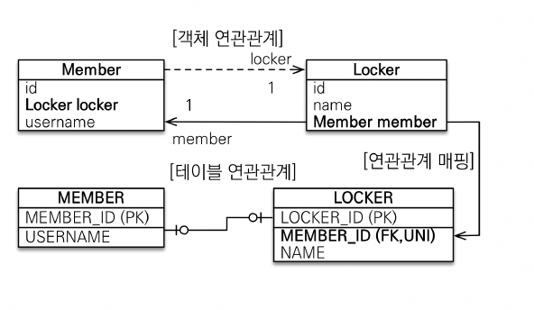

- 일대일 주 테이블의 외래키 양방향과 매핑방법은 같다.

### 정리

- **주 테이블에 외래 키**
  - 주 객체가 대상 객체의 참조를 가지는 것 처럼
  - 주 테이블에 외래 키를 두고 대상 테이블을 찾음
  - 객체지향 개발자 선호
  - JPA 매핑 편리
  - 장점: 주 테이블만 조회해도 대상 테이블에 데이터가 있는지 확인 가능
  - 단점: 값이 없으면 외래 키에 null 허용
- **대상 테이블에 외래 키**
  - 대상 테이블에 외래 키가 존재
  - 전통적인 데이터베이스 개발자 선호
  - 장점: 주 테이블과 대상 테이블을 일대일에서 일대다 관계로 변경할 때 테이블 구조 유지
  - 단점: 프록시 기능의 한계로 **지연 로딩으로 설정해도 항상 즉시 로딩**됨(프록시는 뒤에서 설명)

## 다대다

- RDB에서는 다대다를 표현할 수 없음
  - 보통 연결테이블 혹은 조인테이블을 이용하여 일대다-다대일 관계로 표현해야함.
- 객체는 컬렉션을 사용하여 다대다 관계를 표현가능
- `@ManyToMany`를 사용하고 `@JoinTable`을 이용하여 연결 테이블을 지정
- 다대다 매핑 : 단방향, 양방향 모두 가능

예시)

```java
@Entity
public class Member {
  @ManyToMany
  @JoinTable(name="MEMBER_PRODUCT")
  private List<Product> products = new ArrayList<>();
}

@Entity
public class Product {
  @ManyToMany(mappedBy="products")
  private List<Member> members = new ArrayList<>();
}
```

### 한계

- 편리해보이지만 실무에서 사용 X
- 연결 테이블이 단순히 연결만하고 끝나지 않음.
- 연결 테이블에 추가적인 데이터가 들어올 수 있는데, `@ManyToMany`로는 그것이 불가능

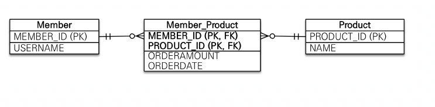

### 한계 극복

- 중간 테이블을 엔티티로 승격
- `@ManyToMany` -> `@OneToMany` + `@ManyToOne`

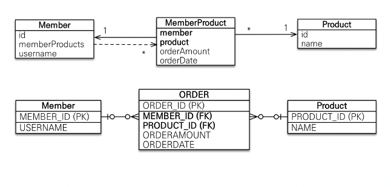

예시)

```java
@Entity
public class Member {
  @OneToMany(mappedBy="member")
  private List<MemberProduct> memberProducts = new ArrayList<>();
}

@Entity
public class MemberProduct {

  @ManyToOne
  @JoinColumn("MEMBER_ID")
  private Member member;

  @ManyToOne
  @JoinColumn("PRODUCT_ID")
  private Product product;

  // 엔티티이기떄문에, 추가 데이터용 컬럼을 사용가능하게 됨.
}

@Entity
public class Product {
  @ManyToMany(mappedBy="product")
  private List<MemberProduct> memberProducts = new ArrayList<>();
}
```

# 고급매핑

## 상속관계 매핑

- RDB에는 상속관계 X
- 슈퍼타입-서브타입 관계라는 모델링 기법이 객체 상속과 유사
- 객체의 상속을 DB의 슈퍼타입-서브타입 관계를 매핑

### 어노테이션

- `@Inheritance(strategy=InheritanceType.XXX)`
  - JOINED: 조인 전략
  - SINGLE_TABLE: 단일 테이블 전략
  - TABLE_PER_CLASS: 구현 클래스마다 테이블 전략
- `@DiscriminatorColumn(name="DTYPE")`
  - DTYPE이라는 컬럼을 생성해 각각의 슈퍼타입에서 서브타입 테이블이 어떤 종류인지 알 수 있음.
  - 슈퍼타입만 조회시 어떤 테이블인지 알 수 있음.
  - 운영시 편리함.
  - 단일 테이블 전략에선 필수적으로 사용. ( 생략시 자동으로 생성 )
- `@DiscriminatorValue("XXX")`
  - 서브타입 테이블의 DTYPE 이름을 지정

### 조인 전략

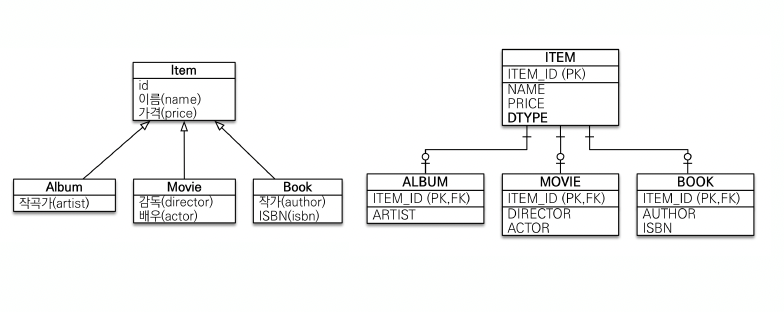

```java
@Entity
@Inheritance(strategy=InheritanceType.JOINED)
@DiscriminatorColumn
public class item {

  @Id @GeneratedValue
  private Long id;

  private String name;
  private int price;
}

@Entity
@DiscriminatorValue("A")
public class Album extends Item{
  private String artist;
}

@Entity
@DiscriminatorValue("M")
public class Movie extends Item{
  private String director;
  private String actor;
}

@Entity
@DiscriminatorValue("B")
public class Book extends Item{
  private String author;
  private String isbn;
}
```

- 각각의 테이블을 슈퍼타입과 JOIN을하여 사용
- Insert 연산이 2번 발생함

  - 슈퍼타입에 대한 쿼리
  - 서브타입 테이블에 대한 쿼리

- 서브타입 테이블 조회시 슈퍼타입과 조인하는 쿼리를 생성

- 장점
  - 테이블 정규화
  - 외래 키 참조 무결성 제약조건 활용가능
  - 저장공간 효율화
- 단점
  - 조회시 조인을 많이 사용, 성능 저하
  - 조회 쿼리가 복잡함
  - 데이터 저장시 INSERT SQL 2번 호출

### 단일 테이블 전략

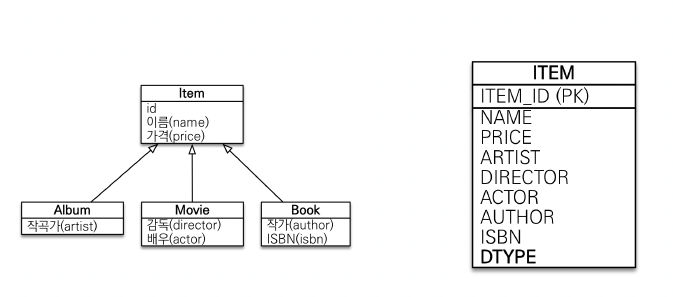

```java
@Entity
@Inheritance(strategy=InheritanceType.SINGLE_TABLE)
@DiscriminatorColumn
public class item {

  @Id @GeneratedValue
  private Long id;

  private String name;
  private int price;
}

@Entity
@DiscriminatorValue("A")
public class Album extends Item{
  private String artist;
}

@Entity
@DiscriminatorValue("M")
public class Movie extends Item{
  private String director;
  private String actor;
}

@Entity
@DiscriminatorValue("B")
public class Book extends Item{
  private String author;
  private String isbn;
}
```

- 논리 모델을 한 테이블에 전부 넣어서 사용

- 장점
  - 조인이 필요 없으므로 일반적으로 조회 성능이 빠름
  - 조회 쿼리가 단순함
- 단점
  - **자식 엔티티가 매핑한 컬럼은 모두 null 허용**
  - 단일 테이블에 모든 것을 저장하므로 **테이블이 커질 수 있다**.
  - **상황에 따라서 조회 성능이 오히려 느려질 수 있다.**

### 구현 클래스마다 테이블 전략

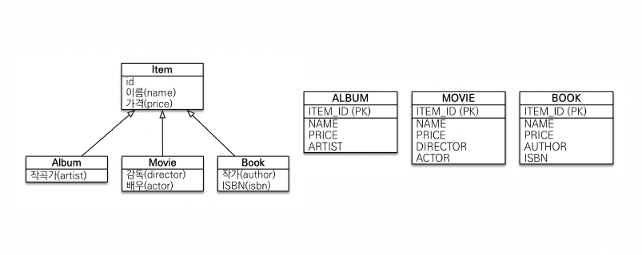

```java
@Entity
@Inheritance(strategy=InheritanceType.TABLE_PER_CLASS)
public abstract class item {

  @Id @GeneratedValue
  private Long id;

  private String name;
  private int price;
}

@Entity
public class Album extends Item{
  private String artist;
}

@Entity
public class Movie extends Item{
  private String director;
  private String actor;
}

@Entity
public class Book extends Item{
  private String author;
  private String isbn;
}
```

- 슈퍼타입을 없애고 각각의 구체적인 테이블을 사용
- 슈퍼타입 테이블도 생성되지않음.
- `@DiscriminatorColumn` 을 사용하지 않음.

**이 전략은 데이터베이스 설계자와 ORM 전문가 둘 다 추천X**

- 장점
  - 서브 타입을 명확하게 구분해서 처리할 때 효과적
  - not null 제약조건 사용 가능
- 단점
  - **여러 자식 테이블을 함께 조회할 때 성능이 느림**(UNION SQL 필요)
  - 자식 테이블을 통합해서 쿼리하기 어려움

## @MappedSuperclass

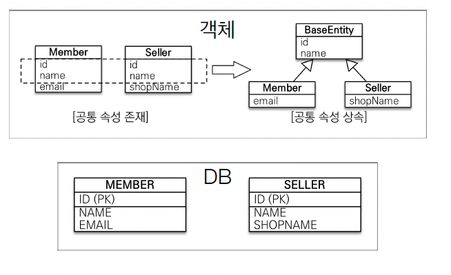

- 공통된 매핑 정보가 필요할 때 사용
- 상속관계 매핑과 상관 X
- 엔티티 X, 테이블과 매핑 X
- 부모 클래스를 상속받는 자식클래스에 매핑 정보만 제공
- BaseEntity는 조회 및 검색 불가
- 직접 생성해서 사용할 일이 없으므로 **추상 클래스**를 권장
- 테이블과 관계가 없고, 단순히 엔티티가 공통으로 사용하는 매핑정보를 모으는 역할
- 주로 등록일, 수정일, 등록자, 수정자 같은 공통 정보를 모을 때 사용
- 참고 : **@Entity 클래스는 엔티티나 @MappedSuperclass로 지정한 클래스만 상속가능**

예시)

```java
@MappedSuperclass
public abstract class BaseEntity {
  private LocalDateTime createDate;
  private LocalDateTime lastModifiedDate;
}

@Entity
public class Member extends BaseEntity{
  @Id
  @GenratedValue
  private Long id;
}
```

**+ 추가내용**
Spring Data JPA는 @MappedSuperclass를 이용한 **JPA Auditing**이라는 기능을 제공한다.

이를 이용하면, 적절한 어노테이션만 적게된다면 JPA가 알아서 등록일, 수정일, 등록자, 수정자 같은 것을 설정해준다.

```java
// Auditing 기능 사용
@EnableJpaAuditing
@SpringBootApplication
public class Application {
  public static void main(String[] args`)` {
    SpringApplication.run(Application.class, args);
  }
}
```

```java
@Getter
@MappedSuperclass
@EntityListeners(AuditingEntityListener.class)
public abstract class BaseTimeEntity{

  // Entity가 생성되어 저장될 때 시간이 자동 저장됩니다.
  @CreatedDate
  private LocalDateTime createdDate;

  // 조회한 Entity 값을 변경할 때 시간이 자동 저장됩니다.
  @LastModifiedDate
  private LocalDateTime modifiedDate;
}

```

```java
@Getter
@NoArgsConstructor
@Entity
public class Posts extends BaseTimeEntity{

  @Id
  @GeneratedValue(strategy = GenerationType.IDENTITY)
  private Long id;

  private String title;

  private String content;

  private String author;
}
```
