# 4주차(Ch06. 다양한 연관관계 매핑 ~ Ch07.고급매핑)

# Ch06. 다양한 연관관계 매핑

## 연관관계 매핑시 고려사항
- 다중성
    - 다대일(@ManyToOne) N:1
    - 일대다(@OneToMany) 1:N
    - 일대일(@OneToOne) 1:1
    - 다대다(@ManyToMany) N:M
- 단방향(Unidirectional), 양방향(Bidirectional)
- 연관관계의 주인

## 단방향, 양방향
- 테이블 
    - 외래키 하나로 양쪽 조인가능
    - 항상 양쪽조회가 가능하므로, 방향이라는 개념이 없음.
- 객체
    - 참조용 필드가 있는 쪽으로만 참조가능 
    - 한쪽만 : 단방향
    - 양쪽이 서로 참조 : 양방향(단방향 2개로 구현)

## 연관관계의 주인
- 핵심 : 객체의 참조는 2곳 이므로 둘 중 외래키를 관리할 곳을 지정해야함!!
- 연관관계의 주인 : 외래키를 관리하는 참조 -> 외래키가 있는 곳으로 주인 설정하기
- 주인의 반대편 : 외래키에 영향 못 준다.

## 다대일 단방향
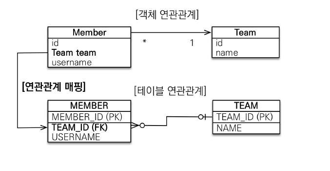
- 가장 많이 사용되는 연관관계 매핑

## 다대일 양방향
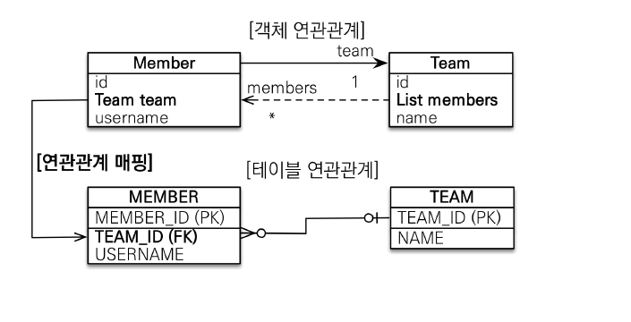
- 외래키가 있는 쪽이 연관관계의 주인
- DB에서는 무조건 N인 쪽이 외래키 관리하므로 N인쪽이 연관관계 주인.

## 일대다 단방향
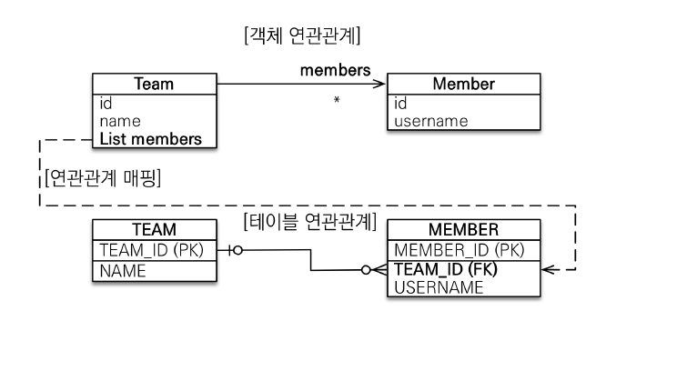
- 1이 연관관계의 주인
- 구현 상으로 가능하지만, 권장되지는 않는다.
- 어떻게 구현하든 테이블의 설계는 동일하다!!!

- 안쓰는 이유
    - 건들지 않는 테이블도 변경이 된다. 이로 인해 헷갈리고, 운영에 어려움을 겪을 수 있다.
    - 차라리 다대일 양방향을 사용하는 것이 낫다.

- 정리
    - 일이 연관관계의 주인
    - 테이블에는 항상 N쪽에 외래키가 있다.
    - 그러므로 일이 N쪽의 테이블에 있는 외래키를 관리하게 된다.
    - 그로인해 비직관적이고 유지보수가 어렵다.
    - 구현시에는 꼭 JoinColmn을 써줘야하고, 그렇지 않을 경우 Join Table이 생긴다.
    - 차라리 다대일 양방향을 사용하는 것이 권장된다.

## 일대다 양방향
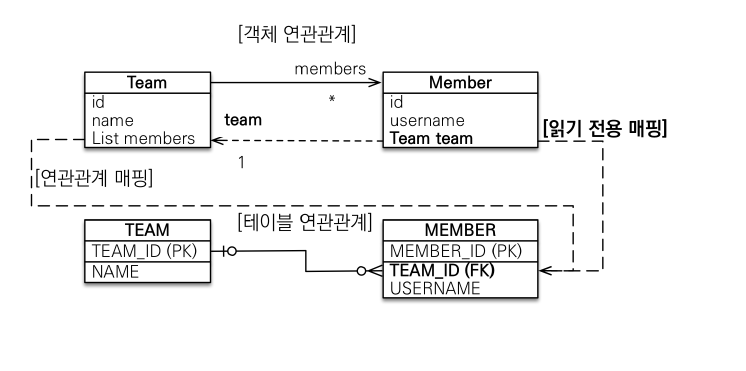
- JPA에서 지원하지는 않지만, 구현은 가능하다.
- @JoinColumn(insertable = false, updatable=false)를 통해 일기 전용 필드를 만들고 양방향처럼 사용한다.
- 다대일 양방향을 사용해라..

## 다대다(@ManyToMany)
- RDB에서는 다대다가 불가능 해서, 연결테이블을 통해서 표현한다.
- 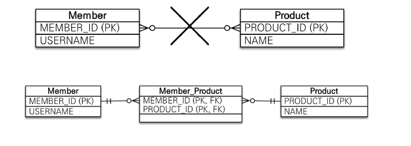
- 객체는 컬렉션으로 다대다가 가능하다.
- JPA에서 구현을 위해서 연결테이블을 만들어서 다대다가 가능하게 만든다.
- @JoinTable 어노테이션을 통해서 연결테이블을 지정한다.

## 다대다 매핑의 한계
- 실무에서 사용이 불가능하다 why?
    - 실무에서 연결 테이블은 단순한 연결의 역할만 하지 않는다.
    - 연결을 위한 FK, PK 이외에도 다른 칼럼을 관리한다.
- 쿼리도 개발자가 생각한 쿼리가 생성되지 않을 수 있다.
- 그러므로 @ManyToMany를 @OneToMany 와 @ManyToOne을 연결테이블을 엔티티로 만든다음 설정하여 사용하는 것을 한다.

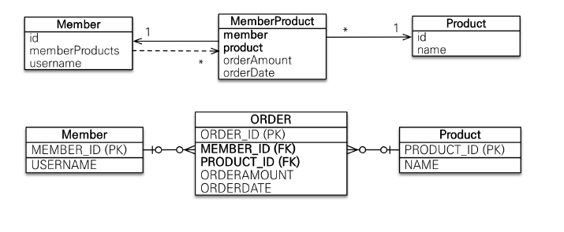

# Ch07. 고급매핑
주요 내용 : 상속관계 매핑, @MappedSuperClass, 실전예제-4. 상속관계 매핑

## 상속관계 매핑
- RDB에는 상속관계가 존재하지 않는다.
- 대신 슈퍼타입, 서브타입 관계라는 모델링 기법이 상속과 유사하다.
-> 그래서 객체의 상속의 구조와 DB의 슈퍼/서브타입 관계를 매핑한다.
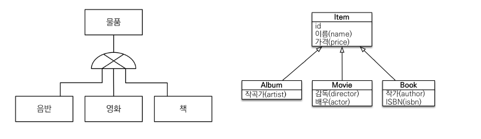

## 구현을 위한 전략 요약
- 조인 전략
    - 각각 테이블로 변환 + 공통속성을 가진 테이블
- 단일 테이블 전략
    - 통합테이블 하나를 생성하여 다 때려 넣음
- 구현 클래스마다 테이블
    - 클래스 각각이 따로 테이블을 가짐.
- 객체의 입장에서는 셋다 동일하고 어노테이션만 다름.
- JPA의 기본 전략은 SingleTalbe 전략

## 주요 어노테이션

- @Inheritance(strategy = InheritanceType.XXX)
    - XXX에 JOIN_TABLE, SINGLE_TABLE, TABLE_PER_CLASS
- @DiscriminatorColumn
    - DTYPE을 생성되게 한다.
    - DTYPE의 값으로는 Entity 명이 들어간다.
- @DiscriminatorValue
    - 자식 클래스에 구분자를 생성하는 방식
    - Default는 클래스명, 따로 지정가능.

## 조인 전략
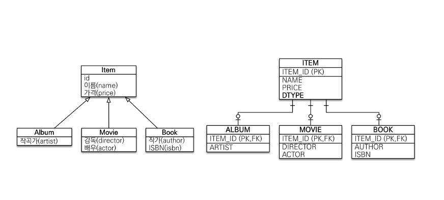
- @Inheritance(strategy=InheritanceType.JOIN_TABLE)
- 추가 : 두번 Insert된다(부모, 자식 테이블)
- 조회 : InnerJoin해서 값을 가져온다.

## 단일 테이블
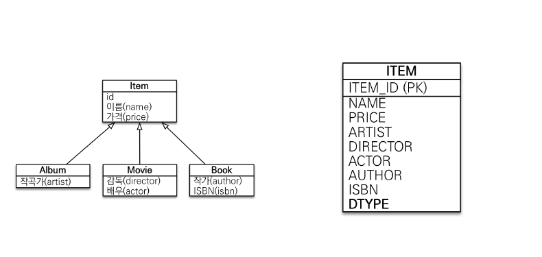
- @Inheritance(starategy=InheritanceType.SINGLE_TABLE)
- 관련 없는 값을 null으로 다 들어간다.
- Default로 DTYPE이 자동 생성된다.

## 구현 클래스마다 테이블
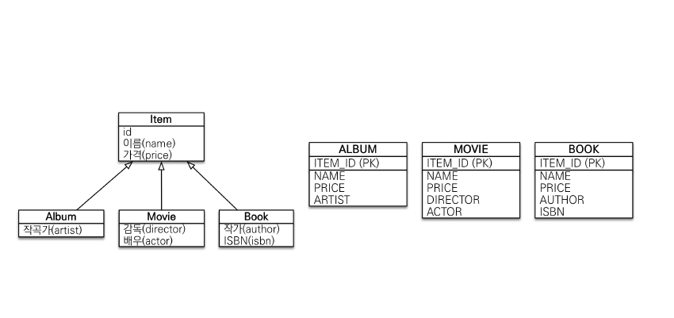
- @Inheritance(strategy=InheritanceType.TABLE_PER_CLASS)
- Item은 추상 클래스로 만들어야 제대로 적용된다.
- 부모 클래스 타입으로 조회할 시에 union이 사용되어 매우 복잡한 쿼리가 날아간다.

## 정리

- 조인전략
    - 장점
        - DB가 정규화 되어있다
        - 외래키 참조 무결성 제약조건이 가능하다.
        - 저장공간이 효율적이다
    - 단점
        - 조회시 조인이 많이 사용되어 성능이 저하된다.
        - 조회쿼리가 복잡하다
        - 저장시 Insert SQL이 2번 호출된다
- 단일테이블전략
    - 장점
        - 조인이 필요없어 조회 성능이 빠르다.
        - 쿼리가 간단하다.
    - 단점
        - 자식 엔티티 칼럼에 null 허용한다.
        - 테이블이 커지고, 그래서 성능이 더 느려질 수 있다.
- 구현클래스마다 테이블 전략 -> 쓰지말 것.
    - 장점
        - 서브타입간의 구분이 명확하다.
        - Not null이 사용가능하다.
    - 단점
        - 여러 테이블 조회시에 성능이 매우 떨어진다(Union)
        - 자식 테이블 통합관리가 어렵다.
        - 유지보수가 어렵다.

## @MappedSuperClass
- 공통 매핑 정보가 필요할 때 사용한다.
- Ex) createdBy, createdDate, lastModifiedBy, lastModifiedDate 등 공통 매핑

## @MappedSuperClass 특징
- 상속관계가 아니다!
- 엔티티가 아니고, 그러므로 테이블과 매핑되지 않는다.
- 오직 "매핑정보"만 제공한다
- 직접 클래스를 생성할 일이 없으므로, 추상 클래스가 권장된다.
- 조회, 검색이 불가능하다.

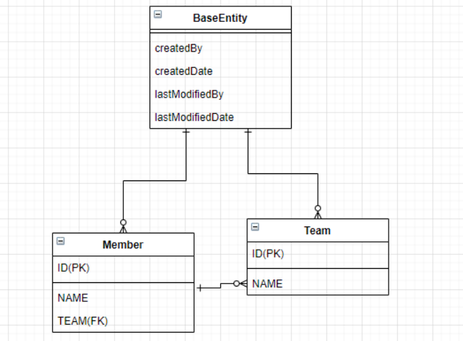

