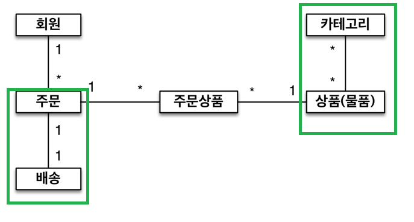

### Section 6. 다양한 연관관계 매핑

------

>  연관관계 매핑시 고려사항 

* 다중성
  * 다대일 : @ManyToOne  
  * 일대다 : @OneToMany
  * 일대일 : @OneToOne
  * 다대다 : @ManyToMany ---> *실무에서 사용하지 않음*
* 단방향, 양방향
  * **테이블**은 외래키 하나로 양쪽 조인 가능하기 때문에 **방향이라는 개념**이 없다. **객체**는 참조용 필드가 있어야 참조가 가능하다. 그렇기 때문에 한쪽만 참조하면 단방향이고, 양쪽이 참조하면 양방향이다. (즉, **단방향 2개**)
* 연관관계의 주인
  * 그렇기 때문에 객체를 테이블에 맞추기 위해서는 참조가 양방향(2개)이 필요하다. 그래서 객체의 방향이 2개이기 때문에 테이블의 1개에 맞춰서 객체도 2개 중 하나를 **진짜 주인**을 정해야한다. 

#### # 1. 다대일 (N:1)

* JPA에서 가장 많이 이용
* 다대일의 반대는 일대다
* 앞의 **section 5에서 참고!!** 
  * 다대일의 양방향 : 외래키가 있는 쪽이 연관관계의 주인

#### # 2. 일대다(1:N)

* 1 방향에서 주인이 되는 경우를 뜻한다.

* 해당 *모델은 권장하지 않는다.*

  > 일대다의 단방향
  * 예시 : 팀은 멤버를 알고 싶은 경우가 많지만 멤버에서 팀을 알 필요가 없는 비지니스 로직인 경우

  

  * DB 입장에서 무조건 "다" 쪽에 외래키가 들어간다. (객체는 일이 연관관계의 주인) --> *차이점 발생*

  * 객체는 List members가 연관관계의 주인임. 그래서 team.getMembers.add를 통해서 팀에 멤버를 추가하면 **Member 테이블에 update**가 일어난다.

    

  >  일대일의 주의점 : 

  * Team entity를 변경했는데 Member table이 update 된 것이 아이러니
    * 즉, 객체와 테이블의 차이때문에 반대편 테이블의 외래키를 관리하는 특이한 구조가 발생
  * **해결** : member에서 team으로 갈 일이 없더라도(비지니스적으로), member의 Team을 추가하여 연관관계 주인으로 만들고, 양방향으로 만들어 처리한다. 

  * **일대다를 하기 위해서는 @OneToMany 밑에 JoinColumn을 꼭 사용**해야한다. 
    * 그렇지 않으면, 조인 테이블이 생성된다. Team_Member라는 **중간 테이블 자동생성** 됨.
    * 중간 테이블의 단점 : 성능이 안 좋고, 운영하기 쉽지 않음.

  

  > 일대다의 양방향 *(공식적이지는 않지만 어찌저찌해서 가능하게 만들 수는 있음.)*
  * @ManyToOne 밑에 

  * @JoinColumn(name = "TEAM_ID", insertable=false, updatable=false) 추가

    * 매핑하고 *읽기 전용*으로 만드는 것 

    

#### # 3. 일대일 (1:1)

* 일대일의 반대는 일대일이다.
* 외래키에 데이터베이스 유니크 제약 조건이 추가되면 된다.
  *  다대일 외래키와 동일하다.

* 주 테이블이나 대상 테이블 중 어디 곳이나 외래키 선택 가능
  * 주 테이블 외래키 단방향 (주테이블이란 자주 access하는 테이블을 의미)
  * 대상 테이블 외래키 단방향
  
  
  
  > 일대일 단방향과 양방향
  
  * **양방향 매핑** 은 **외래키**가 있는 곳이 *주인* 이다.
  * 반대편은 mappedBy 적용
  
  
  
  > 일대일의 주의점
  
  * 일대일은 entity의 외래키는 내가 연관관계의 주인이여야 가능.
    * 테이블의 외래키가 있는 곳에 연관관계의 주인이 지정되어 있어야 함. 그러지 않으면 아예 불가하다. 
    * 즉, member 테이블 안에 FK를 가지고 있는 경우, 동일하게 member 객체 안에서 locker를 연관관계 주인으로 설정해야 함.
  * DBA와 충돌가능성
    * 외래키를 누가 갖고 있는 것이 좋은가?
      * member가 locker FK를 가지고 있는 경우 (주 테이블에 외래키) -> *개발자 선호*
      * locker가 member FK를 가지고 있는 경우 (대상 테이블에 외래키) -> *DBA 선호*
    * 미래 관점으로 봤을 때, 미래에 한 명의 멤버가 여러 개의 라커를 소유할 수 있다고 변경했을 경우
      * 전자는 변경 포인트가 많아지는 반면,
      * 후자는 Member_ID FK에 유니크 제약조건만 빼면 된다.
    * 반대로, 하나의 라커가 여러개의 멤버를 가질 경우에는 반대.
    *  개발자 입장에서는 전자 즉, member가 locker FK를 가지고 있는 경우 성능적으로 더 유리하다.
      * 예를 들어, 라커에 값이 있는 경우에만 어떤 로직을 도는 조건문이 있다면,
      * 보통 비지니스에서 멤버는 항상 조회하기 때문에 멤버의 라커 값이 있는지 없는지 바로 확인할 수 있음.
      * 즉, 쿼리 한번으로 한번에 해결가능한 이점이 존재한다.
    * 김영한님은 너무 먼 미래를 생각하지 않고 **개발자에게 편한 것으로 우선 구성**한다.
  
  
  
  > 주 테이블, 대상 테이블 외래키 장단점
  
  *  주 테이블
    * 장점 : 주 테이블만 조회해도 대상 테이블에 데이터가 있는 확인 가능
    * 단점 : 값이 없으면 외래 키에 null 허용
  * 대상 테이블
    * 장점 : 주 테이블과 대상 테이블을 일대일에서 일대다로 변경했을 때 테이블 구조가 유지된다.
    * 단점 : 
      * JPA 입장에서 어쩔 수 없이 **양방향**으로 만들어야 한다. (주로 member에서 locker로 access하기 때문에)
      * 프록시 기능의 한계로 이 관계에서는 지연 로딩으로 설정해도 항상 **즉시 로딩**된다.
        * 프록시 객체를 만들기 위해서는 locker에 값이 있는지 없는지를 알아야 한다. 
        * 즉, Member에 locker를 조회하면 Member table만 조회해서는 안된다. 
        * 어차피 Locker table을 조회해야하기 때문에 **쿼리가 나오게 됨**. 그러므로 지연 로딩으로 설정해도 즉시 로딩됨.

#### # 4. 다대다 (N:M)

* 실무에서 사용하지 않는다. 

* 관계형 데이터베이스는 다대다 관계를 테이블 2개로 표현할 수 없지만, 객체는 2개의 객체로 해결할 수 있다.

  

  > 단방향

  * @ManyToMany 사용
  * 연관관계 주인에 @JoinTable로 연결 테이블 지정한다.

  > 양방향

  * @ManyToMany(mappedBy = "products")

  

  > 다대다 매핑 한계

  1. 편리해 보이지만 실무에서 사용하지 않는다.
  2. 연결 테이블은 추가 정보가 들어올 수 없다. 하지만 실무에서는 추가 정보가 필요하다.
  3. 쿼리가 생각지 못하게 나올 수 있다.

  

  > 다대다 한계 극복

  * 연결 테이블용 엔티티로 만들고,

  

  * @ManyToMany를 @OneToMany, @ManyToOne으로 만듦.

  

  * 이렇게 하면 **추가적인 정보**를 쓸 수 있다.
  * MEMBER_ID, PRODUCT_ID 두 개를 묶어서 PK를 만드는 것보다 아무 의미없는 값을 PK로 쓰는 것이 좋기 때문에 **@GeneratedValue를 사용**하는 것이 좋다.

  

### Section 7. 고급 매핑

-------

#### # 상속관계 매핑

* 관계형 데이터베이스는 상속 관계가 존재하지 않는다.
* 그러나 슈퍼타입, 서브타입 관계가 객체의 상속과 유사하다.
* 객체의 상속과 DB의 슈퍼타입, 서브타입 관계를 매핑
* **조인 전략을 기본**으로 생각하고, 상황에 따라서 조인 전략의 장단점과 단일 테이블의 장단점을 **비교해서 알맞는 전략을 선택**하면 된다. 
  * 데이터가 단순하면, 보통 단일 테이블 전략을 선택

* 구현하는 방법

  * 조인 전략 : **각각 테이블**로 변환 -> 테이블을 각각 만들고 데이터를 Join으로 가져온다
    * 보통 insert 2번이 발생함.
    * **DTYPE** : ITEM에 *@DiscriminatorColumn* 을 추가하면 어떤 타입인지 알 수 있다.
    * 즉, MOVIE, BOOK, ALBUM인지 알 수 있다. (default 값은 **entity name**)
    * DTYPE에 나오는 값을 entity name이 아닌 다른 이름으로 바꾸고 싶다면,
    * 예 : MOVIE 라는 class 위에 *@DiscriminatorValue("M")* 바꾸면 DTYPE이 M으로 나온다.

  

  * 단일 테이블 전략 : **통합 테이블**로 변환
    * **DTYPE이 필수적**이기 때문에 *@DiscriminatorColumn* 을 추가하지 않아도 **자동 생성**된다.

  

  * 구현 클래스 테이블 전략 : **서브타입 테이블**로 변환

  

> 조인 전략

​	

* 장점

  * 테이블의 정규화 되어 있음
  * 외래키 참조 무결성 제약조건 활용가능
  * 저장 공간 효율화

* 단점

  * 조회시 조인을 많이 사용, 성능 저하 / 조회 쿼리가 복잡

    

  * 데이터 저장시 insert SQL 2번 호출

    

> 단일 테이블 전략

* 장점

  * 조인이 필요없으므로 일반적으로 조회 성능이 빠르다.

  

  * 조회 쿼리가 단순하다.

* 단점

  * 자식 엔티티가 매핑한 컬럼은 모두 null을 허용해야 한다.
  * 단일 테이블에 모든 것을 저장하므로 테이블이 커질 수 있다. 그래서 오히려 상황에 따라서 조회 성능이 느려질 수 있다.

> 구현 클래스마다 테이블 전략

​	

* 이 전략은 데이터베이스 설계자와 ORM 전문가 **둘 다 추천하지 않는다.**
* 장점
  * 서브 타입을 **명확하게 구분**해서 처리할 때 효과적
  * not null 제약 조건 사용가능
* 단점
  * 여러 자식 테이블을 함께 조회할 때 성능이 느리다(**UNION** SQL 필요)
  * 자식 테이블을 통합해서 쿼리하기 어려움.
    * 변경이라는 관점에서 많은 수정이 요구됨

#### # Mapped Superclass - 매핑 정보 상속

* **공통 매핑 정보**가 필요할 때 사용한다. 

* 예를 들어, 변경한 날짜, 변경한 사람 등 공통 속성이 필요한 경우, 상속해서 처리한다.

* *@MappedSuperclass* : 매핑 정보만 상속받는 경우에 사용

  
  
  > 주의점
  
  * 상속관계 매핑이 아니다, 엔티티도 아니다. 그러므로 테이블과 매핑할 수 없다.
  * 조회, 검색 불가능하다.
  * 직접 생성해서 사용할 일이 없으므로 **추상 클래스 권장**

* **@Entity 클래스는 엔티티나 @MappedSuperclass로 지정한 클래스만 상속 가능하다.**

### 실전예제 3, 4

------------

> 실전예제 3

* 배송, 카테고리 추가

  * 주문과 배송은 1 : 1
  * 상품과 카테고리는 N : M

  

  

* 예시에서는 다대다 테이블을 만들었지만, 실무에서는 중간 테이블을 사용하지 않는다.
  * ManyToMany는 필드 추가할 수 없고, 엔티티 테이블이 불이치하기 때문

> 실전예제 4

* 상품 종류는 음반, 도서, 영화가 있으며, 이후 더 확장될 수 있다.
* 모든 데이터는 등록일과 수정일이 필수이다.

* 실제 실무에서 사용하는가?

  * 초기에 데이터가 많지 않은 경우는 상속관계로 사용할 수도 있다.

  * 그러나 데이터가 엄청 많은 경우에는 테이블을 단순하게 유지하기위해서 json으로 사용함

    

> 참고

