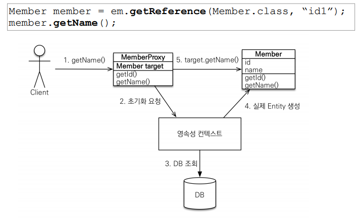
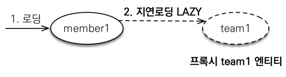
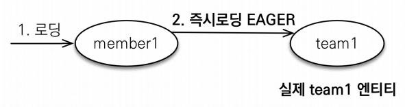

# 프록시와 연관관계 관리

## 프록시

### 프록시 기초

- `em.find()` vs `em.getReference()`
  - 데이터베이스로 실제 엔티티 조회 vs 데이터베이스에서 조회하지않은 프록시 엔티티 조회
  - 실제 데이터를 가지고 있는 엔티티 vs 일단 id만 가지고 있음
  - 실제 쿼리가 나감 vs 실제 쿼리가 나가지 않음 ( 실제 값이 사용시 쿼리가 나감 )

### 프록시

- 실제 클래스를 상속 받아 만들어짐
- 실제 클래스아 겉모양이 같다
- 사용하는 입장에서는 진짜 엔티티인지 프록시인지 구분할 필요 X

### 프록시 특징

- 실제 객체의 참조(target)를 보관
- 프록시 객체를 호출하면, 프록시 객체는 실제 객체 메소드를 호출

### 프록시 객체의 초기화와 특징



- 처음은 target이 null
- 실제 갑을 요청하게 되면, 영속성 컨텍스트를 통해 초기화
  - 영속성 컨텍스트에 존재하면 그 값을 가져옴
  - 없다면, DB에서 조회하여 초기화를 함
- 프록시 객체는 처음 한 번만 초기화하게 됨
- 초기화했다고 **실제 클래스로 바뀌는게 아님**
  - target에 원본 엔티티의 reference를 가지고 있다고 생각하면 됨
- 프록시 객체는 원본 엔티티를 상속받음, 따라서 **타입 체크시 주의** ( `instance of` 를 사용 )
- 영속성 컨텍스트에 이미 원본 엔티티가 존재하면, em.getReference를 **호출해도 실제 원본 엔티티**가 반환된다. ( 프록시가 되지 않음. )
  - 프록시가 영속성 컨텍스트에 존재한다면, em.find로 조회되는 엔티티도 프록시로 반환된다.
- 영속성 컨텍스트의 도움을 받을 수 없는, 준영속 상태일 때는 프록시를 초기화하면 문제가 생긴다.

  ```java
  em.flush();
  em.clear();

  Member refMember = em.getReference(Member.class, member.getId());

  em.detach(refMmember); // 혹은, em.clear();

  // 여기서 LazyInitializationException 에러 발생
  System.out.println("refMember = " + refMember.getUsername());
  ```

### 프록시 확인

- 프록시 인스턴스의 초기화 여부 확인
  - `emf.getPersistenceUnitUtil().isLoaded(entity))`
- 프록시 클래스 확인 방법
  - `entity.getClass()`
- 프록시 강제 초기화
  - `org.Hibernate.initialize(entity)`
- 강제 호출 ( 데이터를 조회함으로써, 강제적으로 데이터를 가져와 초기화 )
  - `member.getName()`

이렇게 프록시의 내용을 이해해야 즉시로딩과 지연로딩을 이해할 수 있다.

## 즉시로딩과 지연로딩

### 지연로딩

지연 로딩 LAZY를 사용해서 프록시로 조회.

- `fetch = FetchType.LAZY` 를 통해 지연로딩



```java
public class Member {
  @Id
  @GeneratedValue
  private Long id;

  @Column(name = "USERNAME")
  private String name;

  @ManyToOne(fetch = FetchType.LAZY)
  @JoinColumn(name = "TEAM_ID")
  private Team team;
}
```

Member를 조회시 Member의 값들만 가져오고, Team의 값은 실제 사용시에 쿼리를 보내 그 때 데이터를 초기화;

### 즉시로딩

즉시 로딩 LAZY를 사용해서 프록시로 조회.

- `fetch = FetchType.EAGER` 를 통해 즉시로딩
  => 연관된 객체를 같이 사용하게 되는 경우가 많다면, 즉시로딩이 이득이있다.



```java
public class Member {
  @Id
  @GeneratedValue
  private Long id;

  @Column(name = "USERNAME")
  private String name;

  @ManyToOne(fetch = FetchType.EAGER)
  @JoinColumn(name = "TEAM_ID")
  private Team team;
}
```

Member를 조회시 Member와 Team의 값을 모두 한꺼번에 가져옴.

### 주의

- 일단 모두 지연로딩으로 설정하자.
- 즉시로딩을 적용하게 되면 예상치 못한 SQL이 나감.
  - 말도 안되게 많은 테이블들이 한꺼번에 연속적으로 조회될 수 있음.
- 즉시로딩은 JPQL을 사용하게 될 때 N+1 문제를 발생시킨다.
  - 1개의 데이터를 가져올 때, N개의 추가적인 쿼리가 나가게 되는 것.
- `@ManyToOne`, `@OneToOne`은 기본적으로 즉시로딩으로 설정되어있다.
  - LAZY로 직접 설정하자.
- `@OneToMany`, `@ManyToMany`은 기본적으로 지연로딩으로 설정되어있다.

=> LAZY를 일단 깔고가고, 필요한 경우에만 EAGER를 쓰자.

### 지연로딩 활용

- Member와 Team을 함께 사용 => 즉시 로딩
- Member와 Order는 가끔 함께 사용 => 지연 로딩
- Order와 Product는 자주 함께 사용 => 즉시 로딩

### 실무에서

- 모든 연관관계는 지연 로딩을 사용
- 실무에서 즉시 로딩을 사용하지마라
- JPQL fetch 조인이나, 엔티티 그래프 기능을 사용해라
- 즉시 로딩은 상상하지도 못한 쿼리가 나간다!

## 영속성 전이 : CASCADE

- 부모 엔티티를 영속 상태로 만들 때, 자식 엔티티도 함께 영속상태로 만들고 싶을 때 사용
  - ex) 부모 엔티티를 저장할 때 자식 엔티티도 함께 저장

## 영속성 전이 : CASCADE 주의!

- 영속성 전이는 연관관계 매핑과 아무 관련 없다.
- 엔티티를 영속화할 때 연관된 엔티티도 함께 영속화하는 편리함을 제공한다.

### CASCADE의 종류

- **ALL : 모두 적용**
- **PERSIST : 영속**
- **REMOVE : 삭제**
- MERGE : 병합
- REFRESH : refresh
- DETACH : detach

하나에서 관리하는 경우에만 영속성 전이를 사용한다.

parent만 child를 관리할 때, 만약 child가 다른 곳에서도 연관 관계를 갖고 있을 경우 영속성 전이를 사용 X

## 고아객체

- parent의 참조가 삭제되면, child를 고아라고 생각하고 child도 함께 삭제
- 참조하는 곳이 하나일 때만 사용!
- 특정 엔티티가 개인 소유할 때만 사용
- `@OneToOne`, `@OneToMany`만 사용 가능
- 개념적으로 부모 자체가 삭제되도 자식은 고아가 되기 때문에, 부모가 삭제된 경우에도 자식도 자동 삭제된다. CascadeType.REMOVE처럼 동작한다.

## 영속성 전이 + 고아 객체, 생명주기

- CascadeType.ALL + orphanRemovel=true
- 스스로 생명주기를 관리하는 엔티티는 `em.persist()`로 영속화, `em.remove()`로 제거
- 두 옵션을 모두 활성화하면 부모 엔티티를 통해 자식의 생명주기를 관리할 수 있음.
  - parent를 JPA로 관리하고, child를 parent가 관리.
- DDD의 Aggregate Root 개념을 구현할 때 유용하다.
