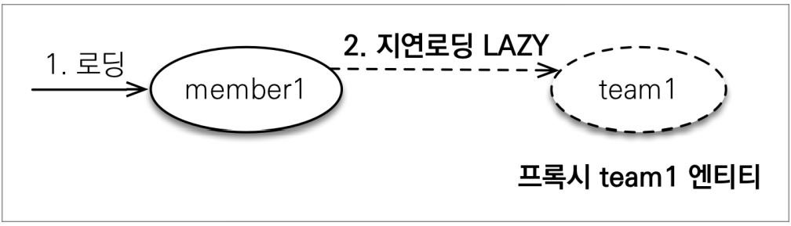

# 5주차(Ch08. 프록시와 연관관계 관리)

## 8.1 프록시

**프록시란?**
```
Proxy.

사전에서는 대리(행위)나 대리권, 대리 투표, 대리인 등을 뜻

책에서 말하는 프록시 객체란 실제 엔티티 객체 대신에
데이터베이스 조회를 지연할 수 있는가짜 객체를 의미함.
```

**프록시 패턴**
```
프록시 패턴(proxy pattern)은 컴퓨터 프로그래밍에서 소프트웨어 디자인 패턴의 하나이다.
일반적으로 프록시는 다른 무언가와 이어지는 인터페이스의 역할을 하는 클래스이다. 
프록시는 어떠한 것(이를테면 네트워크 연결, 메모리 안의 커다란 객체, 파일, 또 복제할 수 없거나 수요가 많은 리소스)과도 인터페이스의 역할을 수행할 수 있다.

[위키백과]

실제 기능을 수행하는 객체Real Object 대신 가상의 객체Proxy Object를 사용해
로직의 흐름을 제어하는 디자인 패턴

[블로그 글](https://jdm.kr/blog/235)
```

**프록시 패턴의 특징**
- 원래 하려던 기능을 수행하며 그외의 부가적인 작업(로깅, 인증, 네트워크 통신 등)을 수행하기에 좋습니다.
- 비용이 많이 드는 연산(DB 쿼리, 대용량 텍스트 파일 등)을 실제로 필요한 시점에 수행할 수 있습니다.
- 사용자 입장에서는 프록시 객체나 실제 객체나 사용법은 유사하므로 사용성이 좋습니다.

### 프록시 패턴은 언제 사용될까?

- 엔티티를 조회할 때 연관된 엔티티들이 항상 함께 사용되는 것이 아니다.
- 그러므로, 객체조회시에 연관된 객체까지 한꺼번에 조회되는 것은 성능상의 저하가 크다.
- 이런 문제해결을 위해, 엔티티가 실제 사용될 때까지 데이터 베이스조회를 지연하는 **지연로딩**을 제공한다.
- 지연로딩을 수행하기위해 데이터 베이스 조회 지연을 위한 **프록시 객체**를 하이버네이트에서 지원한다.

### 참고
* 하이버네이트에서는 프록시를 통한 지연 로딩 설정이외에 바이트코드 수정을 통한 설정을 지원한다.
* JPA @OneToOne Lazyloading을 위한 hibernate bytecode 조작(https://kwonnam.pe.kr/wiki/java/hibernate/lazy_to_one)
* JPA OneToOne 관계에서 lazy로딩이 잘 동작하지 않아서, bytecode를 조작하거나 직접구현하는 등의 방식을 취한 것 같다.

### 프록시 기초
- 실제 사용시점까지 DB조회를 미루고 싶으면 EntityManager.getReference()를 이용


**프록시의 특징**
- 실제 클래스를 상속받아 만들어지기 때문에, 실제 클래스와 겉모양이 같음.
- 그러므로, 진짜 객체인지 프록시 객체인지 구분하지 않고 사용하면 된다.
- 프록시 객체는 실제 객체에 대한 참조(target)를 보관한다, 프록시 객체의 메소드를 호출하면, 프록시 객체는 실제 객체의 메소드를 호출한다.


**프록시 객체의 초기화**
- 데이터베이스에 접근하여 실제 엔티티 객체가 생성될 때 프록시 객체의 초기화가 일어난다.
```java
Member member = em.getReference(Member.class,"id1");
member.getName()// 실제 DB 접근 발생

```
```java
class MemberProxy extends Member{
    Member target=null;

    public String getName(){
        if(target==null){
            ...
        }
        return target.getName();
    }
}
```


**프록시의 특징 정리**
- 프록시 객체는 처음 사용할 때 한 번만 초기화 된다.
- 프록시 객체를 초기화하는 건 프록시가 실제 엔티티로 바뀌는게 아니다.
  초기화되면 프록시 객체를 통해 실제 엔티티에 접근할 수 있다.
- 프록시 객체는 원본엔티티를 **상속**받았기 때문에 타입비교시 instance of를 사용해야한다.(== 불가)
- 영속성 컨텍스트에 엔티티가 이미 있으면 em.getReference()를 호출해도 실제 엔티티를 반환한다.
  (동일 객체에 대한 비교시 일관됨을 보장해줘야 하기 때문에.)
- 초기화는 영속성 컨텍스트를 통해서만 가능하다.
- 그로인해, 준영속 상태의 프록시를 초기화하면 문제가 발생한다.(LazyInitializationException 발생)

**준영속 상태 초기화**
```java
transaction.begin();
Member member=em.getReference(Member.class,"id1");
transaction.commit();
em.close();

member.getName();// 준영속 상태이므로 에러 호출됨.
```

### 프록시 확인
- 프록시 객체의 초기화 여부 확인
PersistenceUnitUtil.isLoaded(Object entity)
```java
boolean isLoad=em.getEntityManagerFactory()
                 .getPersistenceUntiUtil().isLoaded(entity); 
```
- 프록시 클래스 확인방법
entity.getClass().getName() 출력

- 프록시 강제 초기화(hibernate를 통해)
org.hibernate.Hibernate.initialize(entity);

- 프록시 초기화
member.getName()과 같이 메소드 호출.

## 8.2 즉시 로딩과 지연 로딩
- JPA는 개발자과 연관된 엔티티의 조회 시점을 선택할 수 있도록 두가지 방법을 제공한다.

- 즉시로딩: 엔티티를 조회할 때 연관된 객체도 함께 조회
    - EX) em.find(Member.class,"member") 호출시 연관된 팀객체도 함께 조회
    - 설정방법: @ManyToOne(fetch=FetchType.EAGER)
- 지연로딩: 연관된 엔티티를 실제 사용할 때 조회
    - EX) member.getTeam().getName() 처럼 실제 사용하는 시점에
    - 설정방법: @ManyTone(fetch=FetchType.LAZY)

### 8.2.1 즉시 로딩
- fetch 속성을 FetchType.EAGER로 설정.

```java
@Entity
public class Member{
    //...

    @ManyToOne(fetch=FetchType.EAGER)
    @JoinColumn(name="TEAM_ID")
    private Team team;
}
```


- 즉시 로딩시 내부적으로 쿼리를 여러번 실행하는 것보다는,
되도록 조인쿼리를 이용한다.
- JPA는 **선택적 관계(Null가능)**면 **외부 조인(Null불가)**을 사용하고, **필수 관계**면 **내부 조인**을 사용한다.

### 8.2.2 지연 로딩
- fetch 속성을 FetchType.LAZY로 지정한다.

```java
@Entity
public class Member{
    @ManyToOne(fetch=FetchType.LAZY)
    @JoinColumn(name="TEAM_ID")
    private Team team;
}
```


### 8.2.3 즉시 로딩, 지연 로딩 정리
- 지연 로딩(LAZY): 연관된 엔티티를 프록시로 조회한다. 프록시를 실제 사용할 때 초기화하면서 DB를 조회한다.
- 즉시 로딩(EAGER): 연관된 엔티티를 즉시 조회한다. 하이버네이트는 가능하면 **SQL조인**을 이용해서 한 번에 조회한다.

### 프록시와 즉시로딩 주의
- 가급적 "지연 로딩"만 사용할 것 why? 실무의 경우에는 여러 개의 테이블이 연관관계 하에 있으므로
- 즉시로딩 적용시, 예상치 못한 SQL 발생
- 즉시로딩은 JPQL에서 N+1 문제를 발생시킨다.
- @ManyToOne, @OneToOne은 기본이 즉시로딩 -> LAZY로 설정해주기.
- @OneToMany, @ManyToMany는 기본이 지연로딩

### N+1문제
- [N+1문제 정의](https://incheol-jung.gitbook.io/docs/q-and-a/spring/n+1)
- [JPA N+1 문제 해결방안](https://jojoldu.tistory.com/165)

**N+1 문제란?**
```
연관 관계에서 발생하는 이슈로 연관 관계가 설정된 엔티티를 조회할 경우에 조회된 데이터 갯수(n) 만큼 연관관계의 조회 쿼리가 추가로 발생하여 데이터를 읽어오게 된다. 
```
**왜 발생하는가?**
```
JpaRepository에 정의한 인터페이스 메서드를 실행하면 JPA는 메서드 이름을 분석해서 JPQL을 생성하여 실행하게 된다. 
JPQL은 SQL을 추상화한 객체지향 쿼리 언어로서 특정 SQL에 종속되지 않고 엔티티 객체와 필드 이름을 가지고 쿼리를 한다. 
그렇기 때문에 JPQL은 findAll()이란 메소드를 수행하였을 때 해당 엔티티를 조회하는 select * from Member 쿼리만 실행하게 되는것이다.
-> 사용자가 생각한 쿼리와 실제 수행되는 쿼리가 다름!!
JPQL 입장에서는 연관관계 데이터를 무시하고 해당 엔티티 기준으로 쿼리를 조회하기 때문이다. 그렇기 때문에 연관된 엔티티 데이터가 필요한 경우, FetchType으로 지정한 시점에 조회를 별도로 호출하게 된다.
```

**해결방안**
- Fetch 조인을 이용해서 호출 시점에 모든 데이터를 가져오도록 만든다.

## 8.4 영속성 전이: CASCADE
- 특정 엔티티를 영속 상태로 만들 때 연관된 엔티티도 함께 영속 상태로 만들고 싶은 경우 사용.
 ex) 영속성 전이를 통해 부모 엔티티 저장할 때, 자식 엔티티 함께 저장.

**부모 엔티티**
 ```java
 @Entity
 public class Parent{
     @Id @GeneratedValue
     private Long id;

     @OneToMany(mappedBy = "parent", cascade = CascadeType.Persist)
     private List<Child> children = new ArrayList<Child>();
 }
 ```
 **자식 엔티티**
 ```java
 @Entity
 public class Child{
     @Id @GeneratedValue
     private Long id;

     @ManyToOne
     private Parent parent;
 }
 ```
 **CASCADE 저장 코드**
 ```java
 public static void saveWithCascade(EntityManager em){
     Child child1 = new Child();
     Child child2 = new Child();

     Parent parent = new Parent();
     child1.setParent(parent);
     child2.setParent(parent);
     parent.getChildren().add(child1);
     parent.getChildren().add(child2);
 }

 em.persist(parent);
 ```
 

 ### 8.4.3 CASCADE의 종류

 ```java
public enum CascadeType {

    /** Cascade all operations */
    ALL,

    /** Cascade persist operation */
    PERSIST,

    /** Cascade merge operation */
    MERGE,

    /** Cascade remove operation */
    REMOVE,

    /** Cascade refresh operation */
    REFRESH,

    /**
     * Cascade detach operation
     *
     * @since Java Persistence 2.0
     *
     */
    DETACH
}

//여러 속성 함께 사용가능
 @Entity
 public class Parent{
     @Id @GeneratedValue
     private Long id;

     @OneToMany(mappedBy = "parent", cascade = {CascadeType.Persist, CascadeType.REMOVE})
     private List<Child> children = new ArrayList<Child>();
 }
 ```

 ## 8.5 고아 객체
 - 고아 객체 : 부모 엔티티와 연관관계가 끊어진 자식엔티티
 - JPA에서는 부모 엔티티와 연관관계 끊어진 자식 엔티티를 자동으로 삭제하는 기능을 제공한다.
 - orphanRemoval = true 으로 설정
 - 고아 객체 삭제 기능은, **참조하는 객체가 하나 일 때만 사용(종속적인 경우)**
 - @OneToOne, @OneToMany에만 사용 가능함.

 ## 8.6 영속성 전이 + 고아 객체, 생명주기
 - CascadeType.ALL + orphanRemoval =true를 동시에 사용할 시 어떻게 적용될까?
 - 부모 엔티티를 통해서 자식의 생명주기를 관리할 수 있음!

 **자식을 저장하고 싶을 때**
 ```java
 Parent parent=em.find(Parent.class, parentId);
 parent.addChild(child1);
 ```

 **자식을 삭제하고 싶을때**
 ```java
 Parent parent = em.find(Parent.class, parentId);
 parent.getChildren().remove(removeObject);
 ```

 ## 8.7 정리
 - JPA 구현체들은 객체탐색을 지원하는데, 이때 프록시 기술을 사용한다.
 - 즉시로딩 : 객체 조회시 연관된 객체를 즉시 로딩하는 방법
 - 지연로딩 : 객체 조회시 연관된 객체를 지연해서 로딩하는 방법
 - 영속성전이 : 객체를 저장하거나 삭제할 때 연관된 객체도 함께 저장하거나 삭제하는 방법
 - 고아객체제거 : 부모 엔티티와 연관관계가 끊어진 자식 엔티티를 자동으로 삭제하는 방법