# Section 8. 프록시와 연관관계 관리


### # 프록시

* em.find() : 데이터 베이스를 통해서 실제 엔티티 객체 조회

* em.getReference() : 데이터베이스 조회를 미루는 가짜(proxy) 엔티티 객체 조회

  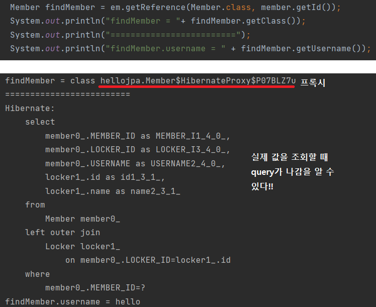

  

> 프록시

* 실제 클래스를 상속받아서 만들어진다. 그래서 실제 클래스와 겉 모양이 같다

  * 이 프록시는 하이버네이트가 내부적으로 라이브러리를 사용해서 만듦.

* 이론상, 사용하는 입장에서는 진짜 객체인지, 프록시 객체인지 구분하지 않고 사용하면 된다.

* 프록시 객체는 실제 객체의 참조(target)를 보관

* 프록시 객체를 호출하면, 프록시 객체는 실제 객체 메소드를 호출

  ​	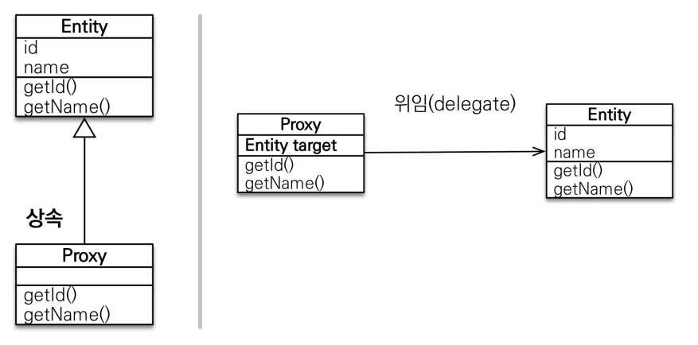


> 프록시 객체 초기화

1. 프록시 객체를 처음 가져오면 target은 null이다.

2. 이때, member.getName() 등으로 실제 값을 호출하는 경우 영속성 컨텍스트로 **초기화 요청**을 하게 된다.

3. 영속성 컨텍스트에서는 있는지 여부를 확인한 후 없을 경우 실제 DB query를 보낸다.

4. 그리고 query를 통해 실제 Entity를 생성하고,

5. 프록시의 target을 실제 Entity와 연결한다. 

6. 그리고 실제 Entity의 member.getName()을 통해 값을 반환한다.

   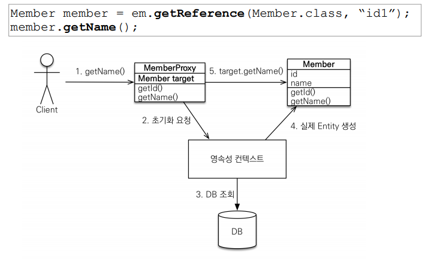


> 프록시의 특징

* 프록시는 처음 사용할 때 한번만 초기화된다.

  * 프록시가 초기화된 상태에서는 member.getName()을 한번 더 호출해도 query를 호출하지 않는다.

* 프록시 객체를 초기화할 때, **프록시 객체가 실제 엔티티로 바뀌는 것은 아니다.** 초기화되면, 프록시 객체를 통해서 실제 엔티티에 접근 가능

* 프록시 객체는 원본 엔티티를 상속받는다. 그래서 **타입 체크시 주의**해야 한다.

  * == 비교 실패 가능성 : 프록시와 실제 객체가 비교될 가능성이 존재. 이 경우, 타입이 맞지 않기 때문에 false 나온다.
  * 그래서, **instanceof** 사용하기!!

  ``` java
  Member m1 = em.Find(Member.class, member1.getId());
  Member m2 = em.getReference(Member.class, member2.getId());
  
  // 하나는 프록시, 하나는 실체 객체일 경우 false 로 나옴
  System.out.println("m1 == m2: " + (m1.getClass() == m2.getClass()));
  
  // 그래서 instanceof를 사용
  System.out.println("m1 == m2: " + (m1.instanceof Member));
  System.out.println("m1 == m2: " + (m2.instanceof Member));
  ```

* 영속성 컨텍스트에 **찾는 엔티티가 이미 있으면**, em.getReference()를 호출해도 **실제 엔티티**가 반환된다.

  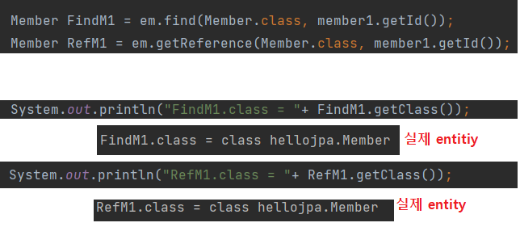

* 반대로, **proxy가 영속성 컨텍스트에 먼저 저장이 되면, 다음 조회하는 엔티티 클래스도 프록시로 반환**한다.

  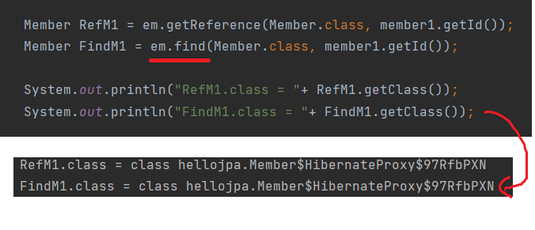

  * !!! JPA는 같은 영속성 컨텍스트에서 조회하면, == 의 비교가 **항상 같다는** 결과값을 도출 해야한다. 

* 영속성 컨텍스트의 도움을 받을 수 없는 준영속 상태일 때, 프록시 초기화할 경우 문제 발생

  * em.close() or em.detach(entity) or em.clear()
  * 하이버네이트는 *LazyInitializationException* : could not initialize proxy - no session 예외 출력


> 프록시 확인

* 유틸리티 메소드

* 프록시 인스턴스의 초기화 여부 확인

  * ```java
    EntityManagerFactory emf = Persistence.createEntityManagerFactory("hello");
    
    System.out.println("isLoaded: "+emf.getPersistenceUnitUtil().isLoaded(entity));
    ```

* 프록시 클래스 확인 방법

  * ``` java
    entity.getClass()
    ```

* 프록시 강제 초기화

  * ``` java
    // 첫번째 방법
    Hibernate.initialize(entity); // 강제 초기화
    // 두번째 방법
    member.getName(); // 이것도 가능! 
    ```


### # 즉시로딩과 지연로딩

> 지연로딩 LAZY

* 비지니스 로직상 멤버를 주로 가져오고, 멤버를 조회할 때 팀도 함께 조회할 필요없는 경우에 **LAZY**를 사용한다. 
* Member class 안에 team @ManyToOne(fetch = FetchType.LAZY)로 설정하면 된다.
* 그러면, 멤버를 조회시 **팀은 프록시**로 가져오고, **팀의 값을 조회하는 경우에 팀에 관련된 query**가 나가면서 초기화가 된다.

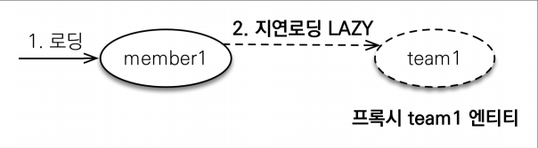

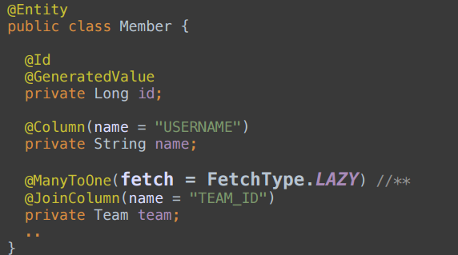

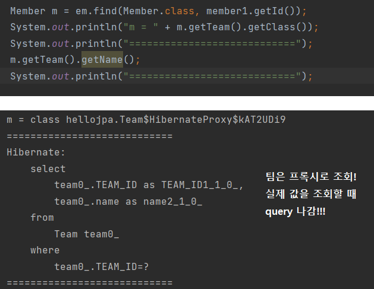


> 즉시로딩

* 멤버와 팀을 한꺼번에 사용하는 경우
* Member class 안에 team @ManyToOne(fetch = FetchType.EAGER)로 설정하면 된다.
* 처음부터 멤버를 조회할 때, **join을 통해 team**도 가져온다. 한번에 가져오기 때문에 team은 프록시가 아닌 **진짜 entity**임

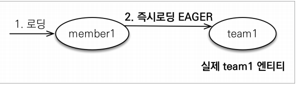

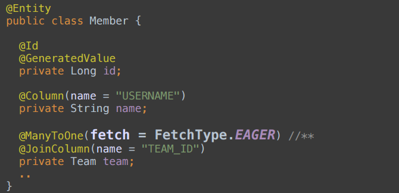

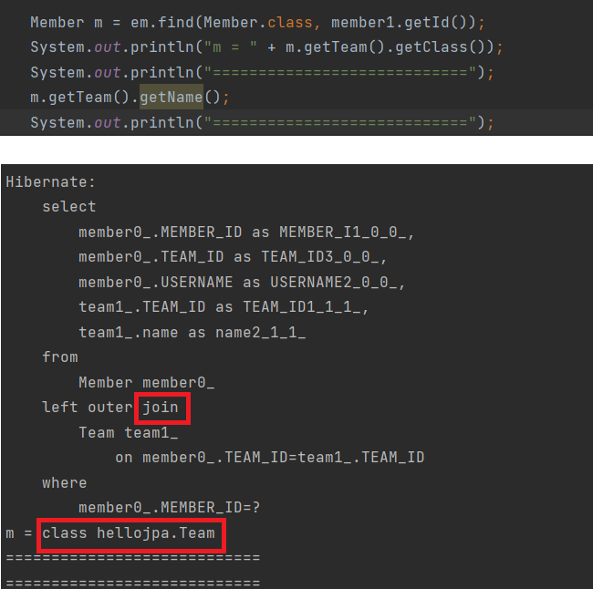


> 프록시와 즉시로딩 주의

* 실무에서는 **즉시로딩 사용하지 않는다.** 지연로딩만 사용한다.

* 즉시로딩을 적용하면 예상하지 못한 SQL이 발생한다.

  * table이 10개가 연결된 경우, 한번 조회할 때 10개의 table이 join이 되기 때문에 성능이 많이 좋지 않다. 

* 즉시로딩은 JPQL에서 N+1 문제를 일으킨다.

  * em.find()는 PK를 주어지기 때문에, JPA가 내부적으로 한번에 가져올 수 있다.
  * 그러나 JPQL은 createQuery의 내용 ``"select m from Member m"``을 SQL로 변환하여 member만 select해서 가져오고
  * member을 가져왔더니 team 즉시 로딩이기 때문에 **team 별로 또 query**가 나가게 된다.
  * 그러므로 **N + 1** 의 query가 나간다. 여기서 1은 JPQL 한 번을 의미한다!!
  * 그러므로 **LAZY**로 설정하고
    * (1) 동적으로 선택해서 가져오는 방법 : ``"select m from Member m join fetch m.team"``  --> fetchjoin 사용 
    * (2) @EntityGraph인 어노테이션으로 해결!
      * 참고 사이트 : https://jaime-note.tistory.com/54
    * (3) batch size

  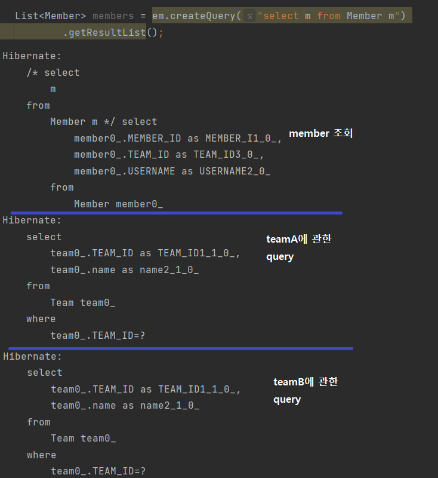

* **@ManyToOne, @OneToOne**은 기본이 즉시로딩이기 때문에 **LAZY**로 설정해야한다. 
  * @ManyToMany는 기본이 지연 로딩


### # 영속성 전이 : CASCADE

* 부모 엔티티를 영속 상태로 만들 때, 자식 엔티티도 **함께 영속상태**로 만들고 싶을 때
* perent 중심으로 코드를 작성하기 때문에 parent를 persist할 때, child로 자동으로 persist 되길 원함
  * Parent를 persist할 때, children의 collection안에 있는 모든 것을 persist하겠다는 의미
  * 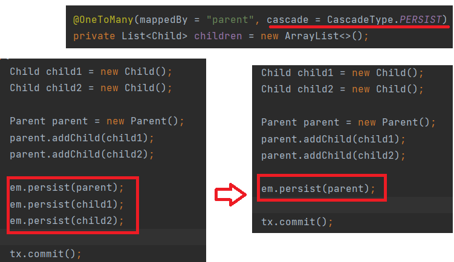

* 영속성 전이는 연관관계를 매핑하는 것과 아무 관련 없다.
* 엔티티를 영속화할 때 연관된 엔티티도 함께 영속화하는 편리함을 제공한다.


> CASCADE의 종류

* **ALL : 모두 적용**
* **PERSIST : 영속**
* REMOVE : 삭제
* MERGE : 병합
* REFRESH : refresh
* DETACH : detach


> CASCADE 주의점

* **하나에서 관리**할 경우에만 영속성 전이를 사용한다. 즉, 단일 엔티티에 종속적일 경우만 사용
  * 예 : parent만 child를 관리할 때, 
  * 만약 child가 다른 곳에서도 연관 관계를 갖고 있을 경우, 영속성 전이를 사용하면 안된다.  
* 혹은 라이프사이클이 거의 똑같을 때, 생성과 삭제의 라이프사이클이 같음


### # 고아 객체

* 고아 객체 제거 : 부모 엔티티와 연관관계가 끊어진 자식 엔티티를 자동으로 삭제

  * **children에서 삭제**되면 자동으로 삭제를 함.

  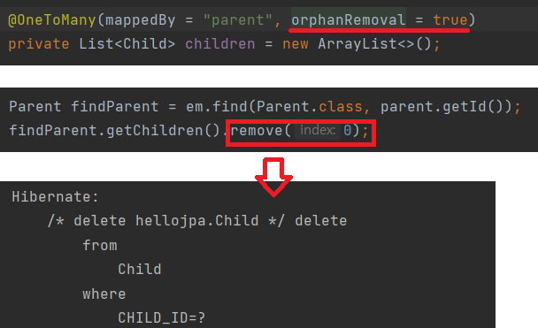


> 고아객체 주의점

* 참조가 제거된 엔티티는 다른 곳에서 참조하지 않는 고아 객체로 보고 삭제하는 기능이다.
* 영속성 전이와 마찬가지로 **참조하는 곳이 하나일 때 사용한다.**
  * 특정 엔티티가 개인 소유할 때 사용
* @OneToOne , @OneToMany만 가능
* 개념적으로 부모 자체가 삭제되도 자식은 고아가 되기 때문에, 부모가 삭제된 경우에도 자식도 자동 삭제된다. CascadeType.REMOVE처럼 동작한다.


> 영속성 전이 + 고아 객체, 생명주기

* CascadeType.ALL + orphanRemovel=true 

* 부모를 통해서 자식의 생명주기를 관리할 수 있다.

  * parent는 JPA를 통해서 생명주기를 관리
  * child는 생명주기를 부모가 관리

* 도메인 주도 설계(DDD)의 Aggregate Root개념을 구현할 때 유용

  * 레파지토리는 Aggregate Root만 컨택하고 나머지는 레파지토리를 만들지 않는다. 

  

  > 참고 : DDD
  
  * 사용자가 사용하는 것을 도메인이라고 함.
  * DDD는 소프트웨어를 이해하고 프로젝트를 성공적으로 완성하기 위한 사고 방식
  * 도메인은 사용자에 따라 또는 사용자가 바라보는 관점에 따라 지속적으로 변화한다.
  * OOP와 차이
    * 객체는 추상화 또는 구체화할 수 있는 특정 요소만 표현하는 반면, 도메인은 사용자가 사용하는 모든 것을 설명한다.
    * 고양이가 사과를 먹는다.
      * 객체 : 고양이, 사과, 먹는다
      * 도메인 : 고양이, 사과, 먹는다, 고양이는 사과를 먹는다
    * 도메인은 사용자가 누구인가에 따라, 어떻게 사용하느냐에 따라 같은 요소라도 계속해서 바뀔 수 있고, 형태가 고정되어있지 않다. 
  * 참고 사이트 : [도메인 주도 설계](https://medium.com/react-native-seoul/%EB%8F%84%EB%A9%94%EC%9D%B8-%EC%A3%BC%EB%8F%84-%EC%84%A4%EA%B3%84-domain-driven-design-in-real-project-1-%EB%8F%84%EB%A9%94%EC%9D%B8-83a5e31c5e45)

  > DDD와 Aggregate Root

  * 같은 연관 객체의 묶음을 Aggregate라고 하고, 데이터의 변경 단위이다. 

  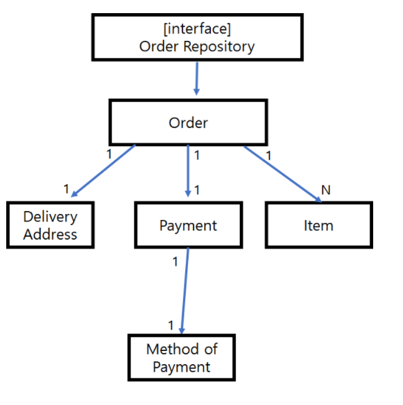
  
  * DDD는 실질적으로 접근하는 aggregate root만 레포지토리를 제공하고, 모든 객체의 저장과 접근은 repository에 위앰해서 클라이언트가 모델에 집중하게 한다.
  * 무결성 측면에서 삭제, 등록 등이 aggregate 단위로 데이터 베이스에 저장, 삭제되어야 한다.
  * 참고 사이트 : https://eocoding.tistory.com/36

