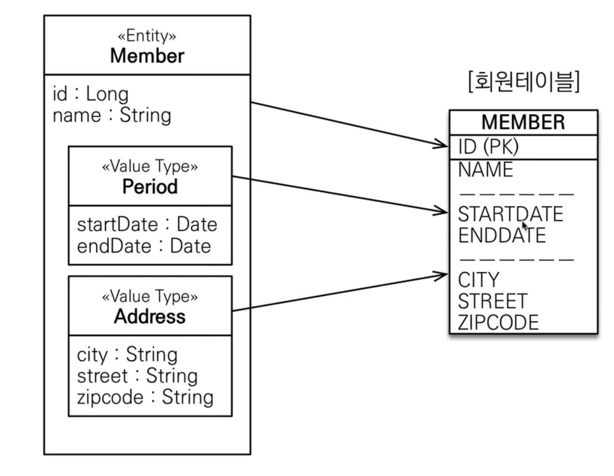
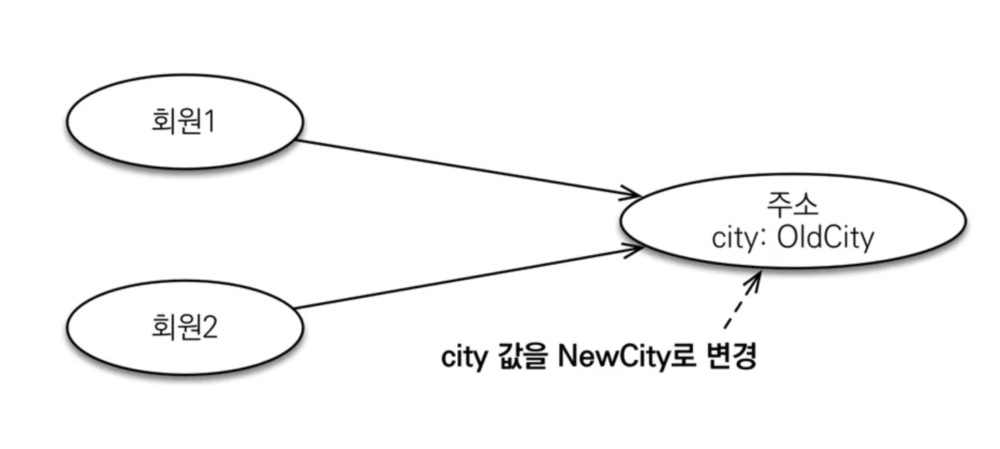
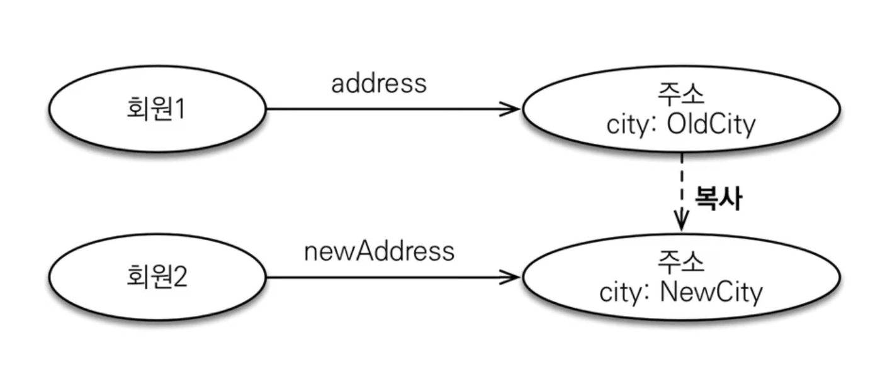
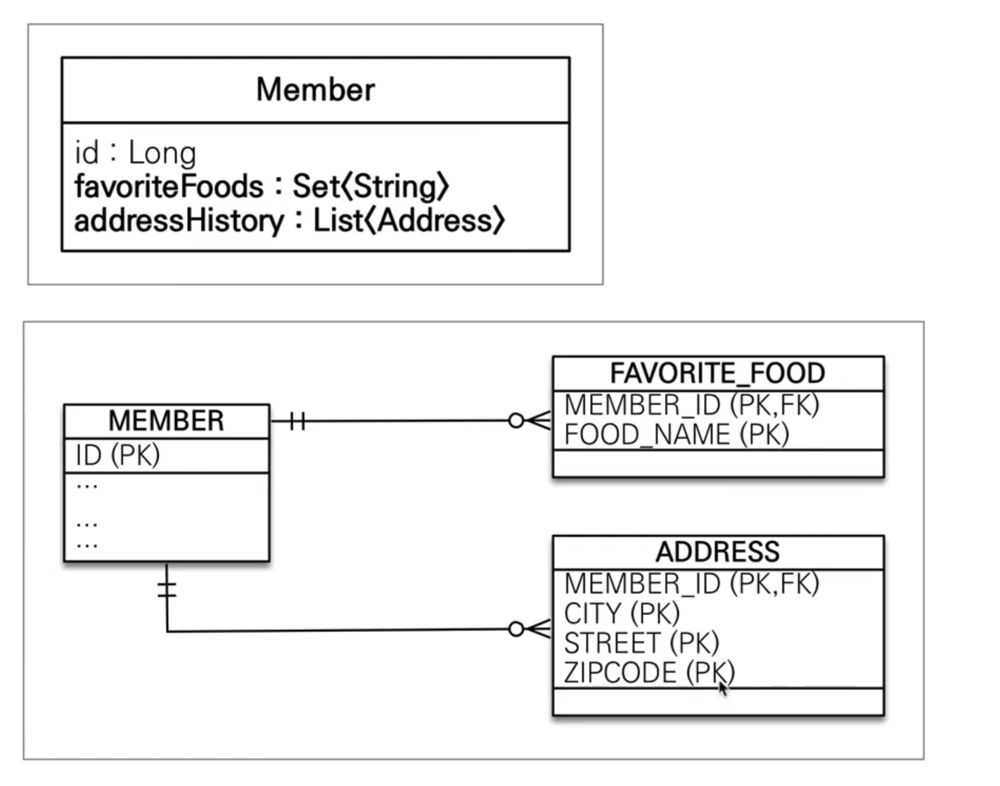

# 값 타입

### JPA의 데이터 타입 분류

- 엔티티 타입
  - @Entity 로 정의하는 클래스 객체
  - 데이터가 변해도 식별자로 지속해서 추적 가능
- 값 타입
  - int, Integer, String 처럼 단순히 값으로 사용하는 자바 기본 타입이나 객체
  - 식별자가 없고 값만 있으므로 변경시 추적 불가

### 값 타입의 분류

- 기본 값 타입
  - 자바 기본 타입 ( int, double )
  - 래퍼 클래스 ( Integer, Long )
  - String
- 임베디드 타입
  - embedded type, 복합 값 타입
- 컬렉션 값 타입
  - collection value type

## 기본 값 타입

예 ) String name, int age

- 생명 주기를 엔티티에 의존
  - 회원을 삭제하면 이름, 나이 필드도 함께 삭제
- 값 타입은 공유하면 X
  - 회원 이름 변경시 다름 회원의 이름도 함께 변경 되면 X

> 참고 : 자바의 기본 타입(int, double)은 절대 공유되지 않음. 기본 타입은 값을 복사함.
> Integer 같은 래퍼 클래스나 String 같은 특수 클래스는 공유 가능하지만 변경 X

## 임베디드 타입

- 새로운 값 타입을 직접 정의 가능
- JPA는 임베디드 타입이라고 함
- 주로 기본 값 타입을 모아서 사용함. 복합 값 타입이라고도 함.
- int, String과 같은 값

ex) 회원 엔티티는 이름, 근무 시작일, 근무 종료일, 주소 도시, 주소 번지, 주소 우편번호를 가짐

=> 회원 엔티티는 이름, 근무 기간, 주소를 가진다. ( 이렇게 묶어 내는 것이 임베디드 타입 )



### 사용법

- @Embeddable : 값 타입을 저장하는 곳에 표시
- @Embedded : 값 타입을 사용하는 곳에 표시
- 기본 생성자가 필수이다.

### 장점

- 재사용
- 높은 응집도
- 해당 값 타입만 사용하는 의미 있는 메소드를 만들 수 있음.
- 임베디드 타입을 포함하는 모든 값 타입은 소유하고 있는 엔티티에 생명 주기를 의존

### 비교

**값 타입을 사용하기 전.**

```java
@Entity
public class Member {
  @Id
  @GeneratedValue
  @Column(name = "MEMBER_ID")
  private Long id;

  @Column(name = "USERNAME")
  private Long name;

  private LocalDateTime startDate;
  private LocalDateTime endDate;

  private String city;
  private String address;
  private String zipcode;

}
```

**값 타입 사용 후**

```java
@Entity
public class Member {
  @Id
  @GeneratedValue
  @Column(name = "MEMBER_ID")
  private Long id;

  @Column(name = "USERNAME")
  private Long name;

  @Embedded
  private Period period;

  @Embedded
  private Address address;
}

@Embeddable
@Getter
@Setter
@DefaultArgContructor
public class Period{
  private LocalDateTime startDate;
  private LocalDateTime endDate;
}

@Embeddable
@Getter
@Setter
@DefaultArgContructor
public class Address{
  private String city;
  private String address;
  private String zipcode;
}
```

### 임베디드 타입과 테이블 매핑

- 임베디드 타입은 엔티티의 값일 뿐.
- 임베디드 타입을 사용하기 전과 후에 **매핑하는 테이블은 같다.**
- 객체와 테이블을 아주 세밀하게 매핑하는 것이 가능
- 잘 설계한 ORM 애플리케이션은 매핑한 테이블 수보다 클래스의 수가 더 많음.

### 임베디드 타입과 연관관계

- 임베디드 타입은 연관관계를 가질 수 있음

### @AttributeOverride 속성 재정의

- 한 엔티티에서 같은 값 타입을 사용하면? => 컬럼 명이 중복
  - repeated column 에러
- @AttributeOverrides, @AttributeOverride를 사용해서 컬러 명 속성을 재정의한다.

### 임베디드 타입과 null

- 임베디드 타입 객체의 값이 null이면 매핑한 컬럼의 모든 값도 null.

## 값 타입과 불변 객체

값 타입은 복잡한 객체 세상을 조금이라도 단순하게하기 위해 만든 개념. 따라서 값 타입은 단순하고 안전하게 다룰 수 있어야 한다.

### 값 타입 공유 참조

- 임베디드 타입 같은 값 타입을 여러 엔티티에서 공유할 수 있음. 하지만 공유하면 위험
- side effect 발생



### 값 타입 복사

- 값 타입을 공유하는 것은 위험하다.
- 값 타입의 값들을 복사해서 사용하자.



### 객체 타입의 한계

- 항상 값을 복사하면 공유 참조로 발생하는 부작용은 피할 수 있음.
- 임베디드 타입처럼 **직접 정의한 값 타입은 자바의 기본 타입이 아닌 객체 타입**이다.
- 자바 기본 타입에 값을 대입하면 값을 복사한다.
- **객체 타입은 참조 값을 직접 대입하는 것을 막을 방법이 없다.**
- **객체의 공유 참조를 피할 수 없다.**

### 불변 객체

- 객체 타입을 수정할 수 없게 부작용을 원천 차단
- 값 타입은 불변 객체로 설계
- 불변객체 : 생성 시점 이후에 절대 값을 변경할 수 없는 객체
- 생성자로만 값을 설정하고, setter를 막자.
- 값을 바꾸려고 한다면, 새로운 객체를 생성해서 넣어주자.

### 값 타입의 비교

- 값 타입은 인스턴스가 달라도 내부의 값이 달라도 값이 같으면 같은 것으로 보아야한다.
- **동일성(identity) 비교** : 인스턴스의 참조 값을 비교 , == 사용
- **동등성(equivalence) 비교** : 인스턴스의 값을 비교, equals() 사용
- 값 타입은 equals를 적절히 재정의하여 비교해야함.
  - equals를 재정의 할 때는 hashcode도 꼭 재정의
  - 그래야 문제 없이 hash map이나 hash set을 사용할 수 있음.

## 값 타입 컬렉션



- 값 타입을 묶어서 컬렉션으로 사용.
- @ElementCollection, @CollectionTable 사용
- 데이터베이스는 컬렉션을 같은 테이블에 저장할 수 없음
- 컬렉션을 저장하기 위한 별도의 테이블이 필요
- 영속성 전이(Cascade) + 고아 객체 제거 기능을 필수로 가진다고 생각하면 된다.

```java
@ElementCollection
@CollectionTable(name="FAVORITE_FOOD", joinColumns=(@JoinColumn(name="MEMBER_ID")))
private Set<String> favoriteFoods = new HashSet<>();
```

### 값 타입 컬렉션 제약 사항

- 값 타입은 엔티티와 다르게 식별자 개념이 없다.
- 값을 변경하면 추적이 어렵다.
- 값 타입 컬렉션에 변경사항이 발생하면, 주인 엔티티와 연관된 **모든 데이터를 삭제**하고, 값 타입 컬렉션에 있는 현재 값을 **모두 다시 저장**한다.
- 값 타입 컬렉션을 매핑하는 테이블은 모든 컬럼을 묶어서 기본키를 구성해야함 : null x, 중복 저장 x

### 값 타입 컬렉션 대안

- 상황에 따라 컬렉션 대신에 일대다 관계를 고려하자
- 엔티티를 만들고, 여기에서 값 타입을 사용
- 영속성 전이 + 고아 객체 제거를 사용해서 값 타입 컬렉션 처럼 사용하자
- ex) AddressEntity

```java
@OneToMany(cascade=CascadeType.ALL, orphanRemoval=true)
@JoinColumn(name="MEMBER_ID")
private List<AddressEntity> addressHistory = new ArrayList<>();
```

## 정리

- 엔티티 타입의 특징

  - 식별자O
  - 생명 주기 관리
  - 공유 가능

- 값 타입의 특징
  - 식별자 X
  - 생명 주기를 엔티티에 의존
  - 공유하지 않는 것이 안전(복사해서 사용)
    - 불변 객체로 만드는 것이 안전
