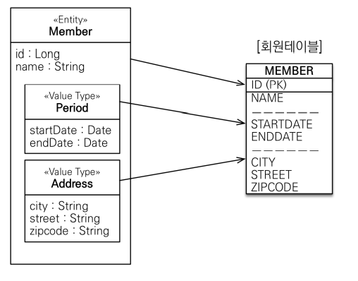
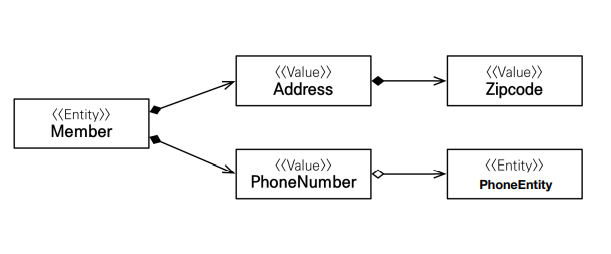
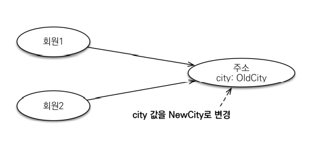
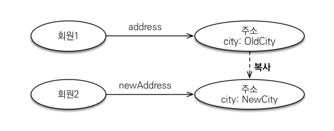

# 6주차(Ch09. 값 타입)

**값 타입의 종류**

- 기본값 타입 
    - 자바 기본 타입(primitive type): int, double 등
    - 래퍼 클래스: Integer 등
    - String
- 임베디드 타입 : 사용자 정의타입

## 9.1 기본값 타입
```java
@Entity
public class Member{

    @Id @GeneratedValue
    private Long id;
    private String name;
    private int age;
}
```

### 정리
- 생명주기를 엔티티에 의존한다.
- 값 타입은 공유하면 안된다.

## 9.2 임베디드 타입
- def) 새로운 값 타입을 직접 정의해서 사용하는 경우 이를 임베디드 타입이라고 한다.
- @Embedded와 @Embbdable 어노테이션을 이용한다.
- @Embedded: 값 타입을 정의하는 곳에 표시, @Embeddable: 값 타입을 사용하는 곳에 표시
- 기본 생성자를 꼭 생성해주어야 한다.
```java
@Entity
public class Member{

    @Id @GeneratedValue
    private Long id;
    private String name;

    @Embedded
    Address homeAddress
}

@Embeddable
public class Address{
    @Column(name="city")
    private String city;
    private String street;
    private String zipcode;
}
```

### 임베디드 타입과 테이블 매핑

- 임베디드 타입과 기본 값 타입과 같이 엔티티의 값일 뿐이다.
- 그러므로 사용 전과  후의 매핑하는 테이블은 동일하다.
- 그래서 잘 설계된 ORM 어플리에키션은 매핑한 테이블 수보다 클래스의 수가 더 많다.
(임베디드 값을 사용했기 때문에)

### 임베디드 타입과 연관관계


- @AttrivuteOverride 속성 재정의
    - 동일한 임베디드 타입을 가진 객체가 하나더 필요할 경우 사용
    - @AttributeOverride를 통해 name과 column을 수정한다.
- 임베디드 타입이 null이면 매핑한 칼럼값도 당연히 null로 저장된다.

```java
@Entity
public class Member{

    @Id @GeneratedValue
    private Long id;
    private String name;

    @Embedded
    Address homeAddress;

    @Embedded
    @AttributeOverrides({
        @AttributeOverride(name="city", column=@Column(name="COPANY_CITY")),
        @AttributeOverride(name="street", column=@Column(name="COPANY_STREET")),
        @AttributeOverride(name="zipcode", column=@Column(name="COPANY_ZIPCODE")),
    })
    Address companyAddress;
}
```
## 9.3 값 타입과 불변 객체
- 값 타입을 단순하고, 안전하게 다룰 수 있도록 설정한다.

### 값 타입 공유 참조

- 임베디드 타입을 만들어서, 여러 엔티티에서 공유해서 사용하면 위험하다.
- 구체적으로 위와 같이 연결되어 있어, 하나의 엔티티의 임베디드 타입 값만 바꾸는 것이 불가능해진다.

### 값 타입 복사

- 값 타입을 새로 복사해서 사용하게 되면 각각 엔티티에 대해 개별적으로 저장이 된다.
```java
member1.setHomeAddress(new Address("OldCity"));
Address address = member1.getHomeAddress();

Address newAddress = address.clone();

newAddress.setCity("NewCity");
member2.setHomeAddress(newAddress);

```

### 문제점
- 공유 참조로 인한 문제는 값 타입 복사를 통해 해결 가능하다.
- 문제는 임베디드 타입처럼 직접 정의한 값 타입은 **객체타입**이라는 것이다.
- 그래서 참조 값을 직접 대입하는 것을 막을 방법이 없다.
- 공유참조 자체는 막을 수 없기 때문에, 객체를 모두 불변으로 선언해서 **부작용**을 막는 방안을 선택한다.

## 9.4 값 타입의 비교
- 기본 값 비교 : == 이용
- 객체 비교 : equals() 이용. hashcode 비교
- 동일성 비교 : 인스턴스의 **참조 값**을 비교. == 사용
- 동등성 비교 : 인스턴스의 **값**을 비교. equals() 사용

## 9.5 값 타입 컬렉션
- 값 타입을 하나 이상 저장하기 위해 컬렉션을 사용한다.
- @ElementCollection, @CollectionTable 어노테이션을 이용해서 정의한다.
```java
@Entity
public class Member {
    @Id @GeneratedValue
    private Long id;

    @Embedded
    private Address homeAddress;

    @ElementCollection
    @CollectionTable(name = "FAVORITE_FOODS",
        joinColumns = @JoinColumn(name = "MEMBER_ID"))
    @Column(name="FOOD_NAME")
    private Set<String> favoriteFoods = new HashSet<String>();

    @ElementCollection
    @CollectionTable(name = "ADDRESS",
        joinColumns = @JoinColumn(name = "MEMBER_ID"))
    private List<Address> addressHistory = new ArrayList<Address>();
}
```

### 값 타입 저장
```java
Member member = new Member();

member.setHomeAddress(new Address("통영","몽돌해수욕장","660-123"))

member.getFavoriteFoods().add("짬뽕");
member.getFavoriteFoods().add("탕수육");
member.getFavoriteFoods().add("짜장");

member.getAddressHistory().add(new Address("서울", "강남", "123-123"));
member.getAddressHistory().add(new Address("서울", "신촌", "000-000"));

em.persist(member);
```
- member insert sql 1번, 각 값타입 컬렉션은 원소 개수 만큼 insert
- 값 타입 컬렉션은 영속성 전이 + 고아 전략을 필수로 가짐.

### 값 타입 조회
- 지연로딩이 기본
- 지연로딩이므로, 컬렉션 값타입의 경우에는 실제 사용될 때 조회함!

### 값 타입 수정
- 임베디드 값 타입 수정 : 엔티티 수정과 동일
- 기본 값 타임 컬렉션 수정 : remove후 add
- 임베디드 값 타입 컬렉션 수정 : remove후 add, remove시 equals,hashcode 이용되므로 구현해야함.

### 값 타입 컬렉션의 제약사항
- 값 타입은 식별자가 없음.
- 그로인해 변경시 추적이 어려움.
- 변경 사항이 발생하면, 주인 엔티티와 연관된 모든 데이터 삭제, 현재 값 모두 다시 저장하는 식으로 작동.
- 그래서 실무에서는 상황에 따라 값 타입 컬렉션 대신에 일대다 관계를 고려한다.

## 정리

- **엔티티 타입의 특징**
    - 식별자O 
    - 생명 주기 관리
    - 공유

- **값 타입의 특징**
    - 식별자X 
    - 생명 주기를 엔티티에 의존
    - 공유하지 않는 것이 안전(복사해서 사용) 
    - 불변 객체로 만드는 것이 안전
