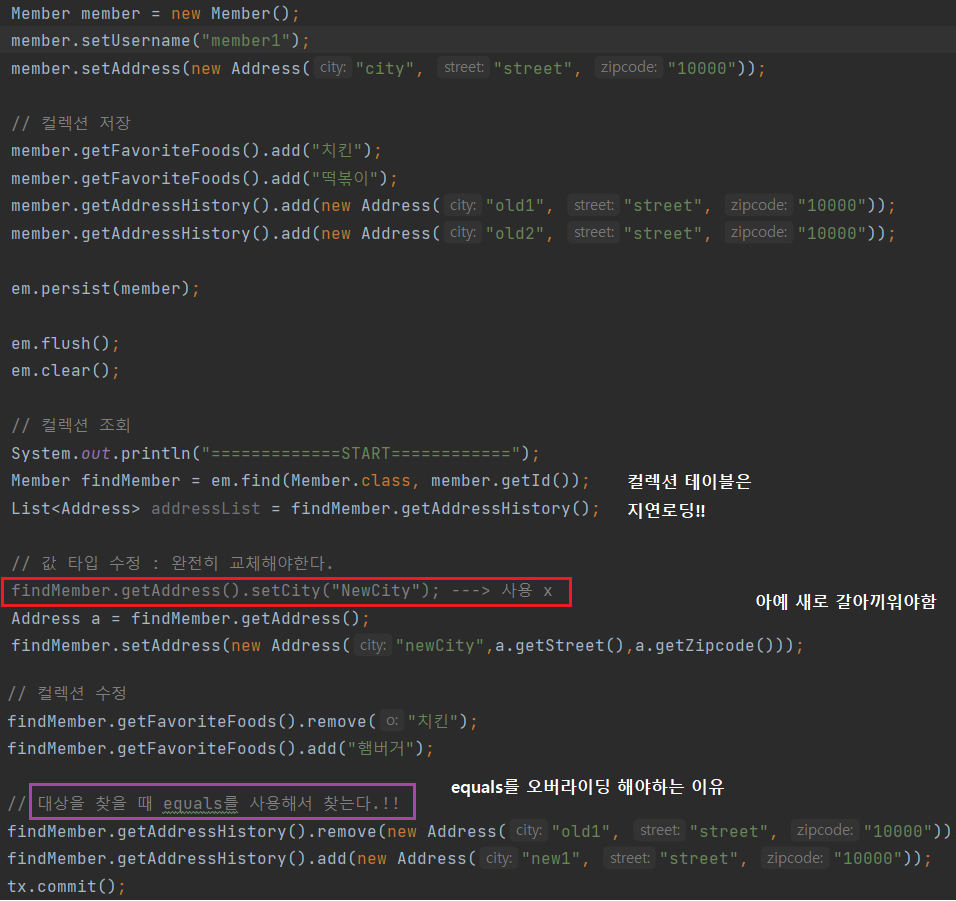

# ch09 : 값 타입

### #1. JPA의 데이터 타입 분류

#### * 엔티티 타입

* *@Entity* 로 정의하는 클래스 객체

* 데이터가 변해도 식별자로 지속해서 추적 가능
  * 회원 엔티티의 키나 나이 값을 변경해도 식별자로 인식이 가능하다.
  * 회원 ID 100번의 키와 나이 값을 변경해도 식별자 ID로 100번의 나이와 키를 추적할 수 있다.

#### * 값 타입

* int, Integer, String 처럼 단순히 값으로 사용하는 자바 기본 타입이나 객체
* 식별자가 없고 값만 있으므로 변경시 추적 불가
  * 숫자를 100에서 200으로 변경하면 완전히 다른 값으로 대체

#### * 값타입의 분류

* 기본값 타입
  * 종류
    * 자바 기본 타입(int, double)
    * 래퍼 클래스 (Integer, Long)
      * 참조 : [[Java\] 래퍼 클래스(Wrapper Class)란 무엇인가? (박싱, 언박싱) (tistory.com)](https://coding-factory.tistory.com/547)
    * String
  * 특징 
    * 생명주기를 엔티티의 의존한다. 
    * 값 타입은 **공유하면 안된다.**
      * side effect : 회원 이름 변경시 다른 회원의 이름이 바뀌면 안된다. 
    * int, double 자바의 기본 타입은 절대 공유되지 않는다. 값을 복사함.
    * *Integer같은 래퍼 클래스 혹 String 같은 클래스는 참조 값으로 공유가능하지만 **변경되지는 않는다.***
* 임베디드 타입(embedded type, 복합 값 타입)
  * 좌표, 주소 등 클래스를 값처럼 쓰고 싶을 때
* 컬렉션 값 타입(collection value type)
  * 기본값 타입이나 임베디드 타입을 넣을 수 있는 자바의 컬렉션 타입을 의미

### #2. 임베디드 타입

* 새로운 값 타입을 직접 정의할 수 있다.
  * 예를들어, city, street, zipcode를 묶어서 주소라는 하나의 값 타입으로 정의가능
* JPA는 임베디드 타입이라고 한다.
* 주로 **기본 값 타입을 모아서 만들기 때문에 복합값 타입**이라고 한다.
* Entity가 아니고 int, String과 같은 **값 타입**으로 추적 불가하다.

> 임베디드 타입 사용법

* @Embeddable : 값 타입을 정의하는 곳에 표시
* @Embedded : 값 타입을 사용하는 곳에 표시
* 기본 생성자 필수

> 임베디드 타입의 장점

* 재사용이 가능하다.
  * 주소, 기간 등은 시스템 전체에서 클래스 재사용이 가능
* 높은 응집도
  * Period.isWork() 해당 값 타입만을 사용한 의미있는 메소드를 만들 수 있다.
* 임베디드 타입을 포함한 모든 값 타입은 값 타입을 소유한 **엔티티의 생명주기**에 의존한다.

> 임베디드 타입과 테이블 매핑

* 임베디드 타입은 엔티티의 값일 뿐이다.
* 임베디드 타입을 사용하기 전과 후에 **매핑하는 테이블은 같다.**
* 차이점은 객체와 테이블이 아주 세밀하게 매핑하는 것이 가능하다.
* 잘 설계한 ORM 애플리케이션은 매핑한 테이블 수보다 클래스의 수가 더 많다.

> 임베디드 타입과 연관관계

* 임베디드 타입 안에 엔티티 객체가 들어있을 수 있다.

> @AttributeOverride 속성 재정의

* 한 엔티티에서 같은 값 타입을 사용하는 경우 사용

* @AttributeOverrides, @AttributeOverride를 사용해서 컬러 명 속성을 재정의한다.

  

> 임베디드 타입과 null

* 임베디드 타입의 값이 null이면 매핑한 컬럼 값은 모두 null이다.

### # 값 타입과 불변 객체

> 값 타입 공유 참조

* 값 타입은 단순하고 **안전**하게 다룰 수 있어야 한다.
* 임베디드 타입 같은 값 타입을 여러 엔티티에서 공유할 수 있다. -> side effect 부작용 발생
  * side effect는 **추적하기 어려운 버그**이다!!

* 값 타입의 실제 인스턴스인 값을 공유하는 것은 위험하다.
* 그러므로 **값을 복사하여 사용한다.**

> 객체 타입의 한계

* 항상 값을 복사하면 공유 참조로 발생하는 부작용은 피할 수 있지만, 실수로 값을 참조하는 경우가 발생할 수 있다.
* 왜냐하면 임베디드 타입처럼 직접 정의한 값 타입은 자바의 기본 타입이 아닌 **객체 타입**이기 때문에 참조 값을 직접 대입하는 것을 막을 방법이 없다.
  * 자바 기본 타입은 값을 대입하면 항상 값이 복사됨.
* 즉, *객체의 공유 참조를 피할 수 없다.*

> 피하는 방법 

* 객체 타입을 수정할 수 없게 만들면 **부작용을 원천 차단** 가능

* 값 타입은 불변객체로 설계해야한다. 
  * 생성 시점 이후 절대 값을 변경할 수 없는 객체

* 생성자로만 값을 설정하고 **수정자(Setter)을 만들지 않거나 Setter을 private으로 만든다.**
* Integer, String은 대표적인 불변 객체

> 값을 바꾸는 방법

* 아예 값을 새로 갈아끼운다.
* 

> 참고 : 

#### # 값 타입의 비교

* **동일성(identity)** 비교 : 인스턴스의 **참조 값 **비교 ,**== 사용**

* **동등성(equivalence) **비교 : 인스턴스의 **값**을 비교, **equals() 사용**

* 값 타입들은 a.equals(b)를 사용해 동등성 비교를 해야한다.

* equals의 메소드는 기본이 == 이기 때문에 적절하게 재정의 해야한다.

  * 대부분 자동으로 만들어주는 것을 사용한다.
  * equals를 만들면 hashCode도 만들어줘야 한다.

  > equals를 변경하면 hashCode도 변경해야하는 이유

  * HashTable이나 HashSeㅎt, HashMap과 같은 자료구조는 자료를 저장하기 위한 위치를 선택하기 위해 hashCode를 이용

  * object 클래스의 hashCode() 메소드는 해당 메모리 주소값을 반환한다.

  * 그렇기 때문에 equals를 원하는 조건으로 오버라이딩 했다면, 그에 맞게 hashCode도 변경해주어야 한다.

  * 예를들어, employee라는 클래스의 equals을 오버라이드했다면, hashcode도 오버라이딩해야 이름이 같은 employee가 hashSet에 저장될 때 1개만 저장될 수 있다. 

    출처: https://mangkyu.tistory.com/101 [MangKyu's Diary]

  * 출처: https://mangkyu.tistory.com/101 [MangKyu's Diary]

### #3. 값 타입 컬렉션

* 값 타입을 컬렉션으로 만든 것이 값 타입 컬렉션이다.

* 관계형 데이터베이스는 컬렉션을 담을 수 없는 구조가 없다.

  * 컬렉션을 별도의 테이블로 만들어야 한다.
  * 식별자 ID를 추가하게 되면 값 타입이 아니라 entity가 되기 때문에 **모든 컬럼과 member의 pk**와 결합해서 pk를 만든다. 

  

  

* 값 타입을 하나 이상 저장할 때 사용
* @ElementCollection, @CollectionTable 사용
  * 일대다 개념이기 때문에 한 테이블에 넣을 수 없고, 별도의 테이블로 풀어서 넣어야 하고 join 되는 key를 넣어줘야 한다. 

> 값 타입 컬렉션 사용

* 컬렉션 값은 member만 persist 해도 라이프사이클이 같기 때문에 같이 저장된다.
  * 값 타입 컬렉션은 영속성 전이(Cascade) + 고아 객체 제거 기능을 필수로 가진다고 볼 수 있다.
* 컬렉션들은 조회될 때, **지연 로딩으로 조회**된다.

> 값 타입 컬렉션 제약사항

* 수정시 
  * 테이블의 데이터를 전부 삭제하고, 새로 추가된 것과 남아있는 것들을 다시 insert query한다.
  * 

* 값 타입은 엔티티와 다르게 식별자 개념이 없다. 그래서 값을 변경하면 추적이 어렵다.
* 그러므로, 값 타입 컬렉션에 **변경사항이 발생**하면, 주인 엔티티와 연관된 **모든 데이터를 삭제**하고, 값 타입 컬렉션에 있는 **현재 값을 모두 다시 저장**한다.
  * 해결하기 위한 대안으로 @orderColumn(name="") 사용가능, 순서가 들어가기 때문에 모두 삭제하지 않고 가능하다. 
  * 그러나 이 경우 중간에 2번째 순서 삭제시 ordercolumn의 2가 null이 되는 등의 위험한 상황이 발생할 수 있음. 

> 값 타입 컬렉션 대안

* 실무에서는 상황에 따라 **값 타입 컬렉션 대신 일대다 관계를 고려**
  * 일대다 관계를 위한 엔티티를 만들고, 여기서 값 타입을 사용한다.
  * 영속성 전이(Cascade) + 고아 객체 제거를 사용해서 값 타입 컬렉션 처럼 사용

* 값 타입 컬렉션은 값이 바뀌어도 추적할 필요없는 단순한 경우에 사용
* 대부분은 값 타입 컬렉션 대신 일대다 관계를 사용해야한다.
  * **식별자가 필요, 지속적으로 값 추적, 변경**해야한다면 그것은 엔티티!!

> 정리

* 엔티티 타입의 특징
  * 식별자O
  * 생명 주기 관리
  * 공유 가능

* 값 타입의 특징
  * 식별자 X 
  * 생명 주기를 엔티티에 의존
  * 공유하지 않는 것이 안전(복사해서 사용)
    * 불변 객체로 만드는 것이 안전

* 새로운 값을 정의할 수 있는 임베디드 타입이 존재 -> 값 타입
* 또한 값 타입을 컬렉션을 만든 ''값 타입 컬렉션''이 있지만 거의 사용하지 않는다. 대부분 일대다 관계로 엔티티를 만들어 사용한다. 

