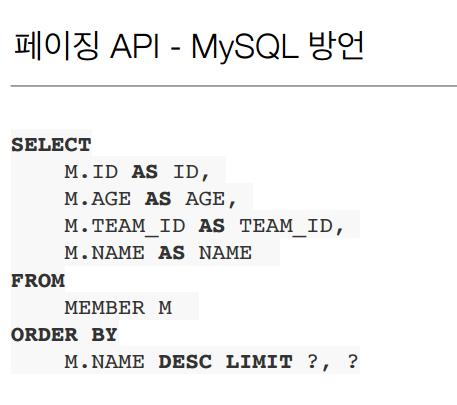

# ch10 : 객체지향 쿼리 언어1 (기본문법)


> JPA 다양한 쿼리 방법

1. **JPQL**  -> 대부분 해결가능
2. JPA Criteria
3. **QueryDSL**
4. 네이티브 SQL
5. JDBC API 직접 사용, MyBatis, SpringJdbcTemplate 함께 사용


## # JPQL 소개

* JPA를 사용하면 entity 객체를 중심으로 개발한다.
* 검색할 때도 **테이블이 아닌 엔티티 객체를 대상으로 검색**해야 한다.
* 모든 DB 데이터를 객체로 변환해서 검색하는 것은 불가능
* 필요한 데이터만 DB에서 불러오려면, 검색 조건이 포함된 SQL이 필요하다.
* JPA는 SQL을 추상화한 JPQL이라는 객체 지향 쿼리 언어 제공
  * SQL 문법 유사 : SELECT, FROM, WHERE, GROUP BY, HAVING, JOIN
  * JPQL은 **엔티티 객체**를 대상으로 쿼리
  * SQL은 데이터베이스 **테이블을 대상**으로 쿼리

``` java
List<Member> result = em.createQuery(
	"select m From Member m where m.username like '%라면%'",
    Member.class
).getResultList();
```

* JPQL은 Query가 **문자열**이기 때문에, **동적쿼리를 만들기 어렵다.**


## # JPA Criteria 소개

* Java 표준 스펙에 있음 / JPS 공식 기능
  * 문자가 아닌 자바코드로 JPQL 작성가능

``` java
CriteriaBuilder cb = em.getCriteriaBuilder();
CriteriaQuery<Member> query = cb.createQuery(Member.class);

Root<Member> m = query.from(Member.class);

CriteriaQuery<Member> cq = query.select(m).where(cb.equal(m.get("username"), "kim"));

List<Member> result = em.createQuery(cq).getResultList();
```

* 장점 : 쉽게 오류를 파악할 수 있다. 동적 쿼리를 짜기 유용하다.
* 단점 : **복잡하고 실용성이 없다**. 유지보수하기 힘듦
* Criteria 대신에 QueryDSL 사용 권장


## # Query DSL

* 라이브러리 open source

``` java
JPAFactoryQuery query = new JPAQueryFactory(em);
QMember m = QMember.member;

List<Member> list = 
    query.selectFrom(m)
    	 .where(m.name.like("kim"))
    	 .orderBy(m.id.desc())
    	 .fetch();
```

* 문자가 아닌 자바코드로 JPQL을 작성할 수 있음.
* JPQL 빌더 역할
* 컴파일 시점 문법 오류를 찾을 수 있다.
* 동적 쿼리 작성하기 편리
* 단순하고 쉬움. 직관적이다 --> **실무 사용 권장**
* www.querydsl.com
  * JPQL 문법을 잘 알면 , querydsl도 잘할 수 있다.


## # 네이티브 SQL 소개

* JPA 제공하는 SQL을 *직접 사용*하는 기능
* JPQL로 해결할 수 없는 특정 데이터 베이스에 의존적인 기능
  * 오라클의 CONNECT BY

``` java
em.createNativeQuery(
    "select MEMBER_ID, city, street, zipcode, USERNAME from MEMBER"
).getResultList();
```


## # JDBC 직접 사용, SpringJdbcTemplate 등

* JPA를 사용하면서 JDBC 커넥션을 직접 사용하거나, 스프링 JdbcTemplate, 마이바티스등을 함께 사용 가능
* 단 영속성 컨텍스트를 적절한 시점에 강제로 플러시 필요
  * 플러시 되는 경우 
    1. commit하는 경우
    2. em.query가 날라갈때도 자동 플러시 된다. 그런데 JPA 기술을 사용할 때는 문제가 발생하지 않지만, JPA를 우회해서 SQL을 실행하면, 영속성 컨텍스트 수동 플러시 해야한다.

* 참고자료 : https://gmlwjd9405.github.io/2018/12/19/jdbctemplate-usage.html


## # JPQL(Java Persistence Query Language)

* JPQL은 객체지향 쿼리 언어다.따라서 테이블을 대상으로 쿼리 하는 것이 아니라 엔티티 객체를 대상으로 쿼리한다. 
* JPQL은 SQL을 추상화해서 특정데이터베이스 SQL에 의존하지 않는다. 
* JPQL은 결국 SQL로 변환된다. 


> JPQL 문법


* select m from **Member** as m where **m.age** > 18 
  * 엔티티와 속성은 대소문자 구분O (Member, age) 
  * JPQL 키워드는 대소문자 구분X (SELECT, FROM, where) 
  * *엔티티 이름 사용*, 테이블 이름이 아님(Member)
  * 별칭은 필수(m) (as는 생략가능)

* 


> TypeQuery, Query

* TypeQuery: 반환 타입이 명확할 때 사용
* Query: 반환 타입이 명확하지 않을 때 사용


> 결과 조회 API

``` java
TypeQuery<Member> query = em.createQuery("SELECT m FROM Member m", Member.class);

// 1. 결과가 하나 이상일 때, 리스트 반환
// 	  * 결과가 없으면 빈 리스트 반환
query.getResultList();
// 2. 결과가 정확히 하나, 단일 객체 반환
// 	  * 결과가 없으면: javax.persistence.NoResultException
//    * 둘 이상이면: javax.persistence.NonUniqueResultException
query.getSingleResult();
```


> 파라미터 바인딩 - 이름 기준, 위치 기준


* 위치 기반은 되도록 사용하지 않는다!!!


### # 프로젝션

* SELECT 절에 조회할 대상을 지정하는 것

* 프로젝션 대상: 엔티티, 임베디드 타입, 스칼라 타입(숫자, 문자등 기본 데이터 타
  입) 모두 가능

  * SELECT **m** FROM Member m -> 엔티티 프로젝션

    

  * SELECT **m.team** FROM Member m -> 엔티티 프로젝션

    * 멤버에 관련된 팀을 가져옴

    * 이 경우 join되어, query가 나간다.

    * 그러나 명확성을 위해서 query를

      **"select t from Member m join m.team t"** 변경하는 것이 바람직 (다른 사람들이 예측 가능할 수 있도록)  

  * SELECT **m.address** FROM Member m -> 임베디드 타입 프로젝션

    ``` java
    em.createQuery("select o.Address from Order o", Address.class)
        .getResultList();
    ```

  * SELECT **m.username, m.age** FROM Member m -> 스칼라 타입 프로젝션
  * SELECT **DISTINCT** m FROM Member m -> 중복 제거


> 여러 값 조회

* SELECT **m.username, m.age** FROM Member m

1. Query 타입으로 조회


2.  Object[] 타입으로 조회


3. new 명령어로 조회

* 단순 값을 DTO로 바로 조회
* SELECT new jpabook.jpql.UserDTO(m.username, m.age) FROM Member m 
* 패키지 명을 포함한 전체 클래스 명 입력
* 순서와 타입이 일치하는 생성자 필요


### # 페이징 API

* JPA는 페이징을 다음 두 API로 추상화
  * 어디서부터 몇 개를 가져올지!
* setFirstResult(int startPosition) : 조회 시작 위치 (0부터 시작) 
* setMaxResults(int maxResult) : 조회할 데이터 수





> 참고 

* ROWNUM은 쿼리 내에서 사용 가능한 (실제 컬럼이 아닌) 가상 컬럼(pseudocolumn)입니다.
* ROWNUM에는 숫자 1, 2, 3, 4, ... N의 값이 할당됩니다. 여기서 N 은 ROWNUM과 함께 사용하는 로우의 수를 의미합니다. ROWNUM의 값은 로우에 영구적으로 할당되지 않습니다(이는 사람들이 많이 오해하는 부분이기도 합니다).
* 테이블의 로우는 숫자와 연계되어 참조될 수 없습니다. 따라서 테이블에서 "row 5"를 요청할 수 있는 방법은 없습니다. "row 5"라는 것은 존재하지 않기 때문입니다.
* ROWNUM 값은 **쿼리의 조건절이 처리되고 난 이후, 그리고 sort, aggregation이 수행되기 이전에 할당**됩니다


* 예를 들어, 
  * select * from A where rownum > 10 and rownum <= 20
    * 결과는 나오지 않음
    * ROWNUM의 값은 쿼리 조건절 처리된 이후 나오기 때문
  * select * from (select * from A) where rownum > 10 and rownum <= 20
    * 으로 수정해야한다.
  * select * from (select * from A order by date desc) where rownum > 10 and rownum <= 20
    * 이것 역시 원하는 결과는 나오지 않는다.
    * 왜냐하면 sort 이전에 수행되기 이전에 ROWNUM이 할당되기 때문이다
  * select * from (select * from (selct * from A order by date desc)  aa ) where rownum > 10 and rownum <= 20
    * 으로 수정해야한다.


출처 1 : https://agreeable.tistory.com/entry/ORACLE-ROWNUM-%ED%99%9C%EC%9A%A9

출처 2 : https://5dol.tistory.com/127 [5dol Story]


### # 조인


> Join - ON 절

* ON절을 활용한 조인(JPA 2.1부터 지원) 

  * 조인 대상 필터링

    

  * 연관관계 없는 엔티티 외부 조인(하이버네이트 5.1부터)

    


### # 서브 쿼리

* 쿼리 안에 또 쿼리를 넣음
* 1번처럼 메인 쿼리와 서브 쿼리와 관련없게 처리 해야 성능상 좋음
* 하지만 2번처럼 일반적으로 SQL에서 지원하는 것이 가능하다. 즉, 메인쿼리에 사용한 m을 서브쿼리에서도 사용 가능.!!


> 서브 쿼리 지원 함수

* [NOT] EXISTS (subquery): 서브쿼리에 결과가 존재하면 참
  * {ALL | ANY | SOME} (subquery) 
  * ALL 모두 만족하면 참
  * ANY, SOME: 같은 의미, 조건을 하나라도 만족하면 참
* [NOT] IN (subquery): 서브쿼리의 결과 중 하나라도 같은 것이 있으면 참


> JPA 서브 쿼리 한계

* JPA는 **WHERE, HAVING 절**에서만 서브 쿼리 사용 가능 (JPA 표준스펙)

* **SELECT 절도** 가능 (하이버네이트에서 지원) 

* **FROM 절의 서브 쿼리는 현재 JPQL에서 불가능**

  * **조인**으로 풀 수 있으면 풀어서 해결
  * 쿼리 두번날려서 해결
  * 네이티브 쿼리 사용

  ``` java
  String query = "select mm from (select m.age Member m) as mm"; // -> 불가
  ```


### # JPQL 타입 표현

* 문자: ‘HELLO’, ‘She’’s’ 

* 숫자: 10L(Long), 10D(Double), 10F(Float) 

* Boolean: TRUE, FALSE 

* **ENUM: jpabook.MemberType.Admin (패키지명 포함) **

* 엔티티 타입: TYPE(m) = Member (상속 관계에서 사용)

  * 상속관계일 때, @DiscriminatorValue("name")
    * 지정하지 않으면 보통 class name

  ``` java
  em.createQuery("select i from Item i where type(i) = Book", Item.class)
      .getResultList();
  ```

  

> JPQL 기타

* SQL과 문법이 같은 식
* EXISTS, IN 
* AND, OR, NOT 
* =, >, >=, <, <=, <> 
* BETWEEN, LIKE, IS NULL


### # 조건식 - CASE 식


> COALESCE: 하나씩 조회해서 null이 아니면 반환

* username이 null이면 '이름 없는 회원'으로 반환

``` java
List<String> result = em.createQuery("select coalesce(m.username,'이름 없는 회원') from Member m", String.class)
    .getResultList();
```


>NULLIF: 두 값이 같으면 null 반환, 다르면 첫번째 값 반환

* 사용자 이름이 ‘관리자’면 null을 반환하고 나머지는 본인의 username으로 반환

``` java
List<String> result = em.createQuery("select NULLIF(m.username, '관리자') from Member m", String.class)
    .getResultList();
```


### # JPQL 기본 함수

* JPQL이 제공하는 **표준 함수**
  * 데이터베이스에 관계없이 사용이 가능
  * CONCAT == ||
  * SUBSTRING 
  * TRIM 
  * LOWER, UPPER 
  * LENGTH 
  * LOCATE 
    * select locate('de', 'abcdefg') From Member m
  * ABS, SQRT, MOD 
  * SIZE, INDEX(JPA 용도)
    * select size(t.members) From Team t;
    * size = 컬렉션의 크기
    * @OrderColumn을 사용했을 경우, INDEX 사용한다. (보통 사용하지 않는 것이 좋음.)

* **사용자 정의 함수 호출**

  * 하이버네이트는 사용전 방언에 추가해야 한다. (다행히 기본적 방언들은 함수로 만들어져 있다.)

    * 사용하는 DB 방언을 상속받고, 사용자 정의 함수를 등록한다.

    

    

    * select function('group_concat', i.name) from Item i

