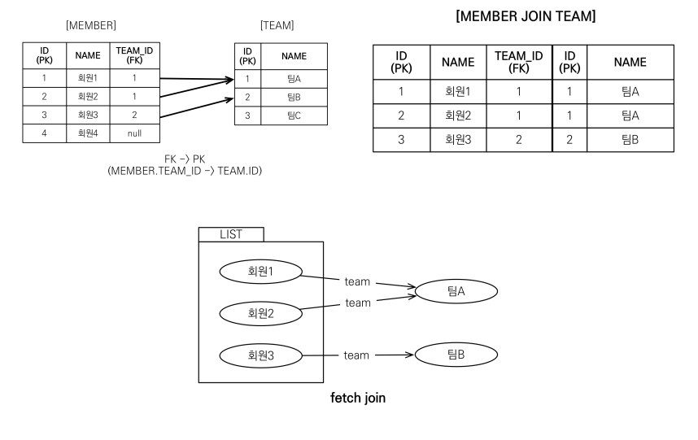
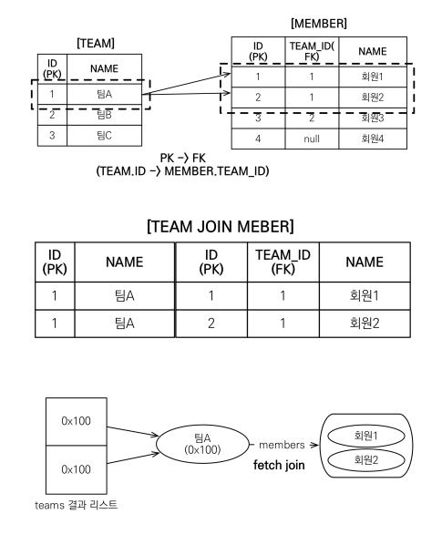
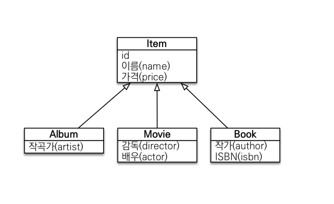

# 8주차(Ch10. 객체지향 쿼리 언어)

## 경로 표현식(Path Expression)
**경로 표현식** : 점(.)을 찍어 객체 그래프를 탐색하는 것

```sql
select m.username -> 상태 필드
 from Member m 
 join m.team t -> 단일 값 연관 필드
 join m.orders o -> 컬렉션 값 연관 필드
where t.name = '팀A'
```

### 경로표현식의 용어정리

- 상태 필드 : 단순히 값을 저장하기 위한 필드 ex) m.username, m.age

- 연관 필드 : 연관관계를 위한 필드, 임베디드 타입 포함 
  - 단일 값 연관 필드 : @ManyToOne, @OneToOne 대상이 단일 엔티티 ex) m.team
  - 컬렉션 값 연관 필드 : @OneToMany, @ManyToMany, 대상이 컬렉션 ex) m.orders

```java
@Entity
public class Member{
    @Id @GeneratedValue
    private Long id;
    
    @Column(name = "name")
    private String username;
    private Integer age;
    
    @ManyToOne(...)
    private Team team;
    
    @OneToMany(...)
    private List<Order> orders;
}
```


### 경로 표현식과 특징

- 상태 필드 경로 : 경로 탐색의 끝이다.(상태 필드 내부에는 더이상 탐색할 값이 없으므로)
- 단일 값 연관 경로 : 묵시적으로 내부 조인 발생. 추가로 탐색가능(엔티티 내에 추가 속성이 있으므로)
- 컬렉션 값 연관 경로 : 묵시적으로 내부 조인이 일어난다. FROM 절에서 조인을 통해 별칭을 얻으면 별칭으로 탐색할 수 있다.


### 작성한 JPQL과 실제 쿼리

- 상태 필드 경로 탐색(거의 동일함)

  - JPQL : select m.username, m.age from Member m
  - SQL: select m.age, m.age from Member m

- 단일 값 연관 경로 탐색

  - JPQL: select o.member from Order o
  - SQL: select m.* **inner join** Member m on o.member_id=m.id
  - 사용자가 **작성하지 않은 내부 조인**이 발생한다. 이를 **묵시적 조인**이라고 한다. <-> **명시적 조인**: 직접 join 키워드 사용

- 컬렉션 값 연관 경로 탐색

  ```sql
  select t.members from Team t // 성공
  select t.members.username from Team t // 실패
  select m.username from Team t join t.members m // 가능
  ```

  - 컬렉션에서 추가적인 경로 탐색을 원할 때는 조인을 사용해서 별칭을 얻어야 한다.

### 경로 탐색을 사용한 묵시적 조인시 주의사항

- 항상 **내부 조인**
- 컬렉션 또한 경로 탐색의 끝이다. 추가로 탐색하려면 위의 예시 처럼 명시적으로 조인을 해야한다.
- 묵시적 조인이 발생하므로 FROM 절에도 영향을 준다.
- 그러므로 묵시적 조인이 아닌 **명시적 조인**을 사용하자. :crossed_fingers:

## Fetch Join

### 페치 조인(fetch join)

- SQL 조인 종류X  
- JPQL에서 성능 최적화를 위해 제공하는 기능 
- 연관된 엔티티나 컬렉션을 SQL 한 번에 함께 조회하는 기능 
- join fetch 명령어 사용 
- 페치 조인 ::= [ LEFT [OUTER] | INNER ] JOIN FETCH 조인경로
- 대부분의 **N+1 문제**를 페치 조인으로 해결 가능하다.! 
- **N+1 문제** : 

### 엔티티 페치 조인

- 페치 조인을 이용해서 회원 엔티티 + 팀 엔티티를 함께 조회

```sql
select m
from Member m join fetch m.team

select M.*, T.*
FROM MEMBER M
INNER JOIN TEAM T ON M.TEAM_ID=T.ID
```

- 페치조인은 별칭을 사용할 수 없다.
- 하이버네이트에서는 페치 조인에도 별칭을 허용한다.



```java
String jpql = "select m from Member m join fetch m.team";
List<Member> members=em.createQuery(jpql, Member.class)
    					.getResultList();
for(Member member : members){
	System.out.println("username= " + member.getUsername()+","+
                      "teamName= " + member.getTeam().name());
}
```

### 컬렉션 페치 조인

- **일대다** 관계, 컬렉션 페치조인
- JPQL

```sql
select t
from Team t join fetch t.members
where t.name='팀A'
```

- SQL

```sql
SELECT T.*, M.*
FROM TEAM T
INNER JOIN MEMBER M ON T.ID=M.TEAM_ID
WHERE T.NAME='팀A'
```



- DB에 쿼리를 수행한 결과를 그대로 가져옴(카테시안 곱), 데이터가 뻥튀기됨.

​	   -> SQL DISTINCT로는 제거안됨!(데이터가 완전 중복이 아니므로)

- 반대로 **다대일**의 경우에는 결과가 증가하지 않음..!

* **카테시안 곱**(Catasian Division)이란?

### 페치 조인과 DISTINCT

- SQL의 DISTINCT : 데이터가 중복되는 경우 제거 -> 패치조인의 일대다 관계의 중복제거 안됨. 

- JPQL의 DISTINCT : 2가지 기능 제공. 

  - SQL에 DISTINCT를 추가 

  - 어플리케이션에서 엔티티 중복 제거( 식별자를 통해서 중복제거!)

### 페치 조인과 일반 조인의 차이

- 일반 조인 실행시 연관된 엔티티를 함께 조회하지 않음.

- 페치 조인을 사용할 때만 연관된 엔티티도 함께 조회(**즉시로딩**), 다른 경우는 **지연로딩**

- JPQL

  ```sql
  select t
  from Team t join t.members m
  where t.name = ‘팀A'
  ```

- SQL

  ```sql
  SELECT T.*
  FROM TEAM T
  INNER JOIN MEMBER M ON T.ID=M.TEAM_ID 
  WHERE T.NAME = '팀A'
  ```

### 페치 조인의 특징과 한계

#### 특징

- join fetch를 통해 sql 한 번으로 연관된 엔티티들을 함께 조회할 수 있다.

- 페치 조인은 엔티티에 직접거는 글로벌 로딩 전략보다 우선한다. (@OneToMany(fetch = FetchType.LAZY))

  -> 지연로딩 설정이 걸려있어도, 페치 조인을 하면 즉시 로딩이 된다.

  -> 이 특성을 이용해 기본적으로는 지연로딩 설정을 해두고, 필요시 페치조인을 사용하는 식으로 적용하기.

- 즉시 로딩 이므로, 준영속 상태에서도 객체 그래프를 탐색할 수 있다.

#### 한계

- JPA에서는 페치 조인 대상에는 별칭을 줄 수 없다, 하이버네이트에서는 지원하나 사용하지 말 것.
- 둘 이상의 컬렉션은 페치 조인할 수 없다.
- **일대다 관계**인 경우, 컬렉션을 페치 조인하면 페이징 API를 사용할 수 없다.
- **일대다 관계**에서 **페이징을 사용**하고 싶다면?
  1. 다대일 관계로 쿼리를 바꿔서 페이징하기
  2. @BatchSize 설정을 통해서 페이징
  3. DTO로 직접 쿼리 작성하기. 

#### 정리

- 기본적으로는 지연로딩 설정을 해두고, 필요시 페치조인을 사용하는 식으로 적용하기
- 주로 객체 그래프 유지할 때, **N+1 문제**를 해결할 때 사용(남용하면 성능이 저하되므로 필요할 때만!)
- 여러 테이블을 조인해서 엔티티가 가진 모양이 아닌 전혀 다른 결과를 내야 하면, 페치 조인 보다는 일반 조인을 사용하고 필요 한 데이터들만 조회해서 DTO로 반환하는 것이 효과적

## 다형성 쿼리

- 다형성: 여러가지 상태를 가질 수 있는 능력. 여러개 타입으로 변경하는 부분을 지원한다?

- 상속관계에서 조회 대상을 특정 자식으로 한정할 수 있다.

  

- 위와 같은 관계에서 Item 중에 Book, Movie만 조회하도록 할 수 있다.

#### TYPE

- **[ JPQL ]** : select i from Item i where type(i) IN (Book, Movie)
- **[ SQL ]**: select i from i where i.DTYPE in ('B', 'M')

#### TREAT

- 자바의 타입 캐스팅과 유사
- 상속 구조에서 부모 타입을 특정 자식 타입으로 다운 캐스팅 할 때 사용.
- **[ JPQL ]** : select i from Item i where treat(i as Book).author = 'kim'
- **[ SQL ]** : select i.* from Item i where i.DTYPE = 'B' and i.author = 'kim'

### JPQL - 엔티티 직접사용

- JPQL에서 엔티티를 직접 사용하면 SQL로 바꿀 때 해당 엔티티의 기본 값으로 바꿔준다.

  - **[ JPQL ]** 

    ```SQL
    select count(m.id) from Member m //엔티티의 아이디를 사용
    select count(m) from Member m //엔티티를 직접 사용
    ```

  - **[ SQL ]** 

    ```sql
    select count(m.id) as cnt from Member m //둘다 같은 SQL을 실행
    ```

- 외래키 값도 동일하게 동작한다.

  - 객체호출

  ```java
  Team team = em.find(Team.class, 1L); 
  String qlString = “select m from Member m where m.team = :team”; 
  List resultList = em.createQuery(qlString) 
   .setParameter("team", team) 
   .getResultList();
  ```

  - 외래키 호출

  ```java
  String qlString = “select m from Member m where m.team.id = :teamId”; 
  List resultList = em.createQuery(qlString) 
   .setParameter("teamId", teamId) 
   .getResultList();
  ```

  - SQL 

  ```sql
  select m.* from Member m where m.team_id=?
  ```

## Named 쿼리

- @NamedQuery( name = , query= ,)

```java
@Entity
@NamedQuery(
 name = "Member.findByUsername",
 query= "select m from Member m where m.username = :username")
public class Member {
 ...
}
List<Member> resultList = 
 em.createNamedQuery("Member.findByUsername", Member.class)
 .setParameter("username", "회원1")
 .getResultList();
```

- xml으로도 작성가능
- 동적 쿼리 : 다양한 검색 조건에 따라 실행 시점에 쿼리를 생성하는 것.
- 정적 쿼리 : 미리 정의한 쿼리에 이름을 부여해서 필요할 때 사용하는 경우. Named 쿼리도 포함.

## 벌크연산

- 한번에 여러 테이블 로우를 변경하는 연산
- JPQ 기본 기능(변경감지)로만 처리하려면 많은 쿼리가 필요..
- executeUpdate()기능 사용

#### 벌크 연산 예제

- 쿼리 한 번으로 여러 테이블 로우 변경
- executeUpdate()의 결과는 영향 받은 엔티티 수 반환.
- UPDATE, DELETE 지원
- INSERT(하이버네이트 지원)

- EX) 재고가 10개 미만인 모든 상품의 가격을 10% 상승하려면?

```java
String qlString = "update Product p " + "set p.price = p.price * 1.1 " + 
 				  "where p.stockAmount < :stockAmount"; 
int resultCount = em.createQuery(qlString) 
 					.setParameter("stockAmount", 10) 
					.executeUpdate();
```

#### 벌크 연산 주의

- 벌크 연산은 영속성 컨텍스트를 거치지 않고 **직접 DB에 쿼리**
- 만약 영속성 컨텍스트에 반영시키고 싶다면?
  1. 벌크 연산을 먼저 실행
  2. 벌크 연산을 수행 후 영속성 컨텍스트를 초기화