# ch11 : 객체지향 쿼리 언어 2 - 중급문법


### # 경로 표현식

* .(쩜)을 찍어 객체 그래피를 탐색하는 것

> 상태필드

* 단순히 값을 저장하기 위한 필드

* ``` java
  select m.username 
  ```

* 경로 탐색의 끝, 탐색이 더 이상 안된다.


> 연관 필드 

* 연관관계를 위한 필드

* ``` java
  from Member m 
  	join m.team t -> 단일 값 연관 필드
  	join m.orders o -> 컬렉션 값 연관 필드
  where t.name = '팀A' 
  ```

  * 단일 값 연관 필드

    * @ManyToOne, @OneToOne, 대상이 엔티티(ex: m.team)
    * 묵시적 **내부 조인(inner join) **발생, 탐색 O
      * 편해보이지만 실무에서 조심해야 한다.
      * 묵시적 내부 조인이 발생하지 않도록 조심해야 한다.

  * 컬렉션 값 연관 필드

    * @OneToMany, @ManyToMany, 대상이 컬렉션(ex: m.orders)

    * 묵시적 내부 조인 발생, **탐색 X**

      * 일대다 관계 즉, 컬렉션에서 탐색 불가 

      * ``` java
        String query = "select t.member From Team t";
        
        // 불가
        String query = "select t.member.username From Team t";
        
        // size만 가능
        String query = "select t.member.size From Team t";
        ```

    * FROM 절에서 명시적 조인을 통해 별칭을 얻으면 별칭을 통해 탐색 가능

      * ``` java
        String query = "select m.username From Team t join t.members m";
        ```


*실무에서는 묵시적 조인을 사용하지말고 명시적 조인을 사용하기!! 그래야 쿼리 튜닝도 쉽다*


> JPQL과 SQL 비교

* 상태 필드 경로 탐색
  * JPQL: select m.username, m.age from Member m 
  * SQL: select m.username, m.age from Member m
* 단일 값 연관 경로 탐색
  * JPQL: select o.member from Order o 
    * SQL: select m.* 
                          from Orders o 
                           inner join Member m on o.member_id = m.id


> 명시적 조인, 묵시적 조인

* 명시적 조인: join 키워드 직접 사용
  * select m from Member m **join m.team t**
* 묵시적 조인: 경로 표현식에 의해 묵시적으로 SQL 조인 발생 (내부 조인만 가능) 
  * select **m.team** from Member m


> 경로 표현식 예제

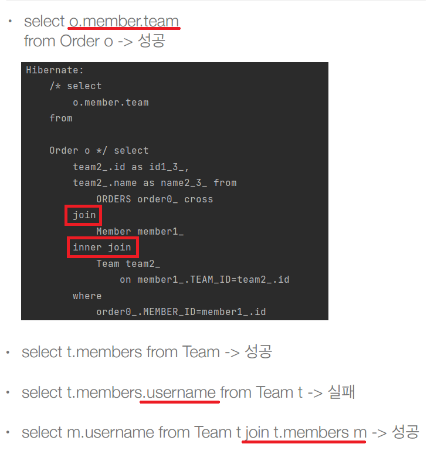


> 경로 탐색을 사용한 묵시적 조인 시 주의사항

* 항상 내부 조인이 일어난다.
* 컬렉션은 경로 탐색의 끝, 명시적 조인을 통해 별칭을 얻어야 한다.
* 경로 탐색은 주로 SELECT, WHERE 절에서 사용하지만 묵시적 조인으로 인해 SQL의 FROM (JOIN) 절에 영향을 준다.


> 실무 조언

* **가급적 묵시적 조인 대신에 명시적 조인 사용**
* 조인은 SQL 튜닝에 중요 포인트
* 묵시적 조인은 조인이 일어나는 상황을 한눈에 파악하기 어려움


### # 페치 조인(fetch join) - 기본

* **실무에서 엄청 많이 사용한다.**
* SQL 조인 종류X 
* JPQL에서 성능 최적화를 위해 제공하는 기능
* 연관된 엔티티나 컬렉션을 SQL **한 번에 함께 조회하는 기능**
* join fetch 명령어 사용
* 페치 조인 ::= [ LEFT [OUTER] | INNER ] JOIN FETCH 조인경로


> 엔티티 페치 조인

* 회원을 조회하면서 **연관된 팀**도 함께 조회(SQL 한 번에) 
* SQL을 보면 회원 뿐만 아니라 팀(T.*)도 함께 SELECT
  * [JPQL] : select m from Member m join fetch m.team 
  * [SQL] SELECT M.* **T.*** FROM MEMBER M
    **INNER JOIN TEAM T** ON M.TEAM_ID=T.ID 


* 예를 들어,  기존 방식대로 'select m From Member m' 이후 team을 출력할 경우,

  * 회원 1 -> 팀A SQL 실행

  * 회원 2 -> 팀A 1차캐시

  * 회원 3 -> 팀B SQL 실행

  * 만약 회원이 100명이고 팀이 100개인 경우, 100 + 1 즉, N + 1쿼리가 나가게된다. 

  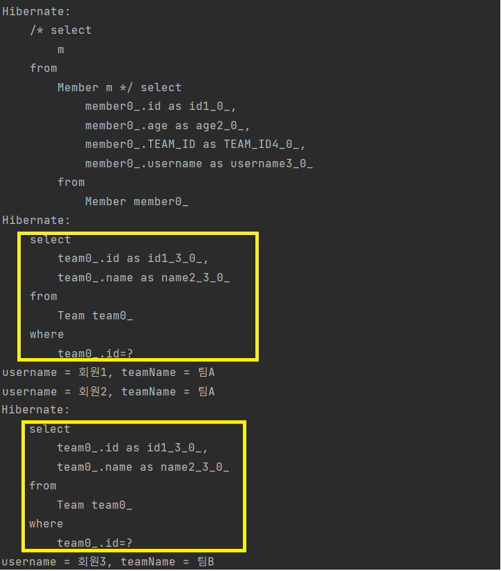


* N + 1 문제를 방지하기 위한 해결책 중 하나가 **fetch join**이다.
* 처음 쿼리에 한꺼번에 가져오게 됨.
* 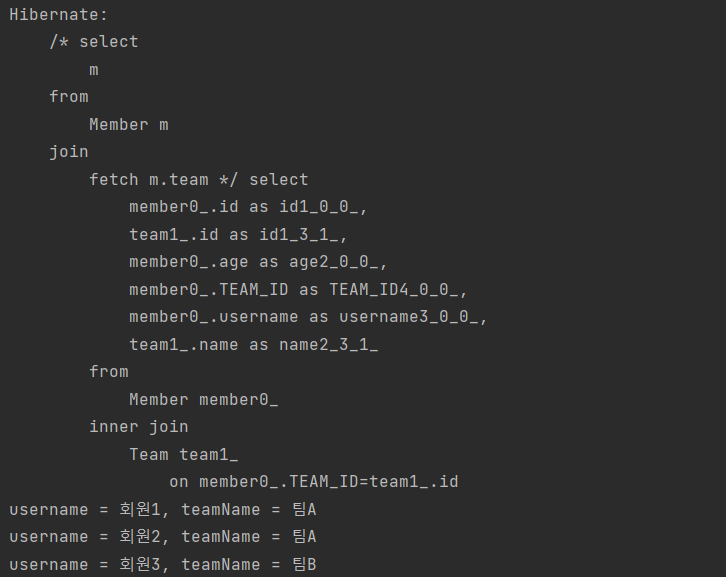


> 컬렉션 페치 조인

* 일대다 관계, 컬렉션 페치 조인

* [JPQL] : select t from Team t **join fetch t.members** where t.name = ‘팀A' 

* [SQL] : SELECT T.* , **M.*** FROM TEAM T INNER JOIN MEMBER M ON T.ID=M.TEAM_ID
  WHERE T.NAME = '팀A' 

* 문제점 : 일대다 조인은 데이터가 **뻥튀기**될 수 있다.

  * 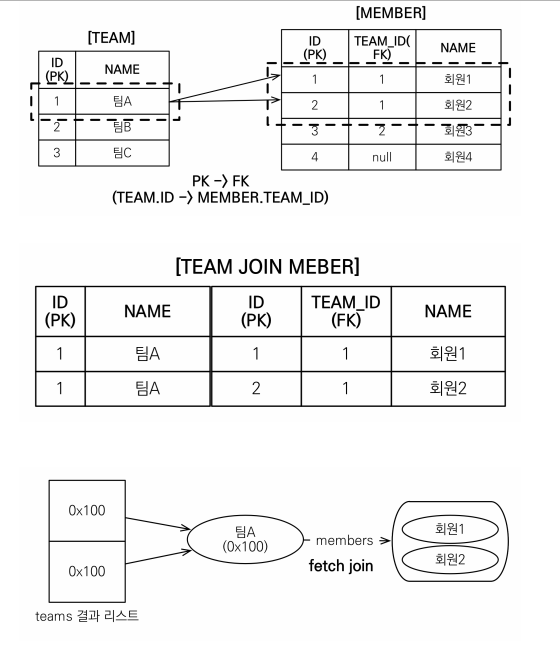

  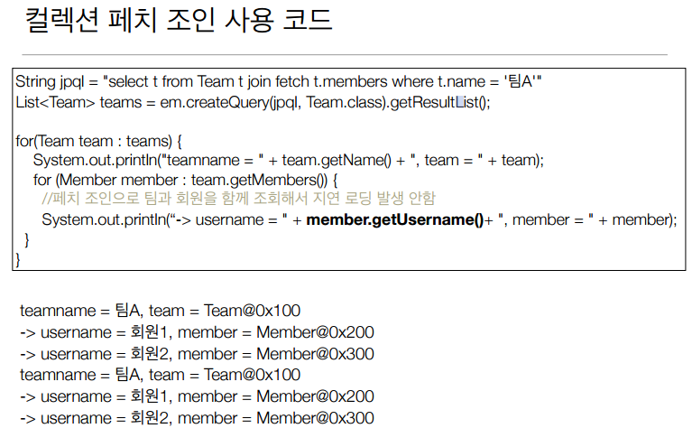


> 페치 조인과 DISTINCT

* SQL의 DISTINCT는 중복된 결과를 제거하는 명령

  * SQL에 DISTINCT는 row의 데이터가 달라야 중복을 제거함 --> 쿼리만으로 해결 불가

* JPQL의 DISTINCT 2가지 기능 제공

  * SQL에 DISTINCT를 추가

  * **어플리케이션에서 엔티티 중복 제거**

    * 같은 식별자를 가진 Team 엔티티 제거

    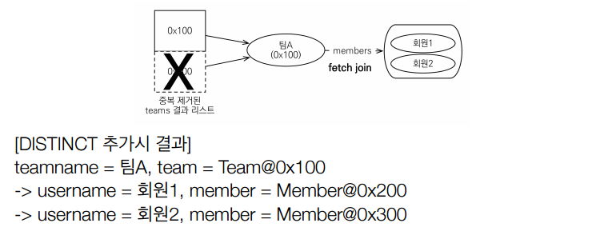


> 뻥튀기 ?? 
>
> * 다대일은 뻥튀기가 되지 않는다.
> * 일대다는 뻥튀기 될 수 있다.
> * 팀이 1개여도 멤버가 두명일 경우 결과가 2개로 증가


> 페치 조인과 일반 조인의 차이

* 일반 조인 실행시 연관된 엔티티를 함께 조회하지 않음

* 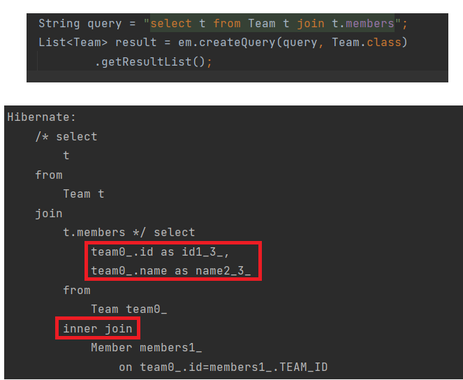
  * 일반 조인 :
    * 조인은 하지만 가져오는 것은 **select 된 것은 team**뿐이기 때문에 **team만 가져오게 된다.**
    * 보통 페치 조인처럼 데이터가 뻥튀기 될 수 있다.
    * 출력할 때 , members에 대한 정보는 없기 때문에 쿼리가 별도로 나가됨.
  * 페치 조인 : 
    * 페치 조인을 사용할 때만 **연관된 엔티티도 함께 조회(즉시 로딩) **
    * **페치 조인은 객체 그래프를 SQL 한번에 조회하는 개념**


### # 페치조인(fetch join) - 한계

* 페치 조인 대상에는 별칭을 줄 수 없다. 

  * 하이버네이트는 가능하지만 가급적 사용하지 않는 것이 좋다. 
  * 페치 조인은 연관된 엔티티가 함께 조회되는 기능인데 임의로 가져오게 되면 문제가 발생될 수 있음. (지워지거나 이상해질 수 있음)
  * 즉, 별칭줘서 일부 데이터만 가져오지 않는 이유 :  데이터의 정합성이나 객체 그래프의 사상이 맞지 않기 때문임.

  * ``` java
    String query = "select t From Team t join fetch t.members m"; // 불가
    String query = "select t From Team t join fetch t.members"; // 가능
    ```

* **둘 이상의 컬렉션은 페치 조인 할 수 없다. **

  * 페치 조인의 컬렉션은 하나만 될 수 있다.
  * 여러개할 경우, 원하는 값을 가져올 수 없는 경우가 많고, 데이터량이 제곱되는 경우 발생

* **컬렉션을 페치 조인**하면 **페이징** API(setFirstResult, setMaxResults)를 사용**할 수 없다. **

  * 일대일, 다대일 같은 단일 값 연관 필드들은 페치 조인해도 페이징 가능

  * 일대다의 경우, 하이버네이트는 경고 로그를 남기고 **메모리에서 페이징(매우 위험)**

    * 예를들어, 팀과 멤버를 페치조인할 경우,

    * 1차적으로 뻥튀기 되기도 하고

    * 팀의 회원이 2명임에도 페이징의 개수가 1일 경우 중간에 짤려서 가져오게 되어 팀의 회원이 1명으로 보일 수 있기 때문이다. 

    * 그래서 JPA는 **페이징해서 가져오지 않고, 모든 데이터를 가져오고 **그 다음에 페이징하게 됨

    * 해결 방법 : 

      * 일대다는 결국 다대일이 될 수 있기 때문에 다대일로 해결

      ```java
      String query = "select t From Team t join fetch t.members";
      // 위에서 아래로 변경
      String query = "select m From Member m join fetch m.team t";
      ```

      * 페치조인하지 않고, 배치 사이즈 이용
      * members가 LAZY 로딩임. LAZY 로딩을 할 때, 내 팀 뿐만아니라 배치 사이즈만큼 in query로 넘김

      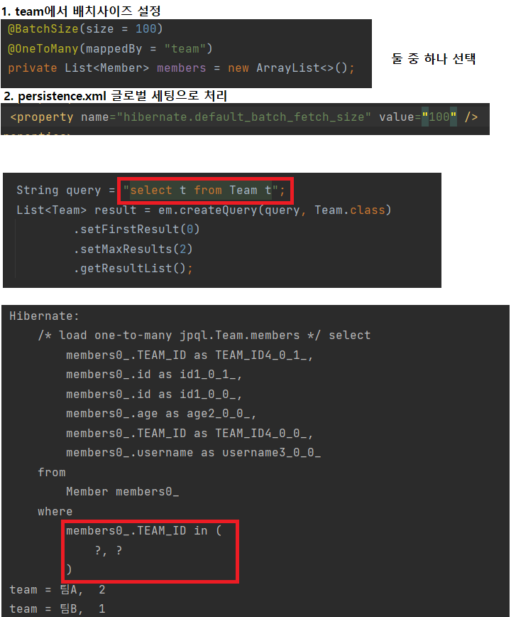


* 연관된 엔티티들을 **SQL 한 번**으로 조회 - 성능 최적화
* 엔티티에 직접 적용하는 **글로벌 로딩 전략보다 우선함**
  * @OneToMany(fetch = FetchType.LAZY)  //글로벌 로딩 전략
* 실무에서 글로벌 로딩 전략은 모두 지연 로딩
* 최적화가 필요한 곳은 페치 조인 적용


> 페치 조인 : 정리

* 모든 것을 페치 조인으로 해결할 수 는 없음
* 페치 조인은 객체 그래프를 유지할 때 사용하면 효과적
* 여러 테이블을 조인해서 엔티티가 가진 모양이 아닌 전혀 다른 결과를 내야 하면, 페치 조인 보다는 일반 조인을 사용하고 필요한 데이터들만 조회해서 DTO로 반환하는 것이 효과적


### # JPQL 다형성 쿼리

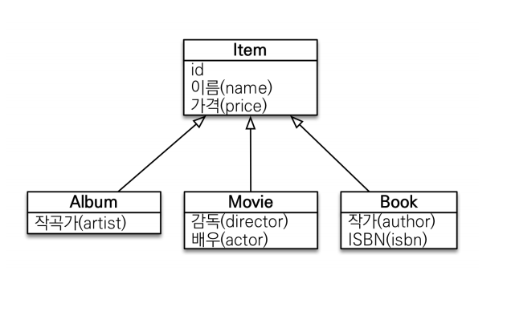

> TYPE

* 조회 대상을 특정 자식으로 한정
* 예) Item 중에 Book, Movie를 조회해라

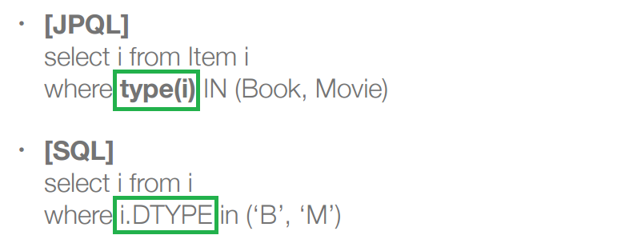


> TREAT(JPA 2.1)

* 자바의 타입 캐스팅과 유사 (다운 캐스팅)
* 상속 구조에서 부모 타입을 특정 자식 타입으로 다룰 때 사용
* FROM, WHERE, SELECT(하이버네이트 지원) 사용
* 예) 부모인 Item과 자식 Book이 있다. 

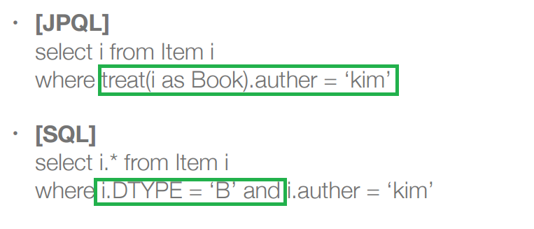


### # 엔티티 직접 사용

* JPQL에서 **엔티티를 직접 사용**하면 SQL에서 해당 엔티티의 **기본 키 값을 사용**

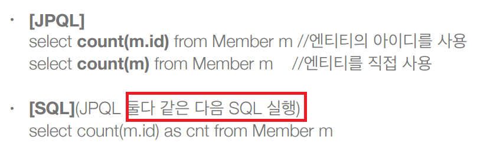

> 예시 - 기본키값 사용

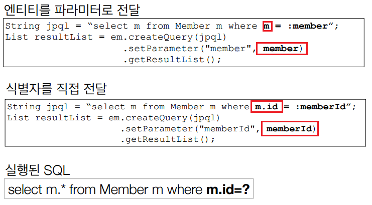


> 예시 - 외래키 값 사용

* m.team이라는 것은 결국 @JoinColumn(name = **"TEAM_ID"**)을 의미

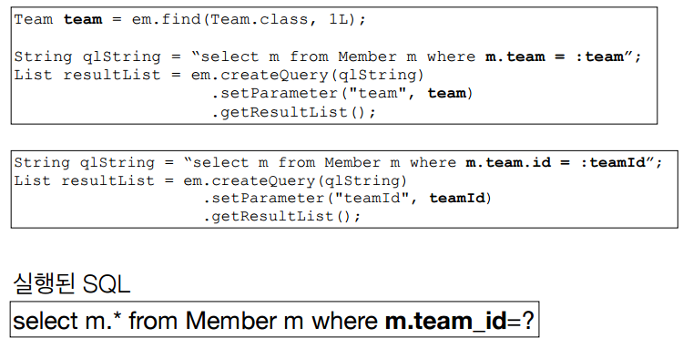


### # Named 쿼리

* 미리 정의해서 이름을 부여해두고 사용하는 JPQL 
* 정적 쿼리
* 어노테이션, XML에 정의
* 애플리케이션 **로딩 시점에 초기화 후 재사용**
  * 하이버네이트 or JPA Named 쿼리를 SQL로 파싱해서 캐시하고 있음
* 애플리케이션 **로딩 시점에 쿼리를 검증**
  * 로딩 시점에 검증할 수 있다는 것은 에러를 미리 확인할 수 있다는 것
  * 가장 안좋은 경우는 사용자 어플리케이션에서 실행 했을 때 나오는 에러


> 사용

1. Member 에서 어노테이션으로 네임드 쿼리 등록

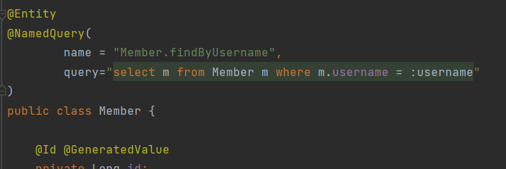

2. Main에서 em.createNaemdQuery로 사용

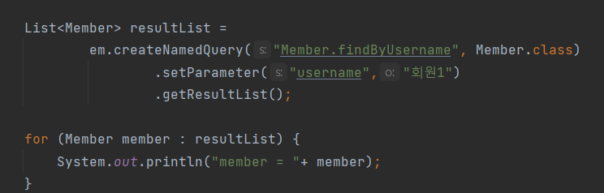


> Named 쿼리 - XML에 정의

* XML이 항상 우선권을 가진다. 
* 애플리케이션 운영 환경에 따라 다른 XML을 배포할 수 있다

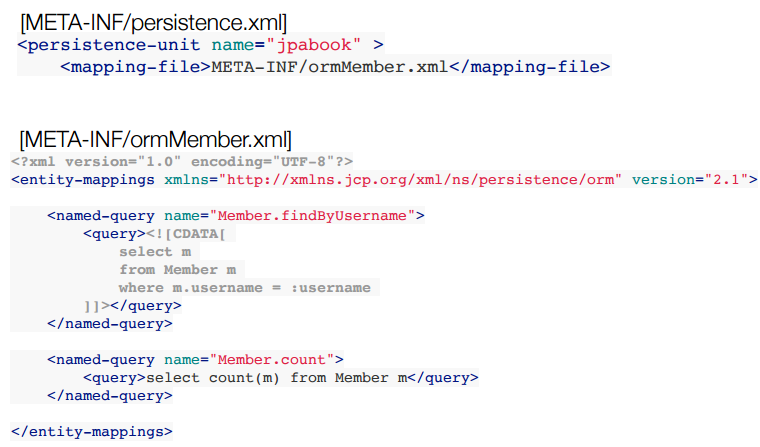


> SpringDateJpa에도 네임드 쿼리 존재 !  ''@query'


### # 벌크 연산

* Pk로하는 SQL이 아닌 모든 update, delete 쿼리
* 영속성 컨텍스트에 반영되지 않고 DB에 직접간다.
* 예를 들어, 재고가 10개 미만인 모든 상품의 가격을 10% 상승하려면?  
* JPA 변경 감지 기능(더티체크)으로 실행하려면 너무 많은 SQL 실행
  * 재고가 10개 미만인 상품을 리스트로 조회한다.  
  * 상품 엔티티의 가격을 10% 증가한다. 
  * 트랜잭션 커밋 시점에 변경감지가 동작한다. 
  * 변경된 데이터가 100건이라면 100번의 UPDATE SQL 실행


> 예제

​	예제 1 

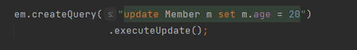

​	예제 2

​	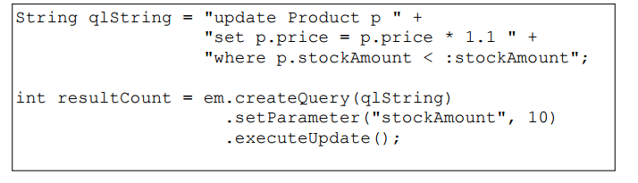

* 쿼리 한 번으로 여러 테이블 로우 변경(엔티티) 
* executeUpdate()의 결과는 **영향받은 엔티티 수 반환**
* **UPDATE, DELETE **지원
* JPA는 표준스펙에는 없지만 INSERT(insert into .. select, 하이버네이트 지원)


> 벌크 연산 주의

* 벌크 연산은 **영속성 컨텍스트를 무시하고 데이터베이스에 직접 쿼리**
* 해결법 
  1. 벌크 연산을 먼저 실행한다. 혹은
  2. **벌크 연산 수행 후 영속성 컨텍스트 초기화**함. 그럼 어플리케이션에서 데이터를 DB에서 가져와 정합성이 일치하게 된다.